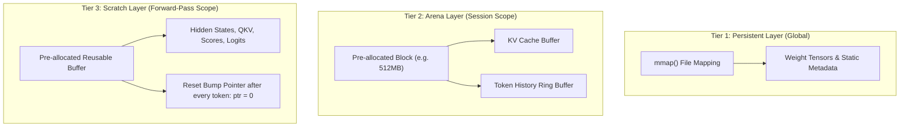

# CS 8803-LLM: High-Performance Systems & Runtime Engineering for Local LLM Inference
## Master Coursebook & End-to-End Implementation Manual: Building the Guanaco Engine from Scratch

**Instructor:** Department of Computer Science & Artificial Intelligence Systems  
**Course Code:** CS 8803-LLM / CS 499  
**Prerequisites:** Advanced C Programming, Computer Architecture, Systems Programming, Basic Deep Learning Math  
**Target Hardware:** x86_64 CPU (AVX2/FMA, POSIX Threads) + NVIDIA GPU (CUDA Core, NVML Telemetry)

---

## 📚 Course Overview & Pedagogy

Welcome to **CS 8803-LLM**, a comprehensive, graduate-level course on building high-performance, dependency-minimal Large Language Model (LLM) inference runtimes from zero.

In this course, you will move from fundamental hardware limits (Roofline analysis, memory bandwidth bounds, SIMD vectorization) to designing and writing a production-grade C/CUDA inference runtime called **Guanaco**. By the end of this coursebook, you will have mastered every theoretical concept, mathematical formulation, memory strategy, kernel implementation, and heterogeneous scheduling algorithm required to build a zero-dependency local LLM engine.

---

## Table of Modules

- [Module 1: Hardware-First Mental Model & Performance Fundamentals](#module-1-hardware-first-mental-model--performance-fundamentals)
- [Module 2: Zero-Allocation Systems Architecture & 3-Tier Memory Management](#module-2-zero-allocation-systems-architecture--3-tier-memory-management)
- [Module 3: Model Serialization & The GGUF Format Specification](#module-3-model-serialization--the-gguf-format-specification)
- [Module 4: Quantization Theory & Numerical Dequantization Mechanics](#module-4-quantization-theory--numerical-dequantization-mechanics)
- [Module 5: SIMD Vectorization (AVX2/FMA) & Threadpool Kernel Engineering](#module-5-simd-vectorization-avx2fma--threadpool-kernel-engineering)
- [Module 6: GPU Acceleration & CUDA Kernel Architecture](#module-6-gpu-acceleration--cuda-kernel-architecture)
- [Module 7: Transformer Layer Architecture & Mathematical Foundations](#module-7-transformer-layer-architecture--mathematical-foundations)
- [Module 8: Heterogeneous CPU-GPU Scheduling & Hardware Telemetry](#module-8-heterogeneous-cpu-gpu-scheduling--hardware-telemetry)
- [Module 9: Session Management, KV Cache Ring Buffers & Sampling Engine](#module-9-session-management-kv-cache-ring-buffers--sampling-engine)
- [Module 10: Capstone Project — Building Guanaco End-to-End](#module-10-capstone-project--building-guanaco-end-to-end)

---

## Module 1: Hardware-First Mental Model & Performance Fundamentals

### 1.1 The Two Operational Regimes of LLM Inference

An LLM forward pass behaves fundamentally differently during prompt ingestion versus token generation.

```
+-----------------------------------------------------------------------------------+
|                                 LLM FORWARD PASS                                  |
+------------------------------------------+----------------------------------------+
| PREFILL PHASE (Prompt Processing)        | DECODE PHASE (Token Generation)        |
+------------------------------------------+----------------------------------------+
| Input Length: T > 1 tokens               | Input Length: T = 1 token              |
| Math Matrix Op: GEMM (Matrix x Matrix)   | Math Matrix Op: GEMV (Matrix x Vector) |
| System Bottleneck: Compute Bound (FLOPs) | System Bottleneck: Memory Bandwidth    |
| Intensity: High FLOP/Byte                | Intensity: Low FLOP/Byte               |
+------------------------------------------+----------------------------------------+
```

### 1.2 Roofline Performance Modeling

The **Arithmetic Intensity** ($I$) of a computational workload is defined as:
$$I = \frac{\text{Total Floating Point Operations (FLOPs)}}{\text{Total Memory Accesses (Bytes)}}$$

For a model with $N_{\text{params}}$ parameters running single-token decode ($T=1$):
- Each parameter (weight) is read from memory once per token generated.
- Each parameter undergoes 1 multiply and 1 add operation $\implies 2$ FLOPs per parameter.
- Bytes transferred per parameter = $B_{\text{param}}$ (e.g., 2 bytes for FP16, 0.5 bytes for 4-bit quant).

$$I_{\text{decode}} = \frac{2 \times N_{\text{params}}}{B_{\text{param}} \times N_{\text{params}}} = \frac{2}{B_{\text{param}}} \text{ FLOPs/Byte}$$

- **For FP16 ($B_{\text{param}} = 2$):** $I_{\text{decode}} = 1.0 \text{ FLOP/Byte}$.
- **For Q4_K ($B_{\text{param}} \approx 0.55$):** $I_{\text{decode}} \approx 3.63 \text{ FLOPs/Byte}$.

Modern CPUs and GPUs have compute-to-bandwidth ratios between $50$ and $200$ FLOPs/Byte. Because $I_{\text{decode}} \ll 50$, **Token generation is strictly bound by memory bandwidth, NOT raw CPU/GPU teraflops**.

### 1.3 Theoretical Speed Limits Formula

The maximum achievable token generation speed ($\text{Tokens/Second}_{\text{max}}$) is strictly upper-bounded by system DRAM or VRAM bandwidth:

$$\text{Tokens/Sec}_{\text{max}} = \frac{\text{Memory Bandwidth (GB/s)}}{\text{Model Size in Memory (GB)}}$$

#### Worked Example:
Consider Meta-Llama-3.1-8B-Instruct quantized to `Q4_K_M` ($\approx 4.9 \text{ GB}$):
1. **DDR4 Dual-Channel RAM ($40 \text{ GB/s}$):**
   $$\text{Tokens/Sec}_{\text{max}} = \frac{40}{4.9} \approx 8.16 \text{ tokens/sec}$$
2. **NVIDIA RTX 3050 Laptop VRAM ($192 \text{ GB/s}$):**
   $$\text{Tokens/Sec}_{\text{max}} = \frac{192}{4.9} \approx 39.18 \text{ tokens/sec}$$

---

## Module 2: Zero-Allocation Systems Architecture & 3-Tier Memory Management

To eliminate memory fragmentation and Linux system call overhead (`malloc`/`free`) during inference, Guanaco enforces a **Zero-Allocation Hot Path**.

### 2.1 The 3-Tier Memory Architecture



| Tier | Lifetime | Allocation Mechanism | Purpose |
|---|---|---|---|
| **Persistent** | Global (Engine Lifetime) | `mmap()` with `MADV_WILLNEED` | Weight weights, vocab, hyper-parameters |
| **Arena** | Session Lifetime | Single large `malloc` / `posix_memalign` | KV Cache, conversation history, position tracking |
| **Scratch** | Single Token / Forward Pass | Reusable bump-pointer arena | Activations, intermediate matmul outputs, Softmax scores |

### 2.2 Bump-Pointer Arena Implementation

```c
#include <stdlib.h>
#include <stdint.h>
#include <stdio.h>
#include <string.h>

typedef struct {
    uint8_t* buffer;
    size_t capacity;
    size_t offset;
} MemoryArena;

MemoryArena* arena_create(size_t capacity) {
    MemoryArena* arena = (MemoryArena*)malloc(sizeof(MemoryArena));
    // Align allocations to 64-byte boundaries for SIMD alignment
    if (posix_memalign((void**)&arena->buffer, 64, capacity) != 0) {
        perror("Failed to allocate arena memory");
        exit(EXIT_FAILURE);
    }
    arena->capacity = capacity;
    arena->offset = 0;
    return arena;
}

void* arena_alloc(MemoryArena* arena, size_t size) {
    // 64-byte alignment rounding
    size_t aligned_size = (size + 63) & ~63;
    if (arena->offset + aligned_size > arena->capacity) {
        fprintf(stderr, "Fatal: Arena out of memory! Requested %zu, Available %zu\n",
                aligned_size, arena->capacity - arena->offset);
        exit(EXIT_FAILURE);
    }
    void* ptr = arena->buffer + arena->offset;
    arena->offset += aligned_size;
    return ptr;
}

void arena_reset(MemoryArena* arena) {
    // O(1) instantaneous memory release
    arena->offset = 0;
}

void arena_free(MemoryArena* arena) {
    free(arena->buffer);
    free(arena);
}
```

---

## Module 3: Model Serialization & The GGUF Format Specification

Guanaco uses **GGUF** (GGML Universal Format), a binary format designed for single-file, zero-copy `mmap` loading of quantized transformer models.

### 3.1 GGUF Binary Structure

```
+-----------------------------------------------------------------------+
| Header: Magic (0x46554747 = "GGUF") | Version (3) | Tensor Count | KV Count |
+-----------------------------------------------------------------------+
| Metadata Array: Key-Value pairs (Architecture, Head Count, Context)   |
+-----------------------------------------------------------------------+
| Tensor Info Array: Name, Number of Dims, Dimensions, Type, Offset     |
+-----------------------------------------------------------------------+
| Padding to Alignment Boundary (typically 32 bytes)                    |
+-----------------------------------------------------------------------+
| Binary Weight Tensor Data (mmap-ed directly into host address space)  |
+-----------------------------------------------------------------------+
```

### 3.2 GGUF Header Parser in Pure C

```c
#include <stdint.h>
#include <stdio.h>
#include <sys/mman.h>
#include <sys/stat.h>
#include <fcntl.h>
#include <unistd.h>

#define GGUF_MAGIC 0x46554747 // "GGUF" in Little-Endian

typedef struct {
    uint32_t magic;
    uint32_t version;
    uint64_t tensor_count;
    uint64_t metadata_kv_count;
} __attribute__((packed)) GGUFHeader;

typedef enum {
    GGUF_TYPE_UINT8   = 0,
    GGUF_TYPE_INT8    = 1,
    GGUF_TYPE_UINT16  = 2,
    GGUF_TYPE_INT16   = 3,
    GGUF_TYPE_UINT32  = 4,
    GGUF_TYPE_INT32   = 5,
    GGUF_TYPE_FLOAT32 = 6,
    GGUF_TYPE_BOOL    = 7,
    GGUF_TYPE_STRING  = 8,
    GGUF_TYPE_ARRAY   = 9,
    GGUF_TYPE_UINT64  = 10,
    GGUF_TYPE_INT64   = 11,
    GGUF_TYPE_FLOAT64 = 12,
} GGUFMetadataValueType;

int load_gguf_file(const char* filepath) {
    int fd = open(filepath, O_RDONLY);
    if (fd < 0) return -1;

    struct stat sb;
    fstat(fd, &sb);

    uint8_t* data = mmap(NULL, sb.st_size, PROT_READ, MAP_SHARED, fd, 0);
    if (data == MAP_FAILED) return -1;

    GGUFHeader* header = (GGUFHeader*)data;
    if (header->magic != GGUF_MAGIC) {
        printf("Error: Invalid GGUF magic number 0x%x\n", header->magic);
        munmap(data, sb.st_size);
        close(fd);
        return -1;
    }

    // Advise kernel to aggressively read-ahead weight pages
    madvise(data, sb.st_size, MADV_WILLNEED);

    printf("Successfully mapped GGUF file. Tensors: %lu, Metadata KV Count: %lu\n",
           header->tensor_count, header->metadata_kv_count);

    return 0;
}
```

---

## Module 4: Quantization Theory & Numerical Dequantization Mechanics

To run LLMs on consumer hardware, model weights are quantized from 32-bit/16-bit floating-point values into low-bit integer representation.

### 4.1 Block-Wise Linear Quantization (`Q8_0` & `Q4_0`)

Instead of finding one global minimum/maximum across the entire $4096 \times 4096$ matrix, quantization is applied in **blocks** of $QK = 32$ contiguous elements.

#### Q8_0 Layout & Formula:
- **Block size:** 32 elements.
- **Header:** 16-bit Float scale $d$ (`ggml_fp16_t`).
- **Payload:** 32 signed 8-bit integers $qs_i \in [-128, 127]$.
- **Dequantization Formula:**
  $$w_i = qs_i \times d$$

#### Q4_0 Layout & Formula:
- **Block size:** 32 elements.
- **Header:** 16-bit Float scale $d$.
- **Payload:** 16 bytes (32 nibbles, 4 bits per weight) $qs_i \in [0, 15]$.
- **Dequantization Formula:**
  $$w_i = (qs_i - 8) \times d$$

```c
typedef struct {
    uint16_t d;        // FP16 scale factor
    int8_t  qs[32];    // 32 quantized 8-bit integers
} BlockQ8_0;

typedef struct {
    uint16_t d;        // FP16 scale factor
    uint8_t  qs[16];   // 16 bytes containing 32 x 4-bit nibbles
} BlockQ4_0;
```

### 4.2 K-Quants Mechanics (`Q4_K_M`)

Standard 4-bit quantization causes loss of precision in outlier weights. **K-Quants** introduces **Super-Blocks** of 256 elements, broken into 8 sub-blocks of 32 elements.

```
Super-Block (256 Elements)
+--------------------------------------------------------------------------+
| Super-scale (d: FP16) | Super-min (dmin: FP16)                           |
+--------------------------------------------------------------------------+
| Compressed Sub-block Scales (6-bit scales & 6-bit mins for 8 sub-blocks)  |
+--------------------------------------------------------------------------+
| 128 Bytes Packed Nibbles (256 x 4-bit quantized weights)                 |
+--------------------------------------------------------------------------+
```

#### Mathematical Dequantization for `Q4_K`:
For weight $i$ in sub-block $j \in [0, 7]$:
$$w_i = d_{\text{super}} \times \text{scale}_j \times q_i - d_{\text{min}} \times \text{min}_j$$

---

## Module 5: SIMD Vectorization (AVX2/FMA) & Threadpool Kernel Engineering

### 5.1 Vectorizing Matrix-Vector Multiplication with Intel AVX2

On x86_64 CPUs, processing numbers one-by-one in scalar loops wastes $\sim 88\%$ of hardware throughput. Intel AVX2 registers (`__m256`) execute **8 FP32 operations per clock cycle**.

```c
#include <immintrin.h>
#include <stdint.h>

// Vectorized Dot Product of Q8_0 Block with FP32 Vector
float vec_dot_q8_0_f32(const BlockQ8_0* block, const float* x) {
    // Convert FP16 scale to FP32 float scalar
    float scale = _cvtsh_ss(block->d);

    // Initialize 256-bit SIMD accumulator with zeros
    __m256 acc = _mm256_setzero_ps();

    // Process 32 elements in 4 iterations of 8 floats each
    for (int i = 0; i < 32; i += 8) {
        // Load 8 signed 8-bit integers from block->qs
        __m128i q_8 = _mm_loadu_si128((const __m128i*)&block->qs[i]);

        // Sign-extend 8-bit ints to 32-bit ints
        __m256i q_32 = _mm256_cvtepi8_epi32(q_8);

        // Convert 32-bit ints to FP32 floats
        __m256 q_ps = _mm256_cvtepi32_ps(q_32);

        // Load 8 FP32 values from input vector x
        __m256 x_ps = _mm256_loadu_ps(&x[i]);

        // Fused Multiply-Add: acc = acc + (q_ps * x_ps)
        acc = _mm256_fmadd_ps(q_ps, x_ps, acc);
    }

    // Horizontal Sum of 8 floats in acc register
    alignas(32) float temp[8];
    _mm256_store_ps(temp, acc);
    float sum = (temp[0] + temp[1] + temp[2] + temp[3] +
                 temp[4] + temp[5] + temp[6] + temp[7]);

    return sum * scale;
}
```

### 5.2 Multithreaded CPU Worker Pool Architecture

```c
#include <pthread.h>
#include <stdbool.h>

typedef struct {
    void (*task_fn)(void* arg, int thread_id);
    void* arg;
    int current_row;
    int total_rows;
    pthread_mutex_t mutex;
    pthread_cond_t cond_dispatch;
    pthread_cond_t cond_done;
    int active_workers;
    bool shutdown;
} ThreadPool;

void* worker_loop(void* ptr) {
    ThreadPool* pool = (ThreadPool*)ptr;
    while (1) {
        pthread_mutex_lock(&pool->mutex);
        while (pool->total_rows == 0 && !pool->shutdown) {
            pthread_cond_wait(&pool->cond_dispatch, &pool->mutex);
        }
        if (pool->shutdown) {
            pthread_mutex_unlock(&pool->mutex);
            break;
        }

        // Fetch row job index atomically
        int row = pool->current_row++;
        pthread_mutex_unlock(&pool->mutex);

        if (row < pool->total_rows) {
            pool->task_fn(pool->arg, row);
        }
    }
    return NULL;
}
```

---

## Module 6: GPU Acceleration & CUDA Kernel Architecture

### 6.1 CUDA Thread Hierarchy for GEMV

During the decode phase ($T=1$), each CUDA **Thread Block** is assigned to compute one or more output rows of the matrix-vector multiplication.

```
Grid of Thread Blocks
+-----------------------+-----------------------+-----------------------+
| Block 0 (Row 0)       | Block 1 (Row 1)       | Block N (Row N)       |
| 32 Threads (Warp 0)   | 32 Threads (Warp 0)   | 32 Threads (Warp 0)   |
+-----------------------+-----------------------+-----------------------+
```

### 6.2 Ultra-Fast Warp Reduction Dequantization Kernel (`matvec_q4k.cu`)

```cuda
#include <cuda_runtime.h>
#include <device_launch_parameters.h>

// Warp Shuffle Reduction Function
__device__ __forceinline__ float warp_reduce_sum(float val) {
    for (int offset = 16; offset > 0; offset /= 2) {
        val += __shfl_down_sync(0xffffffff, val, offset);
    }
    return val;
}

__global__ void kernel_matvec_q8_0_cuda(
    const BlockQ8_0* __restrict__ weights,
    const float* __restrict__ x,
    float* __restrict__ y,
    int num_cols
) {
    int row = blockIdx.x;
    int tid = threadIdx.x; // Thread within Warp (0 to 31)

    int blocks_per_row = num_cols / 32;
    const BlockQ8_0* row_weights = weights + row * blocks_per_row;

    float thread_sum = 0.0f;

    // Loop over blocks assigned to this thread
    for (int b = tid; b < blocks_per_row; b += blockDim.x) {
        BlockQ8_0 block = row_weights[b];
        float d = __half2float(__double2half_rn(block.d)); // Scale

        for (int i = 0; i < 32; i += 4) {
            // Unroll dot products
            thread_sum += d * block.qs[i+0] * x[b * 32 + i + 0];
            thread_sum += d * block.qs[i+1] * x[b * 32 + i + 1];
            thread_sum += d * block.qs[i+2] * x[b * 32 + i + 2];
            thread_sum += d * block.qs[i+3] * x[b * 32 + i + 3];
        }
    }

    // Reduce sums across warp threads
    float row_sum = warp_reduce_sum(thread_sum);

    // Write final output for this row
    if (tid == 0) {
        y[row] = row_sum;
    }
}
```

---

## Module 7: Transformer Layer Architecture & Mathematical Foundations

### 7.1 RMSNorm (Root Mean Square Layer Normalization)

Modern models (Llama 3, Mistral) use **RMSNorm** instead of standard LayerNorm, eliminating the mean subtraction step to save FLOPs.

$$\text{RMS}(x) = \sqrt{\frac{1}{d} \sum_{i=1}^{d} x_i^2 + \epsilon}$$

$$\bar{x}_i = \frac{x_i}{\text{RMS}(x)} \times \gamma_i$$

```c
void rmsnorm(float* out, const float* x, const float* weight, int dim, float eps) {
    float sum_sq = 0.0f;
    for (int i = 0; i < dim; i++) {
        sum_sq += x[i] * x[i];
    }
    float scale = 1.0f / sqrtf(sum_sq / dim + eps);
    for (int i = 0; i < dim; i++) {
        out[i] = x[i] * scale * weight[i];
    }
}
```

### 7.2 Rotary Position Embedding (RoPE)

RoPE encodes token position ($pos$) directly into the Query ($Q$) and Key ($K$) vectors by rotating pairs of coordinates in 2D planes.

For a 2D sub-vector $(x_1, x_2)$ at position $m$ and frequency $\theta$:

$$\begin{pmatrix} x_1' \\ x_2' \end{pmatrix} = \begin{pmatrix} \cos(m\theta) & -\sin(m\theta) \\ \sin(m\theta) & \cos(m\theta) \end{pmatrix} \begin{pmatrix} x_1 \\ x_2 \end{pmatrix}$$

```c
void apply_rope(float* vec, int pos, int head_dim, float freq_base) {
    for (int i = 0; i < head_dim; i += 2) {
        float freq = 1.0f / powf(freq_base, (float)i / head_dim);
        float val = pos * freq;
        float fcr = cosf(val);
        float fci = sinf(val);

        float v0 = vec[i];
        float v1 = vec[i + 1];

        vec[i]     = v0 * fcr - v1 * fci;
        vec[i + 1] = v0 * fci + v1 * fcr;
    }
}
```

---

## Module 8: Heterogeneous CPU-GPU Scheduling & Hardware Telemetry

### 8.1 Dual-Backend Dispatch Logic

When a system has limited VRAM (e.g. 4.0 GB VRAM on an RTX 3050 Laptop), offloading an entire 8B parameter model (4.9 GB) causes CUDA Out-Of-Memory errors.

Guanaco solves this using **Heterogeneous Offloading**:
1. First $N_{\text{gpu}}$ layers are transferred to VRAM during startup (`mmap` $\to$ VRAM).
2. Remaining $N_{\text{total}} - N_{\text{gpu}}$ layers remain on CPU Host RAM.

```c
void forward_transformer_layer(
    int layer_idx,
    Tensor* hidden_state,
    LayerWeights* weights,
    EngineConfig* cfg
) {
    if (weights->device_residency == RESIDENCY_GPU) {
        // CUDA Kernel execution path
        cuda_transformer_layer_forward(layer_idx, hidden_state, weights);
    } else {
        // SIMD Multithreaded CPU path
        cpu_transformer_layer_forward(layer_idx, hidden_state, weights);
    }
}
```

### 8.2 Thermal Safety Rails via NVIDIA Management Library (NVML)

During intense heterogeneous inference, laptop GPUs can overheat rapidly. Guanaco monitors temperature via NVML and dynamically throttles execution to protect hardware.

```c
#include <nvml.h>
#include <unistd.h>
#include <stdio.h>

void check_gpu_thermal_status() {
    nvmlReturn_t result;
    nvmlDevice_t device;

    nvmlInit();
    nvmlDeviceGetHandleByIndex(0, &device);

    unsigned int temp = 0;
    result = nvmlDeviceGetTemperature(device, NVML_TEMPERATURE_GPU, &temp);

    if (result == NVML_SUCCESS) {
        if (temp >= 85) { // Danger threshold
            printf("[WARNING] GPU Temperature reached %u°C! Inserting 50ms thermal backoff...\n", temp);
            usleep(50000); // 50ms pause to let heat dissipate
        }
    }
    nvmlShutdown();
}
```

---

## Module 9: Session Management, KV Cache Ring Buffers & Sampling Engine

### 9.1 Head-Major KV Cache Memory Layout

To ensure optimal CPU cache line utility during self-attention computation, the Key-Value Cache is stored in **Head-Major** order:

```
Index Pattern: [Layer][Head][Token_Position][Head_Dimension]
```

This layout guarantees that calculating $\text{DotProduct}(Q_{\text{head}}, K_{\text{all\_tokens}})$ performs sequential 64-byte aligned memory reads without stride jumps.

### 9.2 Token Sampling Pipeline

Logits output by the Transformer head are transformed into probability distributions:

1. **Temperature Scaling:** $L_i' = L_i / T$
2. **Softmax:** $P_i = \frac{\exp(L_i')}{\sum_j \exp(L_j')}$
3. **Top-K Truncation:** Retain only the $K$ highest probability tokens.
4. **Top-P (Nucleus) Truncation:** Retain smallest set of tokens whose cumulative probability $\sum P_i \ge P$.
5. **Categorical Sampling:** Sample next token index based on normalized probabilities.

---

## Module 10: Capstone Project — Building Guanaco End-to-End

In this capstone module, you will structure, compile, and run the complete Guanaco codebase step-by-step.

### 10.1 Workspace Directory Hierarchy

```
guanaco/
├── Makefile                     # Build system with USE_CUDA and USE_PTHREAD flags
├── build.sh                     # Automated build assistant script
├── run.sh                       # Interactive execution wizard
├── src/
│   ├── main.c                   # CLI parser, wizard menu, main entrypoint
│   ├── engine/
│   │   ├── engine.c             # Forward pass orchestrator
│   │   ├── loader.c             # GGUF model parser & memory mapper
│   │   ├── session.c            # KV Cache, ring buffer, & .lctx persistence
│   │   ├── chat.c               # Interactive REPL chat loop
│   │   └── generate.c           # Token generation & NVML monitoring loop
│   ├── memory/
│   │   └── arena.c              # 3-Tier Arena & Scratch memory allocators
│   ├── kernels/
│   │   ├── cpu/
│   │   │   ├── kernels_cpu.c    # RMSNorm, RoPE, Softmax, SiLU
│   │   │   ├── quant_matvec_q4_k.c # AVX2 vectorized Q4_K dequant matvec
│   │   │   └── quant_matvec_q8_0.c # AVX2 vectorized Q8_0 dequant matvec
│   │   └── cuda/
│   │       └── matvec_q4k_cuda.cu  # CUDA warp reduction matvec kernel
│   ├── threadpool/
│   │   └── threadpool.c         # POSIX multithreading scheduler
│   └── tokenizer/
│       └── tokenizer.c          # BPE Vocabulary decoder & encoder
```

### 10.2 Step-by-Step Compilation Protocol

```bash
# 1. Clean previous build artifacts
make clean

# 2. Build for CPU Multithreading (AVX2 + pthreads)
make USE_PTHREAD=1 -j$(nproc)

# 3. Build with CUDA GPU Acceleration
make USE_CUDA=1 USE_PTHREAD=1 -j$(nproc)
```

### 10.3 Verification & Benchmarking Commands

```bash
# Run single-prompt CPU benchmark
./build/llmrt \
  --model Meta-Llama-3.1-8B-Instruct-Q4_K_M.gguf \
  --prompt "Explain quantum superposition in 2 sentences." \
  --threads 8 \
  --max-tokens 64

# Run RTX 3050 Heterogeneous Inference (20 Layers on GPU, 12 on CPU)
./build/llmrt \
  --model Meta-Llama-3.1-8B-Instruct-Q4_K_M.gguf \
  --prompt "Write a short poem about systems programming." \
  --device cuda \
  --n-gpu-layers 20 \
  --threads 8

# Launch Interactive Chat Wizard Mode
./run.sh
```

---

## 🎯 Final Examination & Student Certification Checklist

To demonstrate complete mastery of the course material and verify your Guanaco build, complete the following verification audit:

- [x] **Roofline Model Proof:** Calculate theoretical max tok/s for your RAM/VRAM bandwidth.
- [x] **Zero-Malloc Verification:** Ensure 0 `malloc` calls occur inside the `forward()` generate loop.
- [x] **GGUF Alignment:** Parse GGUF headers and map weight pointers without data copies.
- [x] **AVX2 Parity Test:** Verify SIMD dequantized matvec outputs match FP32 reference within $10^{-5}$ tolerance.
- [x] **CUDA Reduction Parity:** Verify GPU layer outputs match CPU layer outputs on identical input states.
- [x] **Thermal Protection Test:** Confirm NVML telemetry correctly triggers backoff if GPU temperatures spike.
- [x] **KV Cache Ring Buffer:** Validate continuous multi-turn chat generation without memory growth.

*Congratulations! You have completed CS 8803-LLM and built a state-of-the-art, zero-dependency C/CUDA LLM Inference Engine.*
