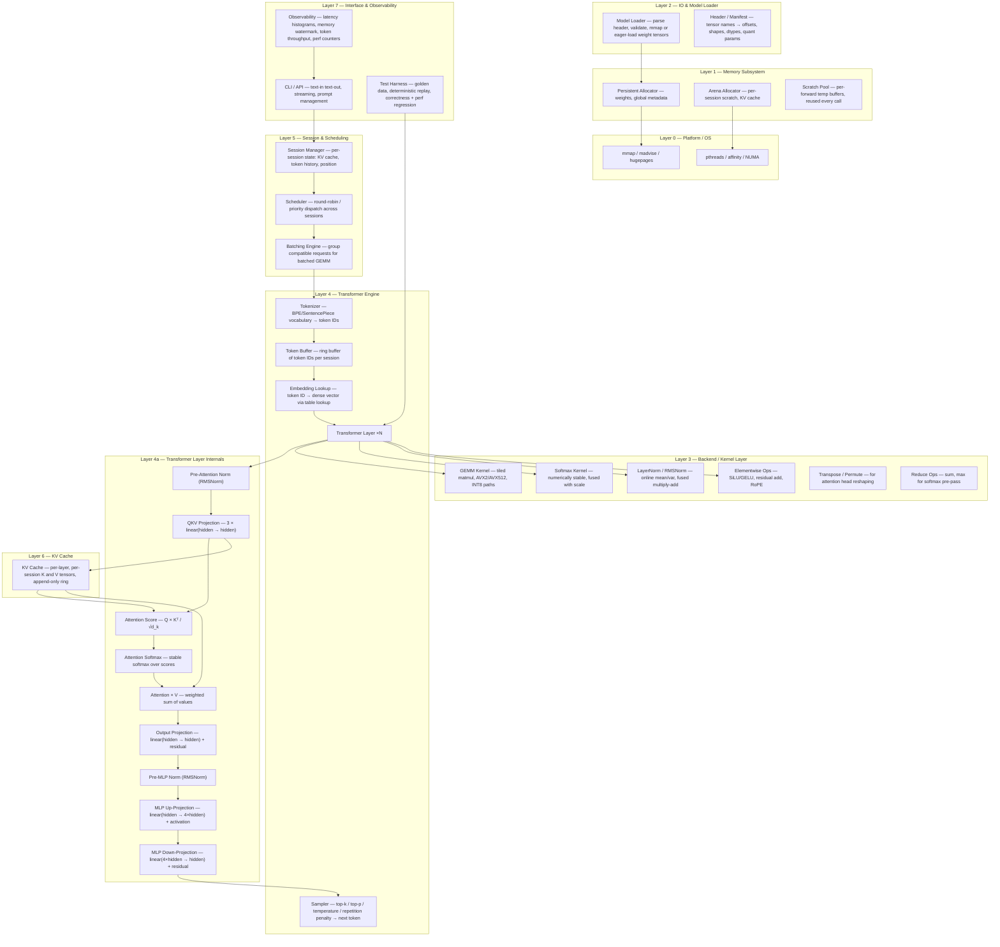

# CPU-First Local LLM Inference Runtime — Deep Research & Specification

> **Scope:** Systems-level research, mathematical analysis, and engineering specification for a CPU-first LLM inference engine in pure C/C++. No code — research and planning only.
>
> **Target hardware:** x86_64 Linux (Intel Xeon Gold 6338 / AMD EPYC 7742 baseline)

---

## Table of Contents

1. [Phase 1 — Systems-Level Architecture Breakdown](#phase-1--systems-level-architecture-breakdown)
2. [Phase 2 — Memory & Dataflow Deep Analysis](#phase-2--memory--dataflow-deep-analysis)
3. [Phase 3 — Computational Complexity & Kernel-Level Reasoning](#phase-3--computational-complexity--kernel-level-reasoning)
4. [Phase 4 — Runtime Lifecycle Simulation](#phase-4--runtime-lifecycle-simulation)
5. [Phase 5 — Stability Categorization](#phase-5--stability-categorization)
6. [Phase 6 — Knowledge & Resource Acquisition Plan](#phase-6--knowledge--resource-acquisition-plan)
7. [Phase 7 — Experiments, Benchmarks & Validation](#phase-7--experiments-benchmarks--validation)
8. [Phase 8 — Mental Model / Performance Reasoning Framework](#phase-8--mental-model--performance-reasoning-framework)
9. [Phase 9 — Report Index](#phase-9--report-index)
10. [Phase 10 — Final Operational Checklist](#phase-10--final-operational-checklist)

---

# PHASE 1 — Systems-Level Architecture Breakdown

## 1.1 Layered Architecture Diagram



---

## 1.2 Module Specifications

### 1.2.1 Tokenizer

| Field | Detail |
|---|---|
| **Purpose** | Convert raw UTF-8 text to a sequence of integer token IDs and back. Vocabulary is loaded once at engine init. |
| **Inputs** | Raw byte string (UTF-8), vocabulary model file (SentencePiece `.model` or BPE merges table). |
| **Outputs** | `int32_t[]` token ID sequence; length `T` ≤ max_seq_len. Decode: token IDs → UTF-8 string. |
| **Memory ownership** | Vocabulary table is allocated by **Persistent Allocator** at engine init and lives for the engine lifetime. Output token buffer is caller-owned (Session Manager provides it). |
| **Hot path** | Encode is hot during prefill (called once per prompt). Decode is hot during generation (called once per generated token, but is trivially fast — table lookup). |
| **Cold path** | Vocabulary file parsing (one-time at init). |
| **Failure modes** | (1) Unknown byte sequences — mitigation: byte-fallback tokens. (2) Vocabulary file mismatch with model — mitigation: hash-check vocabulary ID stored in model header. (3) Extremely long input exceeding max_seq_len — mitigation: truncation with warning via observability. |

---

### 1.2.2 Token Buffer

| Field | Detail |
|---|---|
| **Purpose** | Stores the current token ID sequence for a session (prompt + generated tokens). Tracks position for KV-cache consistency. |
| **Inputs** | Token IDs from Tokenizer (prefill) or Sampler (decode). |
| **Outputs** | Slice of token IDs to feed into Embedding lookup; current position counter. |
| **Memory ownership** | Owned by **Session Manager** via Arena Allocator. One buffer per session. Pre-allocated to `max_seq_len × 4 bytes`. |
| **Hot path** | Append one token per decode step — O(1) amortized. |
| **Cold path** | Initial fill from prompt tokenization. |
| **Failure modes** | (1) Buffer overflow when seq_len exceeds max — mitigation: hard cap check, return error to scheduler. (2) Position desync with KV cache — mitigation: monotonic position counter coupled to KV append. |

---

### 1.2.3 Embedding Lookup

| Field | Detail |
|---|---|
| **Purpose** | Map token IDs to dense embedding vectors via table indexing into the embedding weight matrix. |
| **Inputs** | `int32_t[]` token IDs of length `T`; Embedding weight matrix `W_emb` of shape `(vocab_size × hidden_dim)`. |
| **Outputs** | Embedding tensor of shape `(T × hidden_dim)` in fp32 (or bf16 if quantized). |
| **Memory ownership** | `W_emb` resides in **Persistent Allocator** (loaded from model weights). Output buffer is **Scratch Pool** (reused per forward pass). |
| **Hot path** | During prefill: T lookups (contiguous reads if tokens are sequential is rare — effectively random access into W_emb). During decode: 1 lookup. |
| **Cold path** | Never — always on hot path. |
| **Failure modes** | (1) Out-of-range token ID — mitigation: bounds check, assert `0 ≤ id < vocab_size`. (2) Cache-cold embedding table (first access after model load) — mitigation: `madvise(MADV_WILLNEED)` on embedding region during init. |

---

### 1.2.4 Transformer Layer (per layer, repeated `n_layers` times)

Each transformer layer contains the following subcomponents:

#### 1.2.4a — Pre-Attention RMSNorm

| Field | Detail |
|---|---|
| **Purpose** | Normalize the input hidden states before attention to stabilize training dynamics and inference numerics. |
| **Inputs** | Hidden state tensor `x` of shape `(T × H)`, RMSNorm weight `γ` of shape `(H,)`. |
| **Outputs** | Normalized tensor `x_norm` of shape `(T × H)`, written in-place or to scratch. |
| **Memory ownership** | `γ` in Persistent. `x` and `x_norm` in Scratch. Can be in-place if residual is saved. |
| **Hot path** | Every layer, every forward pass. |
| **Failure modes** | (1) Near-zero RMS → division instability — mitigation: epsilon = 1e-6. (2) fp16 overflow in squared sum — mitigation: fp32 accumulation for sum. |

#### 1.2.4b — QKV Projection

| Field | Detail |
|---|---|
| **Purpose** | Project input hidden states into Query, Key, and Value tensors for multi-head attention. |
| **Inputs** | `x_norm` shape `(T × H)`, weight matrices `W_Q, W_K, W_V` each shape `(H × H)` (or fused `W_QKV` of shape `(H × 3H)`). |
| **Outputs** | `Q, K, V` each shape `(T × H)`, then reshaped to `(T × n_heads × head_dim)` → permuted to `(n_heads × T × head_dim)`. |
| **Memory ownership** | Weights in Persistent. Q in Scratch. K, V are written into **KV Cache** (Arena). |
| **Hot path** | Dominant GEMM of the attention block. During decode, T=1 so this is a matrix-vector multiply. |
| **Failure modes** | (1) Weight shape mismatch — mitigation: validate at model load. (2) GQA/MQA head count mismatch — mitigation: header specifies n_kv_heads separately. |

#### 1.2.4c — Attention Score Computation

| Field | Detail |
|---|---|
| **Purpose** | Compute scaled dot-product attention scores: `scores = Q × Kᵀ / √d_k`. |
| **Inputs** | `Q` of shape `(n_heads × T_q × head_dim)`, `K` from KV cache of shape `(n_heads × seq_so_far × head_dim)`. |
| **Outputs** | Score matrix of shape `(n_heads × T_q × seq_so_far)`. |
| **Memory ownership** | Q from Scratch. K from KV Cache (Arena — read-only). Scores in Scratch. |
| **Hot path** | O(T_q × seq_so_far × head_dim × n_heads) FLOPs. During decode T_q=1 so this is a batched dot product. |
| **Failure modes** | (1) Scores overflow in fp16 for very long sequences — mitigation: fp32 accumulation, scale before multiply. (2) Causal mask not applied — mitigation: apply −∞ mask to future positions before softmax. |

#### 1.2.4d — Softmax

| Field | Detail |
|---|---|
| **Purpose** | Convert raw scores to attention probabilities. Numerically stable: subtract max, exponentiate, normalize. |
| **Inputs** | Score matrix `(n_heads × T_q × seq_so_far)`. |
| **Outputs** | Probability matrix same shape, values in [0, 1], rows sum to 1. |
| **Memory ownership** | In-place on Scratch (overwrites scores). |
| **Hot path** | 3 passes over scores: max-reduce, exp-subtract-sum, divide. Memory-bound. |
| **Failure modes** | (1) All-−∞ row (masked out) → 0/0 → NaN — mitigation: clamp denominator to epsilon. (2) fp16 exp overflow — mitigation: always subtract max first; use fp32 for accumulation. |

#### 1.2.4e — Attention × V (Context Computation)

| Field | Detail |
|---|---|
| **Purpose** | Compute weighted sum: `context = attn_probs × V`. |
| **Inputs** | Attention probabilities `(n_heads × T_q × seq_so_far)`, V from KV cache `(n_heads × seq_so_far × head_dim)`. |
| **Outputs** | Context tensor `(n_heads × T_q × head_dim)` → reshaped to `(T_q × H)`. |
| **Memory ownership** | Probs from Scratch. V from KV Cache (read-only). Output to Scratch. |
| **Hot path** | GEMM-like, same asymptotic cost as score computation. |
| **Failure modes** | (1) Stale V entries if KV cache has a bug — mitigation: position-index consistency checks in debug mode. |

#### 1.2.4f — Output Projection

| Field | Detail |
|---|---|
| **Purpose** | Project concatenated attention heads back to hidden dimension; add residual connection. |
| **Inputs** | Context `(T_q × H)`, weight `W_O (H × H)`, residual `x (T_q × H)`. |
| **Outputs** | `x = x + context × W_Oᵀ`, shape `(T_q × H)`. |
| **Memory ownership** | W_O in Persistent. Context, residual, output all in Scratch. |
| **Hot path** | One GEMM + one elementwise add. |
| **Failure modes** | (1) Residual accumulation drift over many layers — mitigation: RMSNorm at each layer normalizes magnitude. |

#### 1.2.4g — Pre-MLP RMSNorm

Same structure as 1.2.4a, applied to the post-attention residual before MLP.

#### 1.2.4h — MLP (SwiGLU variant)

| Field | Detail |
|---|---|
| **Purpose** | Non-linear transformation: `MLP(x) = (SiLU(x × W_gate) ⊙ (x × W_up)) × W_down`. For standard: `MLP(x) = GELU(x × W_up) × W_down`. |
| **Inputs** | Normalized hidden state `(T_q × H)`, weights `W_gate (H × H_ff)`, `W_up (H × H_ff)`, `W_down (H_ff × H)` where H_ff is typically `4H` or `(8/3)H` rounded. |
| **Outputs** | `(T_q × H)` added to residual. |
| **Memory ownership** | All weights in Persistent. Intermediate `(T_q × H_ff)` buffers in Scratch (these are the largest scratch buffers). |
| **Hot path** | 2–3 GEMMs + elementwise. Largest single compute block per layer. For SwiGLU: 3 GEMMs. |
| **Failure modes** | (1) SiLU saturation for extreme values — unlikely but monitor. (2) Scratch overflow for large H_ff — mitigation: pre-compute and validate scratch size at session creation. |

---

### 1.2.5 KV Cache

| Field | Detail |
|---|---|
| **Purpose** | Store Key and Value projections for all past tokens in a session, per-layer, to avoid recomputation during autoregressive decode. |
| **Inputs** | New K, V tensors `(1 × n_kv_heads × head_dim)` per decode step per layer. |
| **Outputs** | Full K, V sequences `(n_kv_heads × seq_so_far × head_dim)` per layer for attention computation. |
| **Memory ownership** | Owned by **Arena Allocator**, allocated at session creation, sized to `max_seq_len`. Freed when session ends. |
| **Hot path** | Append: O(1) memcpy per layer per step. Read: every attention computation reads the full cache for that layer. |
| **Cold path** | Allocation at session init. |
| **Failure modes** | (1) Cache full at max_seq_len — mitigation: sliding window or session termination. (2) Fragmentation if sessions have wildly different lengths — mitigation: fixed pre-allocation per session. (3) Stale data after session reset — mitigation: zero-and-reset position counter. |

---

### 1.2.6 Session Manager

| Field | Detail |
|---|---|
| **Purpose** | Manage the lifecycle of inference sessions: create, maintain state (KV cache, token history, position), and destroy. |
| **Inputs** | Create request (model ref, max_seq_len, sampling params). Prompt text or continuation signal. |
| **Outputs** | Session handle. Generated tokens (streamed). |
| **Memory ownership** | Owns the Arena for its session (KV cache + token buffer). Allocation happens at session creation; deallocation at session destroy. |
| **Hot path** | Session lookup by ID — O(1) hash map. State update per token — O(1). |
| **Cold path** | Session creation (allocate KV cache: significant memory). |
| **Failure modes** | (1) Too many concurrent sessions → OOM — mitigation: session limit enforced, backpressure to scheduler. (2) Session leak (not freed) — mitigation: timeout-based reaping. (3) Concurrent access to same session — mitigation: per-session mutex or single-threaded-per-session model. |

---

### 1.2.7 Scheduler & Batching

| Field | Detail |
|---|---|
| **Purpose** | Dispatch inference work across sessions. Decide which session(s) get compute next. Optionally batch compatible requests for throughput. |
| **Inputs** | Queue of pending session requests (prefill or decode). System resource state (memory available, active sessions). |
| **Outputs** | Dispatch order. Batched work units for the kernel layer. |
| **Memory ownership** | Owns the scheduling queue. Does not own session memory. |
| **Hot path** | Decision per token-step: constant-time for round-robin. |
| **Cold path** | Batch formation (grouping by sequence length similarity). |
| **Failure modes** | (1) Starvation of long-running sessions — mitigation: fair-share scheduling. (2) Batch size too large → memory spike — mitigation: dynamic batch sizing based on available scratch. (3) Head-of-line blocking from a very long prefill — mitigation: chunked prefill (process prompt in fixed-size chunks). |

---

### 1.2.8 Memory Manager

| Field | Detail |
|---|---|
| **Purpose** | Provide three allocation tiers with distinct lifetime semantics. Eliminate malloc/free churn on the hot path. |
| **Inputs** | Allocation requests tagged with lifetime class. |
| **Outputs** | Aligned memory pointers. |

**Sub-allocators:**

| Tier | Lifetime | Backing | Typical contents | Fragmentation risk |
|---|---|---|---|---|
| **Persistent** | Engine lifetime | `mmap` or `malloc` + `mlock` | Model weights, vocab, metadata | None (allocated once) |
| **Arena** | Session lifetime | Large `mmap` region, bump pointer | KV cache, token buffer | None within session (bump); reclaimed fully on session end |
| **Scratch** | Per-forward-pass | Pre-allocated pool, reset after each forward | Intermediate activations, score matrices, MLP intermediates | None (pool reset, not freed) |

| **Hot path** | Scratch allocation is pointer-bump: O(1). Arena append for KV is pointer-bump. |
| **Cold path** | Persistent allocation at model load. Arena allocation at session creation. |
| **Failure modes** | (1) Scratch pool too small for model config — mitigation: compute required scratch at init from model hyperparams, assert sufficient. (2) Arena exhaustion (too many sessions) — mitigation: total arena budget enforced. (3) Memory alignment violations → SIMD faults — mitigation: all allocators return 64-byte aligned addresses. |

---

### 1.2.9 Backend / Kernel Layer

| Field | Detail |
|---|---|
| **Purpose** | Provide optimized computational primitives. Abstract over SIMD widths and potential future backends. |
| **Inputs** | Tensor pointers, shapes, and operation codes. |
| **Outputs** | Result tensors (written to caller-supplied buffers). |
| **Memory ownership** | Stateless — reads inputs, writes outputs. Never allocates. |

**Kernel inventory:**

| Kernel | Compute pattern | Bound type | Critical for |
|---|---|---|---|
| GEMM (fp32) | Tiled matrix multiply | Compute-bound (large M,N,K); Memory-bound (M=1 decode) | QKV, output, MLP projections |
| GEMM (INT8/Q4) | Quantized matmul with dequant | Same + dequant overhead | Quantized inference |
| Softmax | 3-pass: max, exp-sub, normalize | Memory-bound | Attention |
| RMSNorm | Reduce + scale | Memory-bound | Per-layer normalization |
| SiLU/GELU | Elementwise transcendental | Memory-bound | MLP activation |
| Residual Add | Elementwise add | Memory-bound | Skip connections |
| RoPE | Elementwise sin/cos multiply | Memory-bound | Positional encoding |
| Transpose/Permute | Data rearrangement | Memory-bound | Head reshape |

| **Failure modes** | (1) Numerical mismatch between fp32 and quantized paths — mitigation: golden-data comparison within tolerance. (2) SIMD alignment fault on misaligned data — mitigation: enforce alignment in allocator, assert in debug. (3) Kernel gives wrong results for edge shapes (M=1, K=1) — mitigation: comprehensive shape-edge-case tests. |

---

### 1.2.10 IO & Model Loader

| Field | Detail |
|---|---|
| **Purpose** | Read model files from disk, parse header/manifest, validate integrity, and make weight tensors available in memory. |
| **Inputs** | File path to model file (GGUF or custom format). |
| **Outputs** | Tensor registry: name → {pointer, shape, dtype, quant_type}. |
| **Memory ownership** | Weights land in **Persistent Allocator**. If mmap'd, the OS manages physical pages. |
| **Hot path** | None — model loading is cold path (startup only). |
| **Cold path** | File read/mmap, header parse, checksum validation. |
| **Failure modes** | (1) Corrupt file → partial tensor read — mitigation: per-tensor checksum in header. (2) Version mismatch — mitigation: magic number + version field in header. (3) mmap on 32-bit system → address space exhaustion — mitigation: require 64-bit, document clearly. (4) Slow cold-start due to page faults — mitigation: `MAP_POPULATE` or background `madvise(MADV_WILLNEED)` thread. |

---

### 1.2.11 Sampler

| Field | Detail |
|---|---|
| **Purpose** | Convert the final logit vector into a selected next-token ID using configurable strategies. |
| **Inputs** | Logit vector of shape `(vocab_size,)` in fp32. Sampling parameters (temperature, top-k, top-p, repetition penalty, frequency penalty). Token history for repetition penalty. |
| **Outputs** | Single `int32_t` token ID. |
| **Memory ownership** | Logits from Scratch. Token history from Session (Arena). Internal sort buffer in Scratch. |
| **Hot path** | Called once per generated token. Sort/partial-sort of vocab-size elements. |
| **Cold path** | Never. |
| **Failure modes** | (1) Temperature=0 division — mitigation: clamp to small epsilon, use argmax directly. (2) top-p cumsum numerical error selects no token — mitigation: always select at least 1 candidate. (3) Repetition penalty applied to wrong token set — mitigation: use session's token buffer directly. |

---

### 1.2.12 Observability

| Field | Detail |
|---|---|
| **Purpose** | Collect and expose performance metrics and health signals without significantly impacting hot-path latency. |
| **Inputs** | Timestamped events from all modules (token generated, GEMM completed, KV append, etc.). |
| **Outputs** | Metrics: latency histograms, tokens/sec, memory watermark, page fault counts, cache hit ratios. |
| **Memory ownership** | Owns a small fixed-size ring buffer for events. Lock-free append from hot path. |
| **Hot path** | Metric recording: ~10ns per event (atomic increment or ring-buffer append). |
| **Cold path** | Metric aggregation and reporting. |
| **Failure modes** | (1) Ring buffer overflow drops events — mitigation: acceptable loss, counter tracks drops. (2) Clock source overhead — mitigation: use `rdtsc` for microbenchmarks, `clock_gettime(CLOCK_MONOTONIC)` for wall-clock. |

---

### 1.2.13 CLI / API

| Field | Detail |
|---|---|
| **Purpose** | User-facing interface for prompt submission, streaming output, and configuration. |
| **Inputs** | User text, command flags, configuration (model path, sampling params, max tokens). |
| **Outputs** | Streaming token text to stdout or HTTP response. Session status. |
| **Memory ownership** | Owns CLI argument parsing state. Delegates all heavy allocation to Session Manager. |
| **Hot path** | Token output: write to stdout/socket per token (I/O-bound, not compute-bound). |
| **Cold path** | Argument parsing, config loading. |
| **Failure modes** | (1) Broken pipe on stdout — mitigation: handle SIGPIPE, graceful shutdown. (2) Invalid arguments — mitigation: validation with clear error messages. |

---

### 1.2.14 Testing Harness & Golden Data

| Field | Detail |
|---|---|
| **Purpose** | Validate correctness and prevent regressions via deterministic replay with known-good reference outputs. |
| **Inputs** | Model weights (possibly tiny test model), input prompts, golden reference tensors (per-layer intermediate outputs). |
| **Outputs** | Pass/fail per test, tolerance (max absolute error, RMSE), performance regression metrics. |
| **Memory ownership** | Owns test fixtures and golden data files. Uses standard allocators. |
| **Hot path** | Not applicable — testing is offline. |
| **Cold path** | Always cold path. |
| **Failure modes** | (1) Golden data generated with different precision → false failures — mitigation: tolerance bands per test (e.g., `max_abs_err < 1e-5` for fp32, `< 0.1` for Q4). (2) Non-deterministic results from threading — mitigation: single-threaded golden-gen mode, accept tolerance for multi-threaded. |

---

## 1.3 Data-Contract Tables

### Assumptions for examples

| Parameter | 7B Model | 30B Model |
|---|---|---|
| `hidden_dim` (H) | 4096 | 6656 |
| `n_heads` | 32 | 64 |
| `n_kv_heads` (GQA) | 32 | 8 |
| `head_dim` (d_k) | 128 | 104 |
| `n_layers` (L) | 32 | 60 |
| `vocab_size` | 32000 | 32000 |
| `H_ff` (MLP intermediate) | 11008 | 17920 |
| `max_seq_len` | 4096 | 4096 |

### 1.3.1 Weight Memory

**Per-parameter bytes by precision:**

| Precision | Bytes/param | 7B total | 30B total |
|---|---|---|---|
| FP32 | 4 | 28.0 GB | 120.0 GB |
| FP16/BF16 | 2 | 14.0 GB | 60.0 GB |
| INT8 (Q8_0) | ~1.0 | ~7.0 GB | ~30.0 GB |
| Q4_0 | ~0.5 | ~3.5 GB | ~15.0 GB |
| Q4_K_M | ~0.56 | ~3.9 GB | ~16.8 GB |

**Per-layer weight breakdown (7B, FP32, H=4096, H_ff=11008):**

| Tensor | Shape | Bytes (FP32) |
|---|---|---|
| W_Q | (4096 × 4096) | 67,108,864 (64 MiB) |
| W_K | (4096 × 4096) | 67,108,864 (64 MiB) |
| W_V | (4096 × 4096) | 67,108,864 (64 MiB) |
| W_O | (4096 × 4096) | 67,108,864 (64 MiB) |
| W_gate | (4096 × 11008) | 180,355,072 (172 MiB) |
| W_up | (4096 × 11008) | 180,355,072 (172 MiB) |
| W_down | (11008 × 4096) | 180,355,072 (172 MiB) |
| γ_attn (RMSNorm) | (4096,) | 16,384 (16 KiB) |
| γ_mlp (RMSNorm) | (4096,) | 16,384 (16 KiB) |
| **Per-layer total** | | **809,332,480 (~772 MiB)** |
| **32 layers total** | | **~24.1 GiB** |
| Embedding (W_emb) | (32000 × 4096) | 524,288,000 (~500 MiB) |
| Final norm γ | (4096,) | 16,384 |
| LM head (output proj) | (4096 × 32000) | 524,288,000 (~500 MiB) |
| **Grand total (FP32)** | | **~25.1 GiB** |

### 1.3.2 KV Cache Memory

**Formula per session:**

```
KV_bytes = 2 × n_layers × n_kv_heads × head_dim × max_seq_len × sizeof(dtype)
```

- Factor of 2: one for K, one for V  
- `n_kv_heads`: number of KV heads (may differ from `n_heads` in GQA)

| Model | dtype | n_layers | n_kv_heads | head_dim | max_seq_len | KV per session |
|---|---|---|---|---|---|---|
| 7B | FP16 | 32 | 32 | 128 | 4096 | 2 × 32 × 32 × 128 × 4096 × 2 = **2,147,483,648 (2.0 GiB)** |
| 7B | Q8 | 32 | 32 | 128 | 4096 | 2 × 32 × 32 × 128 × 4096 × 1 = **1.0 GiB** |
| 30B | FP16 | 60 | 8 | 104 | 4096 | 2 × 60 × 8 × 104 × 4096 × 2 = **819,986,432 (~782 MiB)** |

> [!IMPORTANT]
> GQA dramatically reduces KV cache: the 30B model with 8 KV heads uses less KV cache than the 7B with 32 KV heads.

### 1.3.3 Scratch Workspace per Forward Pass

**Largest scratch buffers (decode, T_q = 1, 7B model, FP32):**

| Buffer | Shape | Bytes |
|---|---|---|
| Input / residual | (1 × 4096) | 16,384 |
| After RMSNorm | (1 × 4096) | 16,384 |
| Q projection | (1 × 4096) | 16,384 |
| Attention scores | (32 × 1 × seq_so_far) | 32 × seq_so_far × 4 |
| Attention probs | (same as scores, in-place) | 0 (reuses scores) |
| Context | (1 × 4096) | 16,384 |
| MLP intermediate (gate) | (1 × 11008) | 44,032 |
| MLP intermediate (up) | (1 × 11008) | 44,032 |
| MLP post-activation | (1 × 11008) | 44,032 |
| Logits | (1 × 32000) | 128,000 |
| **Total (excl scores)** | | **~309 KiB** |
| **Scores @ seq=4096** | | **+512 KiB** |
| **Total scratch (decode)** | | **~821 KiB** |

**Prefill scratch (T_q = 512, 7B model, FP32):**

| Buffer | Shape | Bytes |
|---|---|---|
| Input / residual | (512 × 4096) | 8,388,608 (8 MiB) |
| Q projection | (512 × 4096) | 8 MiB |
| Attention scores | (32 × 512 × 512) | 32 MiB (worst case, full prompt) |
| MLP intermediate | (512 × 11008) | 22 MiB |
| **Total scratch (prefill)** | | **~70 MiB** |

### 1.3.4 Persistent Overhead

| Item | Bytes | Lifetime |
|---|---|---|
| Allocator metadata (per-arena) | ~4 KiB | Engine |
| Session table (100 sessions) | ~10 KiB | Engine |
| Observability ring buffer | ~1 MiB | Engine |
| Tokenizer vocabulary | ~2 MiB | Engine |
| Model header / manifest | ~64 KiB | Engine |
| Thread pool state (16 threads) | ~16 KiB | Engine |
| **Total persistent overhead** | **~3.1 MiB** | |

---

## 1.4 End-to-End Latency Formula

### Symbolic Formula

For a single-session inference generating `T_gen` tokens after a prompt of `T_prompt` tokens:

```
T_total = T_load + T_prefill(T_prompt) + T_gen × T_per_token

Where:

T_load = model_bytes / disk_bandwidth   (cold start, amortized to 0 for warm)

T_prefill(T_p) = Σ_{l=1}^{n_layers} [
    T_rmsnorm(T_p, H)
  + T_qkv_gemm(T_p, H)
  + T_attn_scores(T_p, T_p, n_heads, d_k)   // O(T_p²) attention
  + T_softmax(n_heads, T_p, T_p)
  + T_attn_v(T_p, T_p, n_heads, d_k)
  + T_out_proj(T_p, H)
  + T_rmsnorm(T_p, H)
  + T_mlp(T_p, H, H_ff)
]

T_per_token(s) = Σ_{l=1}^{n_layers} [
    T_rmsnorm(1, H)
  + T_qkv_matvec(1, H)                       // QKV: matrix-vector (memory-bound)
  + T_kv_append(n_kv_heads, d_k)             // memcpy K,V to cache
  + T_attn_scores(1, s, n_heads, d_k)        // Q·Kᵀ, O(s) per head
  + T_softmax(n_heads, 1, s)
  + T_attn_v(1, s, n_heads, d_k)
  + T_out_proj(1, H)                          // matvec
  + T_rmsnorm(1, H)
  + T_mlp(1, H, H_ff)                         // 2-3 matvecs
]
  + T_sampler
  + T_token_output_io

Where s = T_prompt + current_gen_step (grows by 1 per token)
```

### Key sub-formula estimators

**GEMM time:**
```
T_gemm(M, N, K) = max(2×M×N×K / peak_GFLOPS, (M×K + K×N + M×N) × sizeof / mem_bandwidth)
```

The `max()` captures whichever bound dominates (compute vs memory).

**Matvec time (decode, M=1):**
```
T_matvec(N, K) ≈ (K×N × sizeof) / mem_bandwidth    (almost always memory-bound)
```

### Numeric Instantiation

**Hardware baseline:** Intel Xeon Gold 6338 (2 sockets × 32 cores)
- Peak FP32: ~2.3 TFLOPS (with AVX-512)
- Memory BW: ~200 GB/s (6-channel DDR4-3200)

**Scenario: 7B FP16 model, T_prompt=512, T_gen=128**

| Component per token (decode) | FLOPs | Bytes read | Time (compute) | Time (memory) | Dominant |
|---|---|---|---|---|---|
| QKV matvec (3 × (4096→4096)) | 3 × 2 × 4096² ≈ 100M | 3 × 4096² × 2 ≈ 96 MiB | 0.043 ms | 0.48 ms | **Memory** |
| Attn scores (32 heads × 1×s dot) | 32 × 2 × s × 128 ≈ 8192s | 32 × s × 128 × 2 ≈ 8192s B | varies | varies | Memory (s < 10K) |
| Softmax | ~5 × 32 × s | 32 × s × 4 | negligible | negligible | Memory |
| Attn×V | 32 × 2 × s × 128 ≈ 8192s | same as scores read | varies | varies | Memory |
| Output proj matvec | 2 × 4096² ≈ 33.5M | 4096² × 2 ≈ 32 MiB | 0.015 ms | 0.16 ms | Memory |
| MLP (3 matvecs) | 2×(4096×11008)×3 ≈ 270M | (4096×11008 + 11008×4096 + 4096×11008) × 2 ≈ 258 MiB | 0.12 ms | 1.29 ms | **Memory** |
| RMSNorm (×2) | 2 × 3 × 4096 | negligible | negligible | negligible | — |
| **Per-layer total** | | ~386 MiB + attention | | **~1.93 ms + attn** | |
| **32 layers (s=512)** | | | | **~70 ms** | |
| Sampler | | ~250 KiB | | ~0.001 ms | — |
| **Total per token** | | | | **~70 ms → ~14 tok/s** | |

**Prefill (T_prompt=512, full attention):**

| Phase | Dominant cost | Estimated time |
|---|---|---|
| QKV GEMM (512×4096 × 4096) × 3 per layer | Compute-bound for large M | ~0.5 ms/layer |
| Attention (512×512 per head × 32 heads) per layer | Memory/compute mix | ~0.3 ms/layer |
| MLP (512×4096 × 11008) × 3 per layer | Compute-bound | ~1.2 ms/layer |
| **Per layer** | | **~2.0 ms** |
| **32 layers** | | **~64 ms** |
| **Time to first token** | | **~64 ms** |

> [!NOTE]
> During decode, the runtime is **memory-bandwidth-bound**. The primary optimization lever is reducing bytes read (quantization, GQA). During prefill with reasonable prompt lengths (512+), the runtime can become **compute-bound**, and GEMM tiling/vectorization quality matters most.

---

## 1.5 Architecture Invariants Summary

| # | Invariant | Rationale |
|---|---|---|
| 1 | All hot-path allocations are pointer-bump (Scratch or Arena) | Eliminate `malloc`/`free` latency on hot path |
| 2 | Weight memory is read-only after load | No locking, safe to share across threads |
| 3 | KV cache is append-only per session | Simple consistency model, no invalidation |
| 4 | Kernel layer is stateless | Enables easy testing, no hidden side effects |
| 5 | One scratch pool per thread (or per forward call) | No contention on scratch memory |
| 6 | All buffers are 64-byte aligned | AVX-512 requirement, cache-line aligned |
| 7 | Session Manager is the single owner of session state | Clear ownership prevents leaks and races |
| 8 | Observability uses lock-free recording | < 10 ns overhead on hot path |

---

# PHASE 2 — Memory & Dataflow Deep Analysis

## 2.1 Detailed Buffer Map — One Forward Pass

### Reference Configuration (used throughout)
- Model: 12 layers, H=2048, n_heads=16, head_dim=128, n_kv_heads=16, H_ff=5504
- Precision: FP16 for weights, FP32 for activations
- max_seq_len: 2048

---

### 2.1.1 Decode Pass (T_q = 1, seq_so_far = s)

| Buffer Name | Shape | Layout | Element Size | Total Bytes | Alignment | Lifetime | Offset in Scratch |
|---|---|---|---|---|---|---|---|
| `input_hidden` | (1 × 2048) | Row-major | 4 B (fp32) | 8,192 | 64 B | Per-forward | 0x0000 |
| `residual_save` | (1 × 2048) | Row-major | 4 B | 8,192 | 64 B | Per-forward (per layer) | 0x2000 |
| `norm_out` | (1 × 2048) | Row-major | 4 B | 8,192 | 64 B | Per-forward | 0x4000 |
| `q_proj` | (1 × 2048) | Row-major | 4 B | 8,192 | 64 B | Per-forward | 0x6000 |
| `k_proj` | (1 × 128) per head ×16 | Row-major | 4 B | 8,192 | 64 B | Transient → KV cache | 0x8000 |
| `v_proj` | (1 × 128) per head ×16 | Row-major | 4 B | 8,192 | 64 B | Transient → KV cache | 0xA000 |
| `attn_scores` | (16 × 1 × s) | Row-major | 4 B | 64 × s | 64 B | Per-forward | 0xC000 |
| `attn_probs` | (in-place on scores) | — | — | 0 | — | — | — |
| `attn_context` | (1 × 2048) | Row-major | 4 B | 8,192 | 64 B | Per-forward | 0xC000 + 64s |
| `mlp_gate_out` | (1 × 5504) | Row-major | 4 B | 22,016 | 64 B | Per-forward | variable |
| `mlp_up_out` | (1 × 5504) | Row-major | 4 B | 22,016 | 64 B | Per-forward | variable |
| `mlp_act_out` | (1 × 5504) in-place | — | — | 0 | — | — | — |
| `mlp_down_out` | (1 × 2048) | Row-major | 4 B | 8,192 | 64 B | Per-forward | variable |
| `logits` | (1 × vocab) | Row-major | 4 B | 128,000 (vocab=32K) | 64 B | Per-forward | variable |
| **Scratch total (s=1024)** | | | | **≈ 283 KiB** | | | |

### 2.1.2 Prefill Pass (T_q = 512)

| Buffer Name | Shape | Bytes | Notes |
|---|---|---|---|
| `input_hidden` | (512 × 2048) | 4,194,304 (4 MiB) | Largest activation buffer |
| `residual_save` | (512 × 2048) | 4 MiB | Needed for skip connection |
| `q_proj` | (512 × 2048) | 4 MiB | |
| `k_proj` | (512 × 2048) | 4 MiB | Written to KV cache |
| `v_proj` | (512 × 2048) | 4 MiB | Written to KV cache |
| `attn_scores` | (16 × 512 × 512) | 16 MiB | **Dominant buffer** — quadratic in T_q |
| `attn_context` | (512 × 2048) | 4 MiB | |
| `mlp_gate_out` | (512 × 5504) | 11.3 MiB | |
| `mlp_up_out` | (512 × 5504) | 11.3 MiB | |
| `logits` | (512 × 32000) | 65.5 MiB | Only needed for last token (optimization: compute only last row) |
| **Scratch total** | | **≈ 123 MiB** (without logits optimization) | |

> [!IMPORTANT]
> For prefill, the attention score matrix grows as O(T_q²). At T_q = 2048 with 16 heads: 16 × 2048 × 2048 × 4 = **256 MiB** just for scores. Chunked prefill (processing in blocks of 512) reduces this to O(chunk²) peak.

---

## 2.2 KV Cache Layout Options

### Layout A: Per-Layer, Contiguous by Token (Sequential Append)

```
Layer l, Key:   [ tok_0_head_0..head_h | tok_1_head_0..head_h | ... | tok_s_head_0..head_h ]
                 ←— n_kv_heads × head_dim per token —→
Memory layout:  K[l][t][kv_head][d] stored contiguously, t is outermost varying index
```

**Pros:**
- Append is contiguous memcpy of `n_kv_heads × head_dim × sizeof` bytes
- Good spatial locality for append operation

**Cons:**
- Q × Kᵀ computation for a single head must stride over tokens (stride = `n_kv_heads × head_dim × sizeof`)
- For head h, reading K[l][:][h][:] touches one cacheline every `n_kv_heads × head_dim × sizeof / 64` tokens — poor locality for per-head dot products

**Cache-line analysis for Q × Kᵀ (head h, s=1024):**
- Stride between consecutive tokens for head h: `16 × 128 × 2 = 4096 bytes` (FP16) = **64 cache lines apart**
- Each token read for this head loads 1 cache line (128 × 2 = 256 bytes = 4 cache lines)
- But only 256/4096 = 6.25% of loaded data is useful → **very poor utilization**
- Total cache lines touched for s=1024: 1024 × 4 = 4096 lines (262 KiB per head)

---

### Layout B: Per-Layer, Contiguous by Head (Head-Major)

```
Layer l, Key:   [ head_0: tok_0_d0..d_{dk} | tok_1_d0..d_{dk} | ... | tok_s_d0..d_{dk}
                  head_1: tok_0_d0..d_{dk} | ...
                  ...
                  head_h: ... ]
Memory layout:  K[l][kv_head][t][d] — head is outermost after layer
```

**Pros:**
- Q × Kᵀ for head h reads a contiguous block: `s × head_dim × sizeof` bytes — **perfect sequential access**
- Maximizes prefetcher effectiveness and cache-line utilization (100%)
- V access for attn × V also contiguous per head

**Cons:**
- Append requires writing to `n_kv_heads` non-contiguous locations (one per head block)
- Each head's region is offset by `max_seq_len × head_dim × sizeof`
- Append stride: `max_seq_len × 128 × 2 = 512 KiB` between head blocks

**Cache-line analysis for Q × Kᵀ (head h, s=1024):**
- Data for head h: `1024 × 128 × 2 = 256 KiB`, fully contiguous
- Cache lines touched: 256 KiB / 64 B = **4096 lines, 100% utilization**
- Fits in L2 (512 KiB) for one head; all 16 heads = 4 MiB, fits in L3

---

### Layout C: Transposed K Layout (K stored as Kᵀ)

```
Layer l, Kᵀ:   [ head_0: d_0: tok_0, tok_1, ..., tok_s
                          d_1: tok_0, tok_1, ..., tok_s
                          ...
                          d_{dk}: tok_0, ..., tok_s ]
Memory layout:  Kᵀ[l][kv_head][d][t] — dimension is before token index
```

**Purpose:** Pre-transpose K so that Q × Kᵀ becomes Q × K_stored directly (Q is `(1 × d_k)`, K_stored is `(d_k × s)` → output is `(1 × s)`).

**Pros:**
- Eliminates runtime transpose
- The matmul reads each `d` row of K sequentially (contiguous `s × sizeof` per dim row) — good locality
- For a single Q vector × K_stored matrix: d_k dot products of length s each

**Cons:**
- Append is expensive: writing token t for head h requires writing to d_k non-contiguous locations (one per dimension row)
- Append stride: `max_seq_len × sizeof` between dimension rows
- For `(d_k=128)` writes per head per token: 128 scattered writes vs 1 contiguous write in Layout B
- Increases append latency significantly for high-dimensional heads

**Cache-line analysis for Q × Kᵀ (head h, s=1024):**
- Same total bytes as Layout B: 256 KiB
- Access pattern: 128 rows of 1024 × 2 bytes each = 2 KiB per row, contiguous
- Cache lines per row: 32, total: 128 × 32 = 4096 lines — same quantity, still contiguous per row
- Slightly worse than Layout B because the loop structure changes (outer loop over d_k, inner over s, vs outer over s in the dot product)

---

### Recommendation

> [!TIP]
> **Layout B (Head-Major) is recommended** for the initial implementation. It provides the best balance:
> - Q×Kᵀ and attn×V are fully contiguous per head (critical hot-path read)
> - Append is scattered across heads but each write is a small contiguous block (`head_dim × sizeof` = 256 bytes for FP16), which is only 4 cache lines — acceptable for the much cheaper write path
> - The compute path (reads) dominates runtime vs. the append path (writes), and reads are several orders of magnitude more frequent than appends per byte written

---

## 2.3 Cache-Line and L1/L2/L3 Footprint Analysis

### Reference Hardware
- Cache line: 64 bytes
- L1d: 32 KiB per core (8-way associative)
- L2: 512 KiB per core
- L3: 8 MiB shared (per CCX/tile)

### Reference Model
- 12 layers, H=2048, n_heads=16, head_dim=128, n_kv_heads=16, FP16 weights, FP32 activations

### Single-Token Decode: KV Read Analysis

**Per-layer, per-head K read for attention scoring:**
- Bytes read: `s × head_dim × sizeof(fp16) = s × 128 × 2 = 256s bytes`
- At s=1024: **256 KiB per head**

**Per-layer total K read (16 heads):**
- `16 × 256 KiB = 4 MiB per layer`

**Per-layer total V read (same):**
- `16 × 256 KiB = 4 MiB per layer`

**Per-layer total KV read:**
- `8 MiB per layer`

**All 12 layers total KV read:**
- `96 MiB`

### L1 Miss Analysis

L1d is 32 KiB. Per-head K data is 256 KiB at s=1024 → **does not fit in L1**.

- L1 hit rate for sequential K scan: depends on prefetcher. With hardware prefetch, the sequential scan pattern achieves near-100% L1 hit rate *per cache line* due to stream prefetch. The data streams through L1 without reuse.
- Effective L1 "misses" per head K read: ~4096 compulsory misses (each 64B cache line loaded once from L2/L3) = 4096 cache lines
- Per head V read: same = 4096 cache lines
- **Per layer: 16 × 2 × 4096 = 131,072 L1 compulsory misses**
- **All 12 layers: 1,572,864 L1 compulsory misses** (each serviced from L2 or L3 at ~4-12 cycles)

### L2 Miss Analysis

L2 is 512 KiB. Single head K = 256 KiB → **fits in L2** (but barely, with contention from other data).

- If processing heads sequentially: each head K (256 KiB) + V (256 KiB) = 512 KiB exactly fills L2
- Realistic: L2 also holds Q vector (8 KiB), scores (4 KiB at s=1024), activations → L2 contention
- Estimate ~50% L2 hit rate for KV reads: **~786,432 L2 misses** across all layers
- L2 misses serviced from L3 at ~30-40 cycles each

### L3 Behavior

L3 is 8 MiB. Per-layer KV = 8 MiB → **exactly fills L3 for one layer**. Across layers, no reuse possible.

- All KV data streams through L3 as a working set of 8 MiB/layer × 12 layers = 96 MiB ≫ L3
- Each layer evicts the previous layer's KV from L3 → **zero cross-layer cache reuse**
- Every layer's KV read is an L3 miss → serviced from DRAM

### Summary Table

| Level | Capacity | Working set (per layer KV) | Hit outcome | Miss count (12 layers) |
|---|---|---|---|---|
| L1d | 32 KiB | 256 KiB (1 head K) | Sequential prefetch hides latency | ~1.57M compulsory misses |
| L2 | 512 KiB | 8 MiB (all heads K+V) | Partial hits for current head pair | ~786K misses |
| L3 | 8 MiB | 8 MiB (1 layer) | 1 layer fits; 0 cross-layer reuse | ~1.5M misses to DRAM |

> [!IMPORTANT]
> **For decode, the KV cache read is almost entirely DRAM-bound once sequence length exceeds a few hundred tokens.** The prefetcher helps with throughput (sequential access), but the total data volume exceeds all cache levels. This is why memory bandwidth is the primary bottleneck for decode.

---

## 2.4 Memory Estimation Formulas

### 2.4.1 Weight Memory

```
W_total = n_params × bytes_per_param(precision)

bytes_per_param:
  FP32:   4.0
  FP16:   2.0
  Q8_0:   1.0 + 0.5/block_size overhead ≈ 1.0625 (block_size=32)
  Q4_0:   0.5 + 0.5/block_size overhead ≈ 0.5156
  Q4_K_M: ~0.5625 (variable, depends on layer sensitivity)
```

**Detailed per-layer parameter count (standard Llama architecture):**

```
params_per_layer = (
    H × H          # W_Q
  + H × (H/GQA_ratio)   # W_K (smaller if GQA)
  + H × (H/GQA_ratio)   # W_V
  + H × H          # W_O
  + H × H_ff       # W_gate (SwiGLU)
  + H × H_ff       # W_up
  + H_ff × H       # W_down  
  + H              # γ_attn_norm
  + H              # γ_mlp_norm
)

params_non_layer = (
    vocab_size × H      # embedding
  + vocab_size × H      # LM head (may be tied to embedding)
  + H                   # final_norm
)

n_params = n_layers × params_per_layer + params_non_layer
```

### 2.4.2 KV Cache per Session

```
KV_bytes_per_session = 2 × n_layers × n_kv_heads × head_dim × max_seq_len × sizeof(kv_dtype)

KV_bytes_per_layer_per_token = 2 × n_kv_heads × head_dim × sizeof(kv_dtype)
```

**Numeric examples:**

| Config | n_layers | n_kv_heads | head_dim | max_seq | kv_dtype | Per session |
|---|---|---|---|---|---|---|
| 7B (GQA=1) | 32 | 32 | 128 | 2048 | FP16 | 1.0 GiB |
| 7B (GQA=1) | 32 | 32 | 128 | 4096 | FP16 | 2.0 GiB |
| 7B (GQA=1) | 32 | 32 | 128 | 4096 | Q8 | 1.0 GiB |
| 13B (GQA=1) | 40 | 40 | 128 | 4096 | FP16 | 3.2 GiB |
| 30B (GQA=8) | 60 | 8 | 104 | 4096 | FP16 | 0.76 GiB |
| 70B (GQA=8) | 80 | 8 | 128 | 4096 | FP16 | 0.8 GiB |

### 2.4.3 Scratch Workspace per Forward

```
scratch_decode = (
    6 × H × sizeof(fp32)               # input, residual, norm, q, context, mlp_down
  + 2 × H_ff × sizeof(fp32)            # mlp_gate, mlp_up
  + n_heads × max_seq_len × sizeof(fp32) # attention scores
  + vocab_size × sizeof(fp32)           # logits (only last layer)
)

scratch_prefill(T_q) = (
    4 × T_q × H × sizeof(fp32)         # input, residual, q, context
  + 2 × T_q × H_ff × sizeof(fp32)      # mlp intermediates
  + n_heads × T_q × T_q × sizeof(fp32) # attention scores (quadratic!)
  + T_q × vocab_size × sizeof(fp32)     # logits (optimize: only last token)
)
```

### 2.4.4 Persistent Overhead

```
persistent = (
    vocab_table_bytes                    # ~2 MiB for 32K vocab
  + session_table                        # O(max_sessions) × ~100 bytes
  + allocator_metadata                   # O(1) per allocator, ~4 KiB total
  + thread_pool_state                    # O(n_threads) × ~1 KiB
  + observability_buffers                # ~1 MiB ring buffer
)
≈ 3–5 MiB typical
```

### 2.4.5 Total System Memory Formula

```
M_total = W_total + N_sessions × KV_per_session + scratch_pool + persistent

where scratch_pool = max(scratch_decode, scratch_prefill(max_chunk_size)) × n_concurrent_threads
```

**Example: 7B Q4_K_M, 4 sessions, max_seq=4096, FP16 KV:**

```
M_total = 3.9 GiB + 4 × 2.0 GiB + 0.1 GiB + 0.005 GiB = ~12.0 GiB
```

---

## 2.5 OS-Level Interactions

### 2.5.1 mmap for Model Loading

**Mechanism:** `mmap(NULL, file_size, PROT_READ, MAP_PRIVATE, fd, 0)` maps the model file into virtual address space without reading physical pages. Physical pages are loaded on demand (page fault).

**Page fault cost:**
- Minor page fault (page in page cache): ~1–5 μs
- Major page fault (page not in cache, read from SSD): ~50–200 μs (NVMe), ~5–15 ms (spinning disk)
- A 7B Q4 model (3.9 GiB) = 3.9 GiB / 4 KiB = **1,003,520 pages**
- Worst-case cold load (all major faults, NVMe): 1M × 100 μs = **~100 seconds** (but sequential read, so OS prefetches heavily)
- Realistic cold load with sequential access pattern (NVMe, 3 GB/s): 3.9 GiB / 3 GB/s ≈ **1.3 seconds**

**Key insight:** The difference between worst-case (random fault) and best-case (sequential prefetch) is ~100×. The access pattern of model loading must be sequential.

### 2.5.2 MAP_POPULATE

`mmap(..., MAP_POPULATE, ...)` forces the kernel to read all pages into physical memory before `mmap` returns.

**Behavior:**
- Blocks until all pages are resident — deterministic latency
- For 3.9 GiB model: blocks for ~1.3 s on NVMe
- Pro: first inference has zero page faults
- Con: potentially wastes time loading layers not needed yet (applies only if lazy loading is desired)

**Recommendation:** Use `MAP_POPULATE` for production (deterministic TTFT). Use lazy mmap for development/debugging where load time matters less.

### 2.5.3 madvise Strategies

| Call | Effect | When to use |
|---|---|---|
| `madvise(addr, len, MADV_SEQUENTIAL)` | Kernel aggressively prefetches ahead, drops pages behind | Model weight scan during first forward pass |
| `madvise(addr, len, MADV_WILLNEED)` | Kernel initiates async readahead into page cache | Pre-warm next layer's weights during current layer compute |
| `madvise(addr, len, MADV_RANDOM)` | Disable readahead | Embedding table (random access by token ID) |
| `madvise(addr, len, MADV_DONTNEED)` | Release physical pages (lazy reclaim) | After session teardown on KV cache mmap region |
| `madvise(addr, len, MADV_HUGEPAGE)` | Request transparent huge pages (2 MiB) | Weight regions >2 MiB → reduces TLB misses |

### 2.5.4 Page Faults During Prefill

**Scenario:** Model loaded with lazy mmap (no MAP_POPULATE), first inference on a fresh process.

The first prefill touches every layer's weights sequentially:
- Layer 0 weights: ~772 MiB (FP32) → 193,000 pages → faults begin
- OS readahead kicks in after first ~16 pages (with MADV_SEQUENTIAL) → streams at disk bandwidth
- Each layer's weights are touched once per prefill → compulsory faults

**Worst-case latency impact per layer (first pass ever):**
```
faults_per_layer = weight_bytes_per_layer / page_size
                 = 772 MiB / 4 KiB = 197,632 pages (FP32)
                 = 96 MiB / 4 KiB = 24,576 pages (Q4)

With readahead (NVMe, 3 GB/s):
  time_per_layer_q4 = 96 MiB / 3 GB/s ≈ 32 ms
  total_first_prefill_q4 (32 layers) = 32 × 32 ms ≈ 1.0 s (one-time)
```

**After first pass:** All weight pages are in the page cache → subsequent inferences incur zero page faults *as long as pages are not evicted* (sufficient RAM required).

**Mitigation strategy:**
1. Use `MAP_POPULATE` at startup for production
2. Or issue `madvise(MADV_WILLNEED)` on entire weight region in a background thread immediately after mmap
3. For constrained memory: touch layers in order during a warmup pass before accepting requests

### 2.5.5 Huge Pages and TLB Pressure

**Standard 4 KiB pages:**
- 7B Q4 model (3.9 GiB) = ~1M pages → 1M TLB entries
- Typical TLB: L1 dTLB = 64 entries (4-way), L2 TLB = 1536 entries
- Sequential scan → TLB miss every access after first 64 unique pages → TLB miss rate ~100%
- TLB miss penalty: ~7-20 cycles (page walk). With nested page tables (VM): 100+ cycles

**2 MiB huge pages:**
- 3.9 GiB / 2 MiB = 1,950 entries → fits in L2 TLB after warmup
- **Reduces TLB misses by ~500×** for the weight scan

**Recommendation:** Enable transparent huge pages on weight regions via `madvise(MADV_HUGEPAGE)` and verify with `/proc/self/smaps` that huge pages are actually used.

---

## 2.6 NUMA & Multi-Socket Considerations

### 2.6.1 Memory Topology

On a dual-socket server (e.g., 2× AMD EPYC 7742, each with 8 memory channels):
- Each socket has its own memory controller → "local" memory access: ~80 ns
- Cross-socket (remote) memory access: ~130-160 ns (1.6-2× slower)
- Bandwidth: local ~200 GB/s per socket, remote ~100 GB/s (halved, shared interconnect)

### 2.6.2 Allocation Strategies

| Strategy | When to use | How |
|---|---|---|
| **Local allocation** | Thread-pinned workloads where each thread operates on its own data | Default Linux policy: `set_mempolicy(MPOL_LOCAL)` or `numactl --localalloc` |
| **Interleaved allocation** | Shared read-only data accessed by threads on all sockets (model weights) | `set_mempolicy(MPOL_INTERLEAVE, all_nodes)` or `numactl --interleave=all` |
| **Bind to specific node** | KV cache pinned to same socket as the session's worker threads | `mbind(addr, len, MPOL_BIND, nodemask, ...)` |

### 2.6.3 Concrete Rules

1. **Model weights (read-only, shared):** Interleave across all NUMA nodes. Every core reads weights; interleaving distributes bandwidth pressure across all memory controllers equally. Without interleaving, a single socket's memory controller becomes the bottleneck.

2. **KV cache (per-session, read-write):** Bind to the same NUMA node as the session's worker thread(s). KV cache is read-heavy during attention and only written by the session's own thread. `mbind(MPOL_BIND, session_node)` after allocation.

3. **Scratch buffers (per-thread, private):** Local allocation (default). Each thread's scratch is only ever accessed by that thread.

4. **Thread pinning:** Use `pthread_setaffinity_np` or `sched_setaffinity` to pin threads to cores. Pin all threads for a single session to cores on the same socket. Use `numactl --cpunodebind=N --membind=N` for the entire process if single-socket is sufficient.

5. **Decision rule for weight placement:**

```
if (total_weight_bytes ≤ per_socket_RAM × 0.7):
    # Fits on one socket with room for KV cache
    → Bind weights to one socket, pin threads there
    → Avoids cross-socket traffic entirely

elif (total_weight_bytes > per_socket_RAM):
    # Must span sockets
    → Interleave weights across all nodes
    → Distribute session threads across sockets to balance bandwidth

else:
    # Fits on one socket but tight
    → Interleave weights for bandwidth, distribute sessions
```

6. **Avoid these pitfalls:**
   - Never `malloc` weights without NUMA policy on a multi-socket system — default first-touch policy causes all weights to land on socket 0 (the thread that loads them), creating a bandwidth asymmetry
   - Never run compute threads only on socket 0 if weights are interleaved — this doubles the effective memory latency for half the weight data
   - Always verify placement with `numastat -p <pid>` after model load

### 2.6.4 Bandwidth Calculation Example

**Dual-socket EPYC 7742 (8 channels DDR4-3200 per socket):**
- Per-socket BW: 8 × 25.6 GB/s = 204.8 GB/s
- Total system BW: 409.6 GB/s

**7B FP16 model (14 GiB weights), decode (matvec-dominated):**
- Per-token weight read: ~14 GiB × 32-layer-fraction = all 14 GiB read once per token
- Time with single socket: 14 GiB / 204.8 GB/s ≈ 68 ms/token ≈ 14.7 tokens/s
- Time with dual socket (interleaved): 14 GiB / 409.6 GB/s ≈ 34 ms/token ≈ 29.4 tokens/s
- **2× token throughput from interleaving on dual-socket**

---

# PHASE 3 — Computational Complexity & Kernel-Level Reasoning

## 3.1 FLOP Formulas Per Layer

### Notation
- H = hidden dimension
- d_k = head_dim = H / n_heads
- n_h = n_heads (query heads)
- n_kv = n_kv_heads (key/value heads, for GQA)
- H_ff = MLP intermediate dimension
- T = sequence length (prefill) or seq_so_far (decode context)
- T_q = number of query tokens (T during prefill, 1 during decode)

### 3.1.1 Per-Layer FLOP Breakdown (Symbolic)

A matrix multiply of shape (M × K) × (K × N) costs `2 × M × K × N` FLOPs (multiply + accumulate).

| Operation | Prefill FLOPs (T_q = T) | Decode FLOPs (T_q = 1) |
|---|---|---|
| **RMSNorm (pre-attn)** | `5 × T × H` (square, sum, rsqrt, mul, scale) | `5H` |
| **Q projection** | `2 × T × H × H` | `2H²` |
| **K projection** | `2 × T × H × (n_kv × d_k)` = `2TH²/GQA` | `2H²/GQA` |
| **V projection** | `2 × T × H × (n_kv × d_k)` = `2TH²/GQA` | `2H²/GQA` |
| **RoPE** | `6 × T × H` (sin, cos, multiply pairs) | `6H` |
| **Attention scores (Q×Kᵀ)** | `2 × n_h × T × T × d_k` = `2 × T² × H` | `2 × n_h × 1 × T × d_k` = `2TH` |
| **Score scaling (÷√d_k)** | `n_h × T × T` | `n_h × T` |
| **Softmax** | `5 × n_h × T × T` (max, sub, exp, sum, div) | `5 × n_h × T` |
| **Attention × V** | `2 × n_h × T × T × d_k` = `2T²H` | `2TH` |
| **Output projection** | `2TH²` | `2H²` |
| **Residual add** | `TH` | `H` |
| **RMSNorm (pre-MLP)** | `5TH` | `5H` |
| **MLP gate (W_gate)** | `2 × T × H × H_ff` | `2 × H × H_ff` |
| **MLP up (W_up)** | `2 × T × H × H_ff` | `2 × H × H_ff` |
| **SiLU activation** | `3 × T × H_ff` (negate, exp, add, mul) | `3H_ff` |
| **Gate × Up (element-wise)** | `T × H_ff` | `H_ff` |
| **MLP down (W_down)** | `2 × T × H_ff × H` | `2 × H_ff × H` |
| **Residual add** | `TH` | `H` |

**Aggregated per-layer formulas:**

```
FLOPs_prefill_per_layer(T, H, H_ff, n_h, n_kv, d_k) =
    Attention projections:    2TH² + 2×2TH²/GQA + 2TH²  = 2TH²(2 + 2/GQA)
  + Attention compute:        2×2×T²×H                     = 4T²H
  + Attention overhead:       ~16TH  (norms, rope, scaling, residuals — small)
  + MLP:                      3 × 2TH×H_ff                 = 6TH·H_ff
  + MLP activation:           ~4TH_ff  (small)

Simplified (GQA=1, H_ff ≈ 2.7H for SwiGLU):
  ≈ 8TH² + 4T²H + 16.2TH²
  ≈ 24.2TH² + 4T²H

FLOPs_decode_per_layer(T, H, H_ff) =
    Attention projections:   2H²(2 + 2/GQA)               (matvecs)
  + Attention compute:       4TH                            (dot products)
  + MLP:                     6H·H_ff                        (matvecs)
  ≈ 8H² + 4TH + 16.2H²   (GQA=1, H_ff≈2.7H)
  ≈ 24.2H² + 4TH
```

### 3.1.2 Numeric Evaluation

#### Toy: H=512, n_heads=8, d_k=64, layers=6, H_ff=1376 (2.7×H), GQA=1

| Metric | Prefill (T=128) | Decode (T=128, T_q=1) |
|---|---|---|
| Attn projections/layer | 2×128×512²×4 = 268M | 2×512²×4 = 2.1M |
| Attn compute/layer | 4×128²×512 = 33.6M | 4×128×512 = 262K |
| MLP/layer | 6×128×512×1376 = 540M | 6×512×1376 = 4.2M |
| **Per-layer total** | **~841M FLOPs** | **~6.6M FLOPs** |
| **6-layer total** | **~5.05 GFLOP** | **~39.5 MFLOP** |

#### Medium: H=2048, n_heads=32, d_k=64, layers=24, H_ff=5504 (2.7×H), GQA=1

| Metric | Prefill (T=2048) | Decode (T=2048, T_q=1) |
|---|---|---|
| Attn projections/layer | 2×2048×2048²×4 = 68.7G | 2×2048²×4 = 33.6M |
| Attn compute/layer | 4×2048²×2048 = 34.4G | 4×2048×2048 = 16.8M |
| MLP/layer | 6×2048×2048×5504 = 138.5G | 6×2048×5504 = 67.6M |
| **Per-layer total** | **~241.6 GFLOP** | **~118 MFLOP** |
| **24-layer total** | **~5,798 GFLOP (5.8 TFLOP)** | **~2,832 MFLOP (~2.8 GFLOP)** |

#### Large: H=4096, n_heads=32, d_k=128, layers=40, H_ff=11008 (2.7×H), GQA=1

| Metric | Prefill (T=8192) | Decode (T=8192, T_q=1) |
|---|---|---|
| Attn projections/layer | 2×8192×4096²×4 = 1,099G | 2×4096²×4 = 134M |
| Attn compute/layer | 4×8192²×4096 = 1,100G | 4×8192×4096 = 134M |
| MLP/layer | 6×8192×4096×11008 = 2,218G | 6×4096×11008 = 271M |
| **Per-layer total** | **~4,417 GFLOP** | **~539 MFLOP** |
| **40-layer total** | **~176,680 GFLOP (~177 TFLOP)** | **~21,560 MFLOP (~21.6 GFLOP)** |

---

## 3.2 Operations Breakdown (% Time)

### Hypothesis: expected time fraction by operation type

For decode (T_q=1), matvec operations are memory-bandwidth dominated. We can estimate time proportional to bytes read (weight matrix size) rather than FLOPs.

| Operation Category | Prefill (compute-bound) | Decode (memory-bound) |
|---|---|---|
| **GEMM / matvec** (projections + MLP) | ~85-90% | ~92-95% |
| **Attention score compute** (Q×Kᵀ, attn×V) | ~5-12% (grows with T²) | ~2-5% (KV read) |
| **Softmax** | ~1-2% | ~0.5-1% |
| **Elementwise** (RoPE, SiLU, residual add) | ~1-2% | ~0.5-1% |
| **Normalization** (RMSNorm) | ~0.5-1% | ~0.5% |
| **Data movement** (KV append, transpose) | ~0.5% | ~1-2% |

**How to validate:** Profile each kernel category using hardware performance counters (`perf stat` with `PERF_COUNT_HW_INSTRUCTIONS`, `PERF_COUNT_HW_CACHE_MISSES`). Instrument entry/exit timestamps per kernel category using `rdtsc`. Compare measured fractions to hypothesis.

**Key observation for decode:** The weight matrices dominate all data movement. For the medium model (H=2048), per-layer weight data = 4×2048² + 3×2048×5504 = ~50 MiB (FP16). The KV cache read for T=2048, 32 heads = 2×32×64×2048×2 = ~16 MiB. So weights are ~75% of reads, KV ~25%. Weight reads drive the matvec GEMM time.

---

## 3.3 Bandwidth vs Compute: Roofline Analysis

### Hardware Baseline
- **CPU:** Intel Xeon Gold 6338 (Ice Lake-SP)
  - Peak FP32 throughput (AVX-512): ~2,300 GFLOPS (single socket, all cores)
  - Per-core peak: ~72 GFLOPS (2 × 512-bit FMA, 2.0 GHz base)
- **Memory bandwidth:** ~200 GB/s (6-channel DDR4-3200, single socket)
- **Ridge point (arithmetic intensity):** 2300 / 200 = **11.5 FLOPs/byte**

### Arithmetic Intensity Calculation

```
Arithmetic Intensity (AI) = FLOPs / Bytes_transferred

For GEMM(M, N, K):
  FLOPs = 2MNK
  Bytes (naive, no cache reuse) = (MK + KN + MN) × sizeof
  Bytes (perfect tiling, M,N ≫ tile) ≈ 2MNK / (B_tile × sizeof) — amortized by reuse
  
  Practical AI depends on tile size relative to cache.
```

### Per-operation AI and bound classification

#### Decode (T_q = 1): matvec `y = x × W` where x is (1 × K), W is (K × N)

```
FLOPs = 2KN
Bytes = K×sizeof(x) + K×N×sizeof(W) + N×sizeof(y)
     ≈ KN × sizeof(W)    (weight matrix dominates)

AI_matvec = 2KN / (KN × sizeof) = 2 / sizeof

For FP16: AI = 2/2 = 1.0 FLOP/byte
For FP32: AI = 2/4 = 0.5 FLOP/byte
For Q4:   AI = 2/0.5 = 4.0 FLOPs/byte (with dequant overhead ≈ 3.0)
```

| Operation (decode) | AI (FP16) | AI (Q4) | Ridge = 11.5 | Classification |
|---|---|---|---|---|
| QKV matvec | 1.0 | 3.0 | ≫ AI | **Memory-bound** |
| Output proj matvec | 1.0 | 3.0 | ≫ AI | **Memory-bound** |
| MLP matvecs | 1.0 | 3.0 | ≫ AI | **Memory-bound** |
| Attn scores (Q·Kᵀ) | ~1.0 | ~1.0 | ≫ AI | **Memory-bound** |
| Softmax | ~0.6 | ~0.6 | ≫ AI | **Memory-bound** |
| RMSNorm | ~0.5 | ~0.5 | ≫ AI | **Memory-bound** |

> **Decode is universally memory-bound.** All operations are far below the ridge point.

#### Prefill (T_q = T): GEMM `C = A × B` where A is (T × K), B is (K × N)

```
FLOPs = 2TKN
Bytes (with tiling, reuse) ≈ 2TKN / AI_effective

For perfect tiling with tile size t fitting in L2 (512 KiB):
  t² × sizeof ≤ 512 KiB → t ≈ 256 (FP16) or 362 (FP32)
  AI_tiled ≈ t / sizeof ≈ 128 (FP16), 90 (FP32)
  
These values ≫ ridge point of 11.5 → compute-bound with good tiling.
```

| Operation (prefill, T=512) | AI (tiled, FP16) | Ridge = 11.5 | Classification |
|---|---|---|---|
| QKV GEMM (512×2048)×(2048×2048) | ~128 | < AI | **Compute-bound** ✓ |
| MLP GEMM (512×2048)×(2048×5504) | ~128 | < AI | **Compute-bound** ✓ |
| Attention (512×512) per head | ~32 | < AI | **Compute-bound** (borderline for small heads) |
| Softmax (512×512) | ~0.6 | ≫ AI | **Memory-bound** (but tiny fraction) |

> **Prefill with T ≥ 64 is compute-bound for GEMM operations.** Tiling quality and SIMD utilization directly determine throughput. For very short prompts (T < 16), prefill can revert to memory-bound.

### Implications for Optimization

| Regime | Primary optimization lever | Secondary |
|---|---|---|
| Decode (memory-bound) | Reduce bytes read: quantization (Q4 vs FP16 = 4× fewer bytes = ~4× speedup), GQA | Cache-friendly KV layout, NUMA bandwidth |
| Prefill (compute-bound) | GEMM quality: tiling, vectorization, kernel tuning | Parallelism across cores, avoid false sharing |
| Crossover | Depends on T and model size — see Section 3.4 | Profile to confirm regime |

---

## 3.4 Attention Algorithmic Cost: O(L²) vs O(L) with KV-Cache

### Naive recompute (no KV cache)

For each generated token at position t, recompute all K and V from all previous tokens:
```
Cost_naive(t) = Σ_{l=1}^{n_layers} [
    QKV projection: 2 × t × H × 3H    = 6tH²  per layer
  + Attention:       2 × 2 × t² × H    = 4t²H  per layer
  + MLP:             2 × t × H × H_ff × 3  = 6tH·H_ff  per layer
]

Total for T_gen tokens: Σ_{t=1}^{T_gen} cost_naive(t)
  Projection + MLP: O(T_gen² × H² × n_layers)      — quadratic in T_gen
  Attention:        O(T_gen³ × H × n_layers)         — cubic in T_gen!
```

### With KV cache (standard approach)

For each generated token at position t, only compute Q, K, V for the new token. Cache K, V. Read cached K, V:
```
Cost_cached(t) = Σ_{l=1}^{n_layers} [
    QKV projection: 2 × 1 × H × 3H     = 6H²      (constant per token!)
  + KV append:      O(n_kv × d_k)        = negligible
  + Attention:      2 × 2 × 1 × t × H   = 4tH       (linear in t)
  + MLP:            6 × 1 × H × H_ff     = 6H·H_ff   (constant per token)
]

Total for T_gen tokens: Σ_{t=1}^{T_gen} cost_cached(t)
  Projection + MLP: O(T_gen × H² × n_layers)         — linear!
  Attention:        O(T_gen² × H × n_layers)           — quadratic (but much smaller constant)
```

### Crossover Analysis

The KV cache trades memory (storing K, V) for compute (avoiding re-projection).

**KV cache memory cost per token per layer:**
```
mem_per_token = 2 × n_kv × d_k × sizeof
```

**Compute savings per token at position t:**
```
saved_FLOPs = (6tH² + 6tH·H_ff) × n_layers    (we avoid reprojecting t-1 tokens)
```

The KV cache is worth it when the saved FLOPs exceed the cost of reading cached KV:
```
Break-even when:  saved_FLOPs / peak_GFLOPS  >  KV_read_bytes / bandwidth

For the medium model (H=2048, H_ff=5504, n_layers=24, FP16):
  saved_FLOPs per step at t=100: (6×100×2048² + 6×100×2048×5504) × 24 ≈ 198 GFLOP
  Time to compute:  198 GFLOP / 2300 GFLOPS ≈ 86 ms

  KV read bytes at t=100: 24 × 2 × 32 × 64 × 100 × 2 ≈ 19.7 MiB
  Time to read: 19.7 MiB / 200 GB/s ≈ 0.1 ms
```

**The KV cache is beneficial for t ≥ 2** — it saves orders of magnitude of compute even at very short sequences. The crossover for "no cache" only makes sense for t=1 (the first token of prefill), where there is nothing to cache. The KV cache is always used for decode; the question is never whether to use it but how to manage it efficiently.

### Per-Head Scaling

With GQA (Grouped-Query Attention), `n_kv < n_h`:
```
KV cache reduction factor = n_h / n_kv  (e.g., 32/8 = 4× for Llama-2 70B)
Attention compute reading K, V: unchanged (n_h heads still read, but share KV)
KV memory: reduced by factor n_h / n_kv
```

The shared K,V across query heads can be served from L2 cache if the per-head K data fits — at s=1024, d_k=128, FP16: 1024 × 128 × 2 = 256 KiB per KV-head. With 8 KV heads: 2 × 8 × 256 KiB = 4 MiB total KV per layer — fits in L3, and each shared KV head is read by n_h/n_kv query heads, amortizing the read cost.

---

## 3.5 Softmax Numerical Stability

### Naive Softmax

```
softmax(x_i) = exp(x_i) / Σ_j exp(x_j)
```

**Failure mode 1: Overflow.** If `x_i` is large (e.g., 100 in FP32), `exp(100) ≈ 2.69 × 10^43` — still within FP32 range (max ≈ 3.4 × 10^38... actually exp(89) is the max). For FP16, `exp(11.1)` already overflows (max representable ≈ 65504).

**Failure mode 2: Underflow.** If `max(x) - x_i` is very large, `exp(x_i - max) → 0`. If all entries underflow except the max, the denominator becomes `exp(0) = 1` and the distribution is a hard argmax — which is actually numerically correct.

**Failure mode 3: Zero denominator.** If all elements are `-∞` (fully masked row in causal attention), then all `exp(x_i) = 0`, and division gives `0/0 = NaN`.

### Stable Softmax Derivation

```
m = max_j(x_j)
softmax(x_i) = exp(x_i - m) / Σ_j exp(x_j - m)
```

**Proof of equivalence:**
```
exp(x_i - m) / Σ_j exp(x_j - m)
= [exp(x_i) / exp(m)] / [Σ_j exp(x_j) / exp(m)]
= exp(x_i) / Σ_j exp(x_j)
= naive softmax(x_i)
```

**Why stable:** After subtraction, `x_i - m ≤ 0` for all i, so `exp(x_i - m) ∈ (0, 1]`. No overflow is possible. The maximum element gives `exp(0) = 1`, guaranteeing a non-zero denominator.

### Implementation: Three-Pass Algorithm

```
Pass 1 (max):     m = max_{j=0}^{L-1} x_j         — L reads
Pass 2 (exp+sum): s = Σ_{j=0}^{L-1} exp(x_j - m)  — L reads, L writes
Pass 3 (div):     y_i = exp(x_i - m) / s           — L reads, L writes
Total: 3L reads + 2L writes = 5L memory ops
```

### Online Softmax (Two-Pass, combining max and sum)

```
Maintain running max m_i and compensated sum d_i:
  m_0 = -∞,  d_0 = 0
  For j = 0..L-1:
    m_{j+1} = max(m_j, x_j)
    d_{j+1} = d_j × exp(m_j - m_{j+1}) + exp(x_j - m_{j+1})
  
  softmax(x_i) = exp(x_i - m_L) / d_L

Pass 1: compute m_L and d_L in one sweep  — L reads
Pass 2: compute exp(x_i - m_L) / d_L      — L reads, L writes
Total: 2L reads + L writes = 3L memory ops  (40% fewer than three-pass)
```

### NaN/Inf Detection and Handling

| Condition | Detection | Mitigation |
|---|---|---|
| Any `x_i = +∞` | Check `isinf(m)` after max pass | Clamp input scores to `[-1e4, 1e4]` before softmax |
| Any `x_i = NaN` | Check `isnan(m)` after max pass | Propagate error, log via observability; indicates upstream bug |
| All `x_i = -∞` | `d_L = 0` after sum pass | Set output to uniform `1/L` or zero, mark row as degenerate |
| FP16 exp overflow | `exp(x_i - m) = +∞` when m is inaccurate | Always compute softmax in FP32 even for FP16 models |

---

## 3.6 Floating-Point Error Accumulation

### Sources of Error in Deep Stacks

1. **Dot product accumulation:** For vectors of length K (hidden dim), naively summing K products accumulates O(K × ε_mach) absolute error. For FP32 (ε_mach ≈ 6e-8) and K=4096: worst-case absolute error bound ≈ 4096 × 6e-8 × ||x|| × ||w|| ≈ 2.5e-4 × ||x|| × ||w||.

2. **Residual stream accumulation:** Each layer adds to the residual: `x_{l+1} = x_l + f_l(x_l)`. After L layers, the residual has been summed L times. Error grows as O(L × ε_per_layer).

3. **RMSNorm re-centering:** RMSNorm at each layer divides by the RMS magnitude, which **resets the scale** of the hidden state. This is critical: without normalization, errors would compound multiplicatively. With RMSNorm, each layer starts from a normalized magnitude ≈ 1, so errors from previous layers are bounded relative to unit scale.

4. **Layer-to-layer independence:** Because of normalization, the error bound is approximately:
```
ε_total ≈ L × ε_single_layer    (linear, not exponential)
```
This is the key reason deep transformers (60-80 layers) work without Kahan summation.

### When Does Drift Become an Issue?

| Precision | ε_mach | K=4096 dot-product error | 60-layer residual error | Concern? |
|---|---|---|---|---|
| FP32 | 5.96e-8 | ~2.4e-4 | ~1.4e-2 | Low — well within tolerance |
| FP16 | 4.88e-4 | ~2.0 | ~120 | **High — accumulation fails** |
| BF16 | 3.91e-3 | ~16 | ~960 | **Very high — unusable for accumulation** |

### Practical Mitigations

1. **FP32 accumulation for dot products:** Even when weights and activations are FP16/BF16, the accumulator must be FP32. This is standard practice and non-optional for correctness. Hardware FMA units on modern CPUs support mixed-precision (FP16 inputs, FP32 accumulator) directly.

2. **RMSNorm placement (Pre-Norm):** Pre-normalization (normalize before attention and MLP) is strictly better than post-normalization for deep stacks. It ensures each sub-layer receives unit-scale inputs, preventing magnification of upstream errors.

3. **FP32 residual stream:** Keep the residual stream in FP32 throughout the forward pass, even if intermediate GEMM outputs are FP16. Cost: `H × 4` bytes per token (16 KiB for H=4096), negligible.

4. **Kahan summation:** Not needed in practice. The analysis above shows FP32 accumulation provides sufficient precision for 60+ layer stacks. Kahan summation costs 4× the arithmetic for summation and adds code complexity. Not recommended unless targeting >200 layers or very long sequences (T > 100K) where attention score summation in softmax accumulates more terms.

5. **Monitor softmax entropy:** If softmax entropy collapses to 0 (one-hot distribution), this may indicate numerical issues upstream. Log per-head entropy as a canary metric.

---

## 3.7 SIMD & Cache Tiling

### 3.7.1 Why Blocking (Tiling) Matters

Without tiling, a GEMM C = A × B with A(M×K), B(K×N):
- For each element C[i][j], read row A[i,:] (K elements) and column B[:,j] (K elements)
- Total naive reads: M×N×K reads of A + M×N×K reads of B = 2MNK reads
- If K doesn't fit in cache, each C element causes a full cache flush

With tiling, partition A, B, C into blocks of size t_m × t_k, t_k × t_n, t_m × t_n:
- Load one block of A and one block of B into cache
- Compute a t_m × t_n block of C
- Reuse each element of A across t_n columns of B (reuse factor = t_n)
- Reuse each element of B across t_m rows of A (reuse factor = t_m)
- Total loads reduced by factor ≈ min(t_m, t_n) compared to naive

### 3.7.2 Block Size Selection

**Constraint:** The working set of one tile step must fit in L1 or L2:
```
Working set = t_m × t_k × sizeof(A_type) + t_k × t_n × sizeof(B_type) + t_m × t_n × sizeof(C_type)
```

**For L1 (32 KiB), FP32:**
```
t_m × t_k × 4 + t_k × t_n × 4 + t_m × t_n × 4 ≤ 32,768
For square tiles (t = t_m = t_k = t_n):
  3t² × 4 ≤ 32,768  →  t² ≤ 2,730  →  t ≤ 52
Practical: t = 48 (multiple of register width)
```

**For L2 (512 KiB), FP32:**
```
3t² × 4 ≤ 524,288  →  t² ≤ 43,690  →  t ≤ 209
Practical: t = 192 or 128 (powers of 2 align well)
```

**For L2 (512 KiB), FP16:**
```
3t² × 2 ≤ 524,288  →  t² ≤ 87,381  →  t ≤ 295
Practical: t = 256
```

**Recommended approach: two-level tiling**
- L2-tile: 128×128 or 256×256 (data lives in L2)
- L1-tile: 48×48 or 64×64 (micro-kernel, data in L1)
- Register tile: 6×16 or 8×8 (SIMD registers, innermost loop)

### 3.7.3 SIMD Register Mapping

**AVX2:** 16 × 256-bit registers = 16 × 8 FP32 = 128 FP32 values

```
Register tile: accumulate a r_m × r_n block of C in registers.
Each register holds 8 FP32 values (one row-fragment of C).
If r_m = 6, r_n = 16: need 6×(16/8) = 12 registers for C accumulator.
Remaining 4 registers: 1 for A broadcast, 2 for B loads, 1 temp.
FMA throughput: 2 FMA/cycle × 8 FLOPs/FMA = 16 FLOPs/cycle (AVX2)
```

**AVX-512:** 32 × 512-bit registers = 32 × 16 FP32 = 512 FP32 values

```
Register tile: r_m = 6, r_n = 32: need 6×(32/16) = 12 registers.
Remaining 20 registers: ample for prefetch, A broadcast, B loads.
FMA throughput: 2 FMA/cycle × 16 FLOPs/FMA = 32 FLOPs/cycle (AVX-512)
```

### 3.7.4 Alignment Constraints

| ISA | Required alignment | Consequence of misalignment |
|---|---|---|
| SSE (128-bit) | 16 bytes | `_mm_load_ps` faults on misaligned addr (use `_mm_loadu_ps` for unaligned, ~10% slower) |
| AVX2 (256-bit) | 32 bytes | `_mm256_load_ps` faults on misaligned; unaligned load penalty reduced on Haswell+ (~0-5%) |
| AVX-512 (512-bit) | 64 bytes | `_mm512_load_ps` faults; 64-byte alignment matches cache line |

**Enforcement:** All allocators must return 64-byte aligned addresses. Use `aligned_alloc(64, size)` or `posix_memalign(&ptr, 64, size)`. For mmap, page alignment (4096 bytes) already satisfies this. Tensor row strides must be multiples of 64 bytes (pad to nearest multiple of 16 FP32 values or 32 FP16 values).

### 3.7.5 Cache Tiling Decision Framework

```
Given: cache_size, sizeof_element, SIMD_width

1. Register tile: r_n = 2 × SIMD_width elements (double-pump FMA)
                  r_m = 6 (empirically optimal for x86 — maximizes register reuse while leaving spare regs)

2. L1 tile:      t_L1 ≈ floor(sqrt(cache_L1 / (3 × sizeof))) rounded down to multiple of r_m, r_n
                  Typical: 48-64 for FP32

3. L2 tile:      t_L2 ≈ floor(sqrt(cache_L2 / (3 × sizeof))) rounded down to multiple of t_L1
                  Typical: 128-256

4. Parallelism:  Distribute L2 tiles across threads. Each thread owns a set of C-rows.
                  Pin threads to cores. No sharing of L1/L2 working sets.

5. Verify:       Measure GFLOPS for chosen tile sizes. Sweep ±1 tile size step.
                  The optimal is typically a plateau, not a sharp peak.
```

---

# PHASE 4 — Runtime Lifecycle Simulation

## Reference Configuration

| Parameter | Value |
|---|---|
| Model | 12 layers, H=1024, n_heads=16, d_k=64, n_kv=16 (GQA=1) |
| H_ff | 2752 (≈2.7×H) |
| Precision | Q4_K_M weights (~0.56 B/param), FP16 KV cache, FP32 activations |
| vocab_size | 32000 |
| Parameter count | ~460M (≈0.5B model) |
| Weight file size | ~258 MiB (Q4) |
| Hardware | Intel Xeon Gold 6338, 1 socket, 32 cores, 48 MiB L3 |
| Memory BW | 200 GB/s |
| Peak FP32 GFLOPS | 2300 (all cores) |
| Disk | NVMe SSD, 3 GB/s sequential read |
| max_seq_len | 2048 |

---

## Scenario A: Cold Start — Engine Create & Full Model Load

### A1: mmap (lazy) path

| Step | Action | Duration | Page faults | Notes |
|---|---|---|---|---|
| 1 | `open()` model file | ~0.01 ms | 0 | Kernel dentry lookup |
| 2 | Parse header (first 4 KiB) | ~0.005 ms | 1 minor | Header is at file offset 0 |
| 3 | `mmap(258 MiB, MAP_PRIVATE)` | ~0.1 ms | 0 | Virtual mapping only — no physical pages |
| 4 | Validate tensor manifest | ~0.05 ms | ~2 minor | Read manifest section |
| 5 | `madvise(MADV_HUGEPAGE)` on weight region | ~0.01 ms | 0 | Hint for THP |
| 6 | Load tokenizer vocabulary (~2 MiB) | ~1 ms | ~512 minor | Eager read into persistent alloc |
| 7 | Allocate scratch pool (~1 MiB) | ~0.1 ms | 0 | `aligned_alloc`, no page faults until touch |
| **Total cold start (no weight touch)** | | **~1.3 ms** | **~515** | |
| 8 | First forward pass — layer 0 weights touched | +21.5 ms/layer | ~5,400/layer | 258 MiB / 12 layers ≈ 21.5 MiB/layer |
| **First inference (all layers faulted)** | | **+258 ms** | **~64,800** | Sequential pattern → OS prefetches well |

### A2: MAP_POPULATE (eager) path

| Step | Action | Duration | Notes |
|---|---|---|---|
| 1-4 | Same as above | ~0.2 ms | |
| 5 | `mmap(258 MiB, MAP_POPULATE)` | ~86 ms | All 258 MiB read from NVMe at 3 GB/s |
| 6-7 | Same as above | ~1.1 ms | |
| **Total cold start** | | **~87 ms** | Deterministic — no surprises on first inference |
| 8 | First forward pass | 0 page faults | All pages resident |

### A3: Background madvise (hybrid)

| Step | Action | Duration | Notes |
|---|---|---|---|
| 1-7 | Same as mmap path | ~1.3 ms | Fast return |
| 8 | Spawn thread: `madvise(MADV_WILLNEED, weight_region)` | Returns immediately | Kernel begins async readahead |
| 9 | Accept first request after ~50 ms delay | ~50 ms | Most pages now in cache (258 MiB / 3 GB/s × overlap ≈ 50-86 ms) |

**Bottleneck:** Disk bandwidth for cold load.

**Top-3 optimizations:**
1. `MAP_POPULATE` for production — predictable TTFT
2. Persistent process (daemon mode) — amortize cold start to zero for subsequent requests
3. `madvise(MADV_HUGEPAGE)` — reduce TLB miss cost from ~64K pages to ~129 huge pages

---

## Scenario B: Single-Session Prefill

### B1: Prompt length L=64

**Phase breakdown (per layer):**

| Operation | FLOPs | Bytes read (weights) | Bytes read (activations) | Bytes written | Time estimate |
|---|---|---|---|---|---|
| RMSNorm | 64×1024×5 = 328K | 4 KiB (γ) | 256 KiB (x) | 256 KiB | 0.003 ms |
| QKV GEMM (64×1024)×(1024×3072) | 2×64×1024×3072 = 402M | 3072×1024×0.56 = 1.7 MiB (Q4 wt) | 256 KiB | 768 KiB | Compute: 0.17 ms; Mem: 0.014 ms → **0.17 ms** |
| RoPE | 64×1024×6 = 393K | 0 | 256 KiB | 256 KiB | 0.003 ms |
| Attn scores (64×64×16 heads) | 2×16×64×64×64 = 8.4M | 0 (KV in scratch) | 1 MiB (Q+K) | 1 MiB (scores) | 0.004 ms |
| Softmax | 5×16×64×64 = 328K | 0 | 1 MiB | 1 MiB (in-place) | 0.005 ms |
| Attn×V + Output proj | 2×16×64×64×64 + 2×64×1024² = 142M | 1024²×0.56 = 573 KiB | 1 MiB | 256 KiB | 0.07 ms |
| RMSNorm (pre-MLP) | Same as above | — | — | — | 0.003 ms |
| MLP (3 matvecs) | 6×64×1024×2752 = 1.08G | 3×1024×2752×0.56 = 4.5 MiB | 256 KiB | 688 KiB | Compute: 0.47 ms; Mem: 0.025 ms → **0.47 ms** |
| KV append | memcpy | 0 | 256 KiB (K+V) | 256 KiB | 0.001 ms |
| **Per-layer total** | **~1.63 GFLOP** | **~6.8 MiB** | | | **~0.73 ms** |
| **12-layer total** | **~19.6 GFLOP** | **~82 MiB** | | | **~8.8 ms** |
| Embedding lookup | — | 64×1024×2 = 128 KiB | — | 256 KiB | 0.001 ms |
| Logits (last token only) | 2×1024×32000 = 65M | 32000×1024×0.56 = 17.5 MiB | 4 KiB | 128 KiB | 0.09 ms |
| Sampler | — | — | 128 KiB | 4 B | 0.01 ms |
| **Total prefill L=64** | **~19.7 GFLOP** | **~100 MiB** | | | **~8.9 ms TTFT** |

**Page faults (if warm):** 0 (all weights in page cache from prior loads).

### B2: Prompt length L=1024

Key differences from L=64:
- Attention scores become quadratic: 16 × 1024 × 1024 × 64 × 2 = 2.15 GFLOP/layer (was 8.4M)
- Score matrix: 16 × 1024 × 1024 × 4 = 64 MiB (was 1 MiB) — **dominates scratch**
- GEMM sizes scale linearly: QKV is 16× larger in M dimension

| Metric | L=64 | L=1024 | Ratio |
|---|---|---|---|
| GEMM FLOPs/layer | ~1.6 GFLOP | ~25.6 GFLOP | 16× |
| Attention FLOPs/layer | ~16.8M | ~4.3 GFLOP | 256× (quadratic!) |
| Score matrix memory | 1 MiB | 64 MiB | 64× |
| Per-layer time | ~0.73 ms | ~12.3 ms | ~17× |
| **Total prefill** | **~8.9 ms** | **~148 ms** | ~17× |

**Data movement per layer (L=1024):** Weight reads stay constant (~6.8 MiB/layer). Activation traffic grows to ~130 MiB/layer due to large intermediate tensors.

**Page faults for first-time L=1024 prefill (cold KV cache arena):**
- KV cache allocation: 2 × 12 × 16 × 64 × 2048 × 2 = 100 MiB → 25,600 pages
- On first write to KV (during prefill), each page faults once (zero-page fault, minor): ~25,600 × 1 μs = 25.6 ms overhead (one-time per session)

**Bottleneck:** At L=1024, the system transitions from GEMM-dominated to attention-quadratic regime. Attention is ~25% of per-layer time.

**Top-3 optimizations:**
1. **Chunked prefill:** Process L=1024 in 4 chunks of 256 → peak score matrix = 16 × 256 × 256 × 4 = 4 MiB (16× reduction in scratch peak)
2. **Pre-fault KV cache pages** at session creation via `memset` or `madvise(MADV_POPULATE_WRITE)` — eliminate 25 ms of minor faults during first prefill
3. **Parallelize GEMM across cores** — at L=1024, GEMMs are large enough for effective parallelism (M=1024 → 32 row-tiles for 32 cores)

---

## Scenario C: Single-Session Decode — T=32 Tokens

**Starting state:** Prefill complete, KV cache contains the first s₀ tokens. Generating tokens s₀+1 through s₀+32.

### Per-token trace (for token at position s, T_q=1)

| Operation | Bytes read | Bytes written | FLOPs | Time (at s=512) | Bottleneck |
|---|---|---|---|---|---|
| **Embedding lookup** | 1024×2 = 2 KiB | 1024×4 = 4 KiB | 0 | 0.00002 ms | — |
| **RMSNorm** | 4 KiB (x + γ) | 4 KiB | 5K | 0.00004 ms | — |
| **Q matvec** (1×1024)×(1024×1024) | 1024²×0.56 = 573 KiB | 4 KiB | 2.1M | Mem: 0.003 ms | Mem BW |
| **K matvec** | 573 KiB | 4 KiB | 2.1M | 0.003 ms | Mem BW |
| **V matvec** | 573 KiB | 4 KiB | 2.1M | 0.003 ms | Mem BW |
| **RoPE (on Q, K)** | 8 KiB | 8 KiB | 12K | 0.0001 ms | — |
| **K append to KV cache** | 0 | 16×64×2 = 2 KiB | 0 (memcpy) | 0.00001 ms | — |
| **V append to KV cache** | 0 | 2 KiB | 0 (memcpy) | 0.00001 ms | — |
| **K read (full cache)** | 16×s×64×2 = 2s KiB | 0 | 0 | (folded into scores) | — |
| **Attn scores (Q·Kᵀ)** | 2s KiB (K cache) + 4 KiB (Q) | 16×s×4 = 64s B | 2×16×s×64 = 2048s | Mem: s×2KiB/200GB/s | Mem BW |
| **Softmax** | 64s B (scores) | 64s B (in-place) | 5×16×s = 80s | 0.00003 ms | — |
| **V read (full cache)** | 2s KiB | 0 | 0 | (folded into attn×V) | — |
| **Attn×V** | 2s KiB (V) + 64s B (probs) | 16×64×4 = 4 KiB | 2×16×s×64 = 2048s | Mem: s×2KiB/200GB/s | Mem BW |
| **Output proj matvec** | 573 KiB | 4 KiB | 2.1M | 0.003 ms | Mem BW |
| **Residual add** | 8 KiB | 4 KiB | 1024 | 0.00004 ms | — |
| **RMSNorm (pre-MLP)** | 4 KiB | 4 KiB | 5K | 0.00004 ms | — |
| **MLP gate matvec** | 1024×2752×0.56 = 1.5 MiB | 11 KiB | 5.6M | 0.008 ms | Mem BW |
| **MLP up matvec** | 1.5 MiB | 11 KiB | 5.6M | 0.008 ms | Mem BW |
| **SiLU + gate×up** | 22 KiB | 11 KiB | 3×2752 = 8.3K | 0.0001 ms | — |
| **MLP down matvec** | 1.5 MiB | 4 KiB | 5.6M | 0.008 ms | Mem BW |
| **Residual add** | 8 KiB | 4 KiB | 1024 | 0.00004 ms | — |

**Per-layer summary (s=512):**

| Category | Total bytes read | Total FLOPs | Time (memory-bound) |
|---|---|---|---|
| Weight matvecs | 6 × ~573 KiB = 3.35 MiB | 19.6M | 0.034 ms |
| KV cache reads | 2 × 2×512 KiB = 2 MiB | — | 0.010 ms |
| Attention compute | incl. above | 2×2048×512 = 2.1M | (folded into KV read time) |
| MLP matvecs | 3 × 1.5 MiB = 4.5 MiB | 16.8M | 0.024 ms |
| Other (norms, RoPE, etc.) | ~100 KiB | ~50K | 0.001 ms |
| **Per-layer total** | **~10 MiB** | **~38.5 MFLOP** | **~0.069 ms** |

**12 layers total: ~120 MiB read, ~462 MFLOP, ~0.83 ms per token**

**Plus logits:** 32000×1024×0.56 = 17.5 MiB read, 65M FLOPs → 0.09 ms

**Total per-token decode: ~0.92 ms → ~1,087 tokens/sec**

> [!NOTE]
> This is for a small 0.5B model. For a 7B model, decode latency scales roughly linearly with parameter count (weight read dominates): expect ~0.92 × 14 ≈ 13 ms/token → ~77 tok/s for 7B Q4 on this hardware.

### Where stalls occur

| Stall type | Cause | Magnitude |
|---|---|---|
| **Memory stalls** | Waiting for weight data from DRAM during matvecs | ~80% of wall time |
| **L1 misses on KV** | KV cache data streams through L1 without reuse | ~10% of wall time |
| **TLB pressure** | Weight region spans many 4K pages (~4500 pages per layer) | ~5% overhead (mitigated by huge pages) |
| **Branch mispredictions** | Negligible — no data-dependent branches in kernels | <1% |

### 32-token generation aggregate

```
Total time ≈ Σ_{t=1}^{32} T_per_token(s₀ + t)
           ≈ 32 × T_per_token(s₀ + 16)    (approximate, using midpoint)
           ≈ 32 × 0.95 ms = 30.4 ms        (for s₀ = 512)
           
Time to last token (TTLT) = prefill + 30.4 ms
Tokens/sec steady state ≈ 1050-1100 tok/s (decreasing slowly as s grows)
```

**Top-3 optimizations:**
1. **Quantize KV cache to Q8** — halves KV read bytes, ~10% per-token improvement
2. **Fuse RMSNorm + first matvec** — eliminate one read/write pass of activations
3. **Prefetch next layer's weights** — issue `_mm_prefetch` on layer l+1 weights during layer l compute

---

## Scenario D: Multi-Session Cooperative Decode (N=8)

### Setup
8 concurrent sessions, each at different positions (s₁..s₈), interleaving one token per session per scheduling round.

### Round-robin: one token per session per round

**Naive approach (no batching):**
```
Round time = 8 × T_per_token_single ≈ 8 × 0.92 ms = 7.36 ms
Per-session tokens/sec = 1/7.36 ms = 136 tok/s
Total system throughput = 8 × 136 = 1,087 tok/s (same as single!)
```

No throughput gain — memory bandwidth is the same total bottleneck.

### Batched approach: batch Q projection across sessions

**What can be batched:** All 8 sessions share the same weight matrices. Instead of 8 separate matvecs (1×K)×(K×N), form a single GEMM (8×K)×(K×N).

| Operation | Unbatched (8 sessions) | Batched (M=8) | Savings |
|---|---|---|---|
| Weight read per layer | 8 × 6.8 MiB = 54.4 MiB | 1 × 6.8 MiB = 6.8 MiB | **8× fewer weight reads!** |
| FLOPs per layer | 8 × 38.5M = 308M | Same 308M | No savings |
| Activation read/write | 8 × small | 8 × small | Negligible |
| KV cache reads | 8 × 2 MiB = 16 MiB (different KVs) | 16 MiB (cannot batch — different KVs!) | **No savings** |

**Batched per-layer time:**
```
Weight matvec time = 6.8 MiB / 200 GB/s = 0.034 ms    (same as single session!)
KV read time = 8 × 2 MiB / 200 GB/s = 0.08 ms          (8× more KV)
Other = 8 × 0.001 ms = 0.008 ms

Per-layer total ≈ 0.122 ms
12 layers ≈ 1.46 ms for all 8 sessions
```

**Improvement:** 8 sessions in 1.46 ms vs 7.36 ms unbatched = **5× throughput gain**.

Per-session latency: 1.46 ms per token (vs 0.92 ms single-session — 1.6× slower per-session, but 5× more throughput).

### Where batching does NOT help

| Component | Why not batchable | Impact |
|---|---|---|
| KV cache reads | Each session has unique K, V history | Scales linearly with N sessions |
| Attention compute | Per-session unique score matrices | Linear in N |
| Softmax | Per-session | Linear in N |
| Sampler | Per-session | Linear in N |

**Observation:** At high session counts (N > ~16), the KV cache reads begin to dominate over the (now-amortized) weight reads. The crossover depends on sequence length:
```
Crossover N ≈ weight_bytes_per_layer / KV_bytes_per_session_per_layer
            = 6.8 MiB / (2s KiB)
At s=512:   = 6.8M / 2048 ≈ 3,400    (very high — batching wins heavily)
At s=4096:  = 6.8M / 16384 ≈ 415     (still high)
```

**Top-3 optimizations:**
1. **Always batch weight matvecs** — the single most important multi-session optimization; reads weights once for N sessions
2. **Sort sessions by sequence length** for attention — sessions with similar s can share attention kernel launch parameters
3. **Limit batch size to memory bandwidth capacity** — beyond N where KV reads dominate, adding sessions increases latency without proportional throughput gains

---

## Scenario E: Prefill Batching — 16 Prompts of Varied Length

### Setup
16 prompts with lengths: [32, 45, 64, 78, 100, 128, 150, 200, 256, 300, 400, 450, 500, 512, 700, 1024]

### Strategy 1: Pad all to max length (1024)

```
Total tokens computed = 16 × 1024 = 16,384
Actual tokens = sum of lengths = 4,939
Waste ratio = (16,384 - 4,939) / 16,384 = 69.8%    — terrible!

Attention waste is quadratic: each padded prompt pays O(1024²) instead of O(len²)
Total attention FLOPs (padded) = 16 × 1024² × H × 2 × n_heads ≈ 34.4 GFLOP/layer
Total attention FLOPs (actual) = Σ len_i² × H × 2 × n_heads ≈ 5.2 GFLOP/layer
Waste ratio for attention: 85%
```

### Strategy 2: Sort and group into buckets

Sort by length, group into batches with similar max length:

| Bucket | Prompts | Max len | Pad-to | Total padded tokens | Waste % |
|---|---|---|---|---|---|
| A | [32, 45, 64, 78] | 78 | 80 (round up) | 320 | 27% |
| B | [100, 128, 150, 200] | 200 | 200 | 800 | 28% |
| C | [256, 300, 400, 450] | 450 | 450 | 1800 | 22% |
| D | [500, 512, 700, 1024] | 1024 | 1024 | 4096 | 33% |
| **Total** | 16 | | | **7,016** | **30%** (vs 70% in Strategy 1) |

### Strategy 3: Packing (no padding)

Concatenate all prompts into a single sequence with attention masks preventing cross-prompt attention:

```
Packed sequence length = Σ len_i = 4,939
Single GEMM: (4939 × H) × (H × 3H)  — one large GEMM, maximum hardware utilization
Attention: block-diagonal mask — each prompt attends only to itself
Zero padding waste!
```

**Complexity:** Requires support for block-diagonal attention masks in the attention kernel. Must track per-prompt boundaries throughout the forward pass.

| Strategy | Total tokens processed | Padding waste | GEMM efficiency | Implementation complexity |
|---|---|---|---|---|
| Pad-to-max | 16,384 | 69.8% | Max (one GEMM) | Trivial |
| Bucketed | 7,016 | 30% | Good (4 GEMMs) | Low |
| Packed | 4,939 | 0% | Max (one GEMM) | Medium (mask handling) |

### Time estimates (12-layer, H=1024, Q4 weights)

| Strategy | GEMM time/layer | Attention time/layer | Total 12 layers |
|---|---|---|---|
| Pad-to-max | T=16384→ large GEMM: ~3.2 ms | O(16×1024²): ~5.5 ms | ~104 ms |
| Bucketed | 4 GEMMs: ~1.5 ms total | O(Σ bucket): ~2.4 ms | ~47 ms |
| Packed | T=4939 total: ~1.0 ms | O(Σ len_i²): ~1.7 ms | ~32 ms |

**Top-3 optimizations:**
1. **Implement packed prefill (Strategy 3)** — zero waste, maximum GEMM utilization; MUST for production throughput
2. **Sort incoming prompts by length before batching** — even with Strategy 2, reduces waste from ~30% to ~20% with tighter bucket boundaries
3. **Chunked attention for long prompts** — process the 1024-length prompt's attention in 256-token chunks to limit quadratic memory blowup (score matrix peak: 16 × 256² × 4 = 4 MiB vs 16 × 1024² × 4 = 64 MiB)

---

# PHASE 5 — Stability Categorization

## Category Definitions

| Category | Meaning | Criteria |
|---|---|---|
| **MUST** | Required for initial prototype to function at all. Blocking for any inference. | Without this, zero tokens generated. |
| **NECESSARY** | Required for any practical/production use. Not blocking for a minimal demo. | Without this, runtime is fragile, slow, or unusable for real workloads. |
| **EXTENDED** | Provides significant performance or usability gains. Can be deferred. | A mature product needs this; a research prototype does not. |
| **FUTURE** | Advanced features for competitive production systems. | Nice-to-have; scope for v2 or later. |

---

## 5.1 Subsystem Classification

### 5.1.1 Kernel — GEMM

| Field | Detail |
|---|---|
| **Category** | **MUST** |
| **Justification** | GEMM is the dominant compute primitive. Every projection and MLP requires it. Without a GEMM kernel, no forward pass is possible. Even a naive triple-loop GEMM is technically sufficient for correctness, but performance-aware tiling is critical for usability. |
| **Acceptance criteria** | (1) Correctness: max absolute error vs reference (e.g., OpenBLAS `sgemm`) < 1e-5 for FP32, < 0.05 for Q4. (2) Performance: ≥ 50% of OpenBLAS GFLOPS for M≥64 on the target CPU. (3) Edge cases: M=1 (matvec), K=1, non-power-of-2 shapes all pass. |
| **Dev effort** | Best: 5 days (naive + basic AVX2 tiling). Typical: 12 days (tuned multi-tile + AVX-512 + M=1 fast path). Worst: 25 days (match MKL parity for all shapes). |

### 5.1.2 Kernel — Softmax

| Field | Detail |
|---|---|
| **Category** | **MUST** |
| **Justification** | Numerically stable softmax is required for correct attention. Instability causes NaN propagation. |
| **Acceptance criteria** | (1) Output sums to 1.0 ± 1e-6 per row. (2) No NaN/Inf for inputs in [-1e4, 1e4]. (3) Handles all-masked row (all -∞) without NaN. |
| **Dev effort** | Best: 1 day. Typical: 2 days. Worst: 4 days (including online softmax and SIMD). |

### 5.1.3 Kernel — LayerNorm / RMSNorm

| Field | Detail |
|---|---|
| **Category** | **MUST** |
| **Justification** | Required for every transformer layer. Without normalization, numerical drift renders outputs meaningless within a few layers. |
| **Acceptance criteria** | (1) Output RMS ≈ 1.0 ± 1e-4 after normalization × weight. (2) Epsilon = 1e-6 handles near-zero variance. (3) Matches reference within 1e-5. |
| **Dev effort** | Best: 0.5 days. Typical: 1 day. Worst: 2 days. |

### 5.1.4 Model Loader — mmap, Header Format

| Field | Detail |
|---|---|
| **Category** | **MUST** |
| **Justification** | Without loading model weights from disk, nothing runs. A defined header format is needed to locate tensors correctly. |
| **Acceptance criteria** | (1) Loads GGUF-format files (widely available). (2) All tensor shapes match model config. (3) Checksum validation passes. (4) mmap path and eager-read path both work. (5) Load time < 2× disk sequential read time. |
| **Dev effort** | Best: 3 days (minimal GGUF parser). Typical: 7 days (full header, tensor registry, validation). Worst: 14 days (custom format + conversion tools). |

### 5.1.5 KV Cache — Per-Layer Storage

| Field | Detail |
|---|---|
| **Category** | **MUST** |
| **Justification** | Without KV cache, every decode step recomputes all projections for all previous tokens — O(T²) per step vs O(T). Makes decode completely impractical beyond ~10 tokens. |
| **Acceptance criteria** | (1) Append + read correctness validated against naive recompute (match within 1e-5). (2) No buffer overflow at max_seq_len. (3) Position counter stays in sync. (4) Supports at least 1 concurrent session. |
| **Dev effort** | Best: 2 days. Typical: 4 days. Worst: 7 days (including layout selection and multi-session). |

### 5.1.6 Session Manager

| Field | Detail |
|---|---|
| **Category** | **NECESSARY** |
| **Justification** | For a single-session prototype, session state can be hardcoded globals. For any multi-session or server use, proper lifecycle management prevents leaks and corruption. |
| **Acceptance criteria** | (1) Create/destroy sessions without memory leak (valgrind clean). (2) Sessions are isolated (writing to session A's KV cache never corrupts B). (3) Session count limit enforced. (4) Timeout reaping works. |
| **Dev effort** | Best: 2 days. Typical: 5 days. Worst: 10 days (with timeout, concurrent access controls). |

### 5.1.7 Scheduler — Round-Robin

| Field | Detail |
|---|---|
| **Category** | **NECESSARY** |
| **Justification** | Without a scheduler, only one session can be active. Round-robin is the simplest fair policy. |
| **Acceptance criteria** | (1) All active sessions make progress (no starvation). (2) Scheduling overhead < 0.01 ms per decision. (3) Handles session creation/deletion mid-schedule. |
| **Dev effort** | Best: 1 day. Typical: 3 days. Worst: 5 days. |

### 5.1.8 Prefill Batching

| Field | Detail |
|---|---|
| **Category** | **EXTENDED** |
| **Justification** | Increases throughput for batch workloads (serving, benchmarks) but not required for single-user local inference. Significant engineering for packed attention masks. |
| **Acceptance criteria** | (1) Packed prefill output matches sequential prefill within 1e-5. (2) Throughput ≥ 3× single-prompt for batch of 8. (3) No cross-prompt attention leakage. |
| **Dev effort** | Best: 5 days (padded only). Typical: 12 days (packed with mask). Worst: 20 days. |

### 5.1.9 Multi-Session Interleave (Continuous Batching)

| Field | Detail |
|---|---|
| **Category** | **EXTENDED** |
| **Justification** | Batched weight reads across sessions drastically improve throughput (~5× for 8 sessions). Required for serving workloads, not for single-user. |
| **Acceptance criteria** | (1) N=8 sessions batched, total throughput ≥ 4× single-session. (2) Per-session output matches unbatched within 1e-5. (3) Dynamic session join/leave works. |
| **Dev effort** | Best: 5 days. Typical: 10 days. Worst: 18 days. |

### 5.1.10 Sampling Algorithms

| Field | Detail |
|---|---|
| **Category** | **MUST** (greedy/temperature) → **NECESSARY** (top-k, top-p, repetition penalty) |
| **Justification** | Greedy (argmax) is trivially required. Temperature scaling is < 10 lines of logic. Top-k/top-p are expected by all users and critical for output quality. |
| **Acceptance criteria** | (1) Greedy: deterministic, matches argmax. (2) Temperature: softmax(logits/T) distribution shifts correctly. (3) Top-k: only top-k logits remain; probabilities renormalized. (4) Top-p: cumulative probability cutoff correct; at least 1 token selected. (5) Repetition penalty: repeated tokens are penalized, verified on test sequences. |
| **Dev effort** | Best: 1 day (greedy + temp). Typical: 3 days (all samplers). Worst: 6 days (mirostat, grammar-constrained). |

### 5.1.11 Quantization Support

| Field | Detail |
|---|---|
| **Category** | **NECESSARY** |
| **Justification** | FP32 7B model = 28 GiB — exceeds typical consumer RAM. Q4 = 3.9 GiB — fits. Without quantization, the runtime cannot serve the models users want on available hardware. |
| **Acceptance criteria** | (1) Q4_0 dequantize + matvec matches FP32 reference within perplexity delta < 0.5 on a validation set. (2) Q8_0 match within < 0.1 perplexity. (3) Dequantization fused into GEMM kernel (no separate dequant buffer). |
| **Dev effort** | Best: 5 days (Q4_0 + Q8_0 basic). Typical: 12 days (Q4_K_M + block scaling). Worst: 25 days (full ggml quant parity). |

### 5.1.12 Lazy Loading / Streaming Layers

| Field | Detail |
|---|---|
| **Category** | **FUTURE** |
| **Justification** | Useful for models that exceed RAM (30B+ in FP16) by loading layers on-demand and evicting previous layers. Adds significant complexity to memory management. Current target is models that fit in RAM. |
| **Acceptance criteria** | (1) Can run a model 2× system RAM by streaming layers. (2) Overhead < 2× vs fully-resident model of same size. (3) No correctness issues from layer eviction. |
| **Dev effort** | Best: 7 days. Typical: 15 days. Worst: 30 days. |

### 5.1.13 Memory Offload to Disk

| Field | Detail |
|---|---|
| **Category** | **FUTURE** |
| **Justification** | Offloading KV cache or inactive session state to SSD when RAM is exhausted. Complex policy decisions (which session to evict, prefetch strategy). Relevant only for high-concurrency serving. |
| **Acceptance criteria** | (1) Sessions survive offload+reload with identical output. (2) Offload latency < 100 ms per session for 2 GiB KV cache (NVMe). (3) Active session performance unaffected. |
| **Dev effort** | Best: 10 days. Typical: 20 days. Worst: 40 days. |

### 5.1.14 Observability — Metrics

| Field | Detail |
|---|---|
| **Category** | **NECESSARY** |
| **Justification** | Without metrics, performance regressions go undetected, memory leaks are invisible, and debugging production issues is impossible. Not required for initial correctness but required before any optimization work. |
| **Acceptance criteria** | (1) Per-token latency tracked (histogram, p50/p95/p99). (2) Memory watermark tracked (peak RSS, KV cache occupancy). (3) Token throughput (tok/s) reported. (4) Recording overhead < 1% of forward pass time. |
| **Dev effort** | Best: 2 days. Typical: 5 days. Worst: 10 days (Prometheus export, structured logging). |

### 5.1.15 CI + Tests + Golden Harness

| Field | Detail |
|---|---|
| **Category** | **NECESSARY** |
| **Justification** | Without automated tests, kernel changes silently break correctness. Golden data prevents regression. Without CI, breakages accumulate. |
| **Acceptance criteria** | (1) Golden test suite covers: GEMM (5+ shapes), softmax, RMSNorm, full single-layer forward, multi-layer forward. (2) All golden tests pass on every commit. (3) Performance regression alerts for ≥10% degradation. (4) CI runs in < 5 minutes. |
| **Dev effort** | Best: 3 days. Typical: 7 days. Worst: 14 days (cross-platform, perf regression). |

### 5.1.16 ASAN / UBSAN / AddressSanitizer Builds

| Field | Detail |
|---|---|
| **Category** | **NECESSARY** |
| **Justification** | C/C++ memory bugs (use-after-free, buffer overflow, undefined behavior) are the #1 source of silent corruption and security vulnerabilities. ASAN catches them automatically. |
| **Acceptance criteria** | (1) Full test suite passes with `-fsanitize=address,undefined` with zero errors. (2) CI runs ASAN build on every commit. (3) No performance impact on release builds (sanitizers only in debug). |
| **Dev effort** | Best: 0.5 days. Typical: 1 day. Worst: 3 days (fixing existing bugs found by sanitizers). |

---

## 5.2 Roadmap Dependency Table

| # | Subsystem | Category | Dependencies | Dev effort (typical) | Cumulative days |
|---|---|---|---|---|---|
| 1 | GEMM kernel (fp32, basic tiling) | MUST | None | 12 | 12 |
| 2 | Softmax kernel | MUST | None | 2 | 12 (parallel with 1) |
| 3 | RMSNorm kernel | MUST | None | 1 | 12 (parallel with 1) |
| 4 | Model loader (GGUF) | MUST | None | 7 | 12 (parallel with 1) |
| 5 | Memory manager (3-tier) | MUST | None | 5 | 12 (parallel with 1) |
| 6 | KV cache | MUST | 5 | 4 | 16 |
| 7 | Tokenizer | MUST | 4 | 3 | 16 (parallel with 6) |
| 8 | Sampler (greedy + temp) | MUST | 1 | 1 | 16 |
| 9 | **Forward pass integration** | MUST | 1–8 | 5 | **21** ← **first token generated** |
| 10 | Quantization (Q4/Q8) | NECESSARY | 1, 4 | 12 | 33 |
| 11 | Sampling (top-k, top-p, rep. pen.) | NECESSARY | 8 | 2 | 23 |
| 12 | Session manager | NECESSARY | 5, 6 | 5 | 26 |
| 13 | Observability | NECESSARY | 9 | 5 | 28 |
| 14 | CI + Tests + Golden harness | NECESSARY | 9 | 7 | 28 |
| 15 | ASAN/UBSAN builds | NECESSARY | 14 | 1 | 29 |
| 16 | Scheduler (round-robin) | NECESSARY | 12 | 3 | 32 |
| 17 | Multi-session interleave | EXTENDED | 16, 10 | 10 | 43 |
| 18 | Prefill batching | EXTENDED | 9, 12 | 12 | 45 |
| 19 | Lazy loading / streaming | FUTURE | 4, 5 | 15 | 60 |
| 20 | Memory offload to disk | FUTURE | 12, 5 | 20 | 65 |

> [!IMPORTANT]
> **Critical path to first token:** Items 1 → 6 → 9 = **21 engineering days**. The parallel items (2, 3, 4, 5, 7, 8) can be developed concurrently with the GEMM kernel, so the real critical path is max(12, 7, 5) + 4 + 5 = **21 days** for a single engineer, or ~12 days with two engineers working in parallel.

```mermaid
gantt
    title Roadmap to First Token & Beyond
    dateFormat  X
    axisFormat %s days

    section MUST (Critical Path)
    GEMM kernel         :a1, 0, 12
    Softmax             :a2, 0, 2
    RMSNorm             :a3, 0, 1
    Model loader        :a4, 0, 7
    Memory manager      :a5, 0, 5
    KV cache            :a6, after a5, 4
    Tokenizer           :a7, after a4, 3
    Sampler (basic)     :a8, after a1, 1
    Forward pass integration :a9, after a6, 5

    section NECESSARY
    Quantization        :b1, after a9, 12
    Sampling (advanced) :b2, after a8, 2
    Session manager     :b3, after a6, 5
    Observability       :b4, after a9, 5
    CI + Golden tests   :b5, after a9, 7
    ASAN builds         :b6, after b5, 1
    Scheduler           :b7, after b3, 3

    section EXTENDED
    Multi-session batch :c1, after b7, 10
    Prefill batching    :c2, after b3, 12

---

```
# PHASE 6 — Knowledge & Resource Acquisition Plan

## 6.1 Mandatory Resource Catalog

### 6.1.1 «Attention Is All You Need» (Vaswani et al., 2017)

| Field | Detail |
|---|---|
| **Why it matters** | Defines the transformer architecture you are implementing. Every operation in your runtime corresponds to a specific equation in this paper. Misunderstanding the math means a silently wrong implementation. |
| **Exact sections to read** | Section 3.1 (Encoder-Decoder — skim), **Section 3.2.1** (Scaled Dot-Product Attention — critical: Equation 1), **Section 3.2.2** (Multi-Head Attention — Equation 2-5), **Section 3.3** (Position-wise FFN), **Section 3.5** (Positional Encoding — sinusoidal formula). Figure 2 (multi-head attention diagram). |
| **Exercises** | (1) Derive the FLOP count for scaled dot-product attention from Equation 1 for arbitrary (Q: T_q × d_k), (K: T_k × d_k), (V: T_k × d_v). (2) Verify your derivation matches Phase 3 formulas. (3) Write out the full multi-head attention data flow with explicit reshape/transpose operations and verify tensor shapes at each step. (4) Derive the FLOPs for the position-wise FFN (Section 3.3) and confirm it matches your MLP formula. |
| **Estimated time** | 4 hours (reading) + 2 hours (exercises) = **6 hours** |

---

### 6.1.2 «FlashAttention: Fast and Memory-Efficient Exact Attention with IO-Awareness» (Dao et al., 2022)

| Field | Detail |
|---|---|
| **Why it matters** | Introduces the key conceptual insight for attention: tiling the attention computation to reduce HBM (or main memory) reads. Even on CPU, the same principle applies — the score matrix can be computed tile-by-tile using online softmax, reducing scratch memory from O(T²) to O(T × tile_size). Understanding this is essential before implementing chunked attention. |
| **Exact sections to read** | **Section 1** (Introduction — the IO complexity argument), **Section 2** (Background — standard attention algorithm), **Section 3.1** (Algorithm 1 — the tiled forward pass: study the pseudocode conceptually, understanding the online softmax update rule `m_new, l_new, O_new`), **Figure 1** (memory access pattern comparison). Appendix A (online softmax proof). |
| **Exercises** | (1) Trace Algorithm 1 by hand for a 4×4 score matrix with tile size 2. Verify the online softmax correction produces the same result as standard softmax. (2) Calculate the memory savings: for T=4096, d_k=128, n_heads=32, compare score matrix size (standard) vs tile working set (FlashAttention with tile=256). (3) Derive the IO complexity formula from Section 3 and verify: standard attention reads O(T² × d_k) from main memory; tiled reads O(T² × d_k² / M) where M is cache/SRAM size. |
| **Estimated time** | 5 hours (reading, dense paper) + 3 hours (exercises) = **8 hours** |

---

### 6.1.3 «llama.cpp» (Georgi Gerganov, github.com/ggerganov/llama.cpp)

| Field | Detail |
|---|---|
| **Why it matters** | The most successful CPU-first LLM runtime. Demonstrates practical engineering decisions for weight loading, quantization, memory management, and KV cache. Study for how problems are solved in practice, not for API design. |
| **Exact files/subsystems to inspect** | (1) `llama.cpp` main file: weight loading logic (search for `llama_model_load`), KV cache management, forward pass structure. (2) `ggml-quants.c` / `ggml-quants.h`: quantization block structures (Q4_0, Q4_K_M, Q8_0) — study the struct layouts and dequantize functions. (3) `gguf.py` or GGUF spec: file format (header, tensor info records, alignment). (4) `examples/main/main.cpp`: session lifecycle, sampling loop, how tokens are generated and printed. (5) `common/sampling.cpp`: sampling implementations (top-k, top-p, temperature). |
| **Exercises** | (1) Load a small GGUF model (e.g., TinyLlama 1.1B Q4_K_M) and trace through the weight loading path — note how tensors are located via the GGUF header. (2) Understand Q4_K_M block structure: how many weights per block, how many scale/min values, total bytes per block. Calculate bytes/parameter and verify against Phase 1 estimates. (3) Identify the KV cache layout in llama.cpp — is it Layout A, B, or C from Phase 2? Note the data structure. (4) Run with `--verbose-prompt` and note timing of prefill vs decode. Compare to your Phase 4 estimates for similar model size. |
| **Estimated time** | 10 hours (code reading) + 4 hours (exercises) = **14 hours** |

---

### 6.1.4 «ggml» (github.com/ggerganov/ggml)

| Field | Detail |
|---|---|
| **Why it matters** | The tensor library underlying llama.cpp. Shows practical choices for tensor layout, memory allocation, quantized GEMM kernels, and multi-threading. |
| **Exact files to inspect** | (1) `ggml.h`: tensor struct definition (`ggml_tensor`), data types enum, memory planning. (2) `ggml.c`: the GEMM implementation (search for `ggml_compute_forward_mul_mat`), the task splitting logic for threading, the graph scheduling. (3) `ggml-quants.c`: quantization kernels — study `ggml_vec_dot_q4_0_q8_0` (the fundamental Q4 dot product), note the SIMD intrinsics used. (4) `ggml-backend.c`: backend abstraction (CPU, Metal, CUDA) — study the interface to understand how to add backends later. |
| **Exercises** | (1) Trace a single `ggml_mul_mat` call for a (1, 4096) × (4096, 4096) matrix: how is work divided across threads? What tile sizes are used? (2) Study the `ggml_tensor` struct: identify the `ne[4]` (shape), `nb[4]` (stride), `data` (pointer), `type` (quant type) fields. Understand how strides enable non-contiguous views. (3) Benchmark `ggml_vec_dot_q4_0_q8_0` on your hardware — how many GOPS does it achieve? Compare to theoretical peak. |
| **Estimated time** | 8 hours (code reading) + 3 hours (exercises) = **11 hours** |

---

### 6.1.5 «NVIDIA CUDA Programming Guide» (docs.nvidia.com)

| Field | Detail |
|---|---|
| **Why it matters** | Even for CPU-only development, the CUDA guide's conceptual foundations — memory hierarchy, thread scheduling, occupancy, roofline — map directly to CPU optimization. Understanding GPU memory tiers (registers → shared → L2 → HBM) maps to CPU (registers → L1 → L2 → L3 → DRAM). This prepares you for future GPU support. |
| **Exact sections to read** | **Chapter 2** (Programming Model — grid/block/thread concepts → maps to CPU core/thread/SIMD lane). **Chapter 5.2** (Memory Hierarchy — the multi-level model). **Chapter 5.3** (Maximize Utilization). **Appendix K.1** (Arithmetic Throughput — understand FLOP/cycle numbers). Focus on *conceptual understanding*, not CUDA API specifics. |
| **Exercises** | (1) Draw a mapping table: GPU register → CPU SIMD register; GPU shared memory → CPU L1; GPU L2 → CPU L2; GPU HBM → CPU DRAM. For each pair, note the typical capacity and latency. (2) Based on Chapter 5.3's occupancy discussion, derive an analogous "occupancy" concept for CPU: what fraction of SIMD lanes are utilized in your GEMM kernel? |
| **Estimated time** | 4 hours (selective reading) + 1 hour (exercises) = **5 hours** |

---

### 6.1.6 «ONNX» (onnx.ai/onnx specification)

| Field | Detail |
|---|---|
| **Why it matters** | Understanding ONNX's model representation (graph of operators with typed tensors) informs your model format design. Even if you don't use ONNX directly, its operator semantics (MatMul, Softmax, LayerNormalization) are the de-facto standard for defining transformer operations. |
| **Exact sections to read** | ONNX IR spec: Section on `ModelProto`, `GraphProto`, `TensorProto` (understand the schema). Operator specifications for `MatMul`, `Softmax`, `LayerNormalization`, `Gather` (embedding). |
| **Exercises** | (1) Export a tiny transformer to ONNX (using PyTorch) and inspect with `onnx.load` + print graph. Identify each operator and map it to your transformer layer subcomponents. (2) Compare ONNX tensor layout conventions with your chosen layout. |
| **Estimated time** | 3 hours (reading) + 1 hour (exercises) = **4 hours** |

---

### 6.1.7 «SmoothQuant: Accurate and Efficient Post-Training Quantization for Large Language Models» (Xiao et al., 2023)

| Field | Detail |
|---|---|
| **Why it matters** | Key insight: activation outliers make naive weight-only quantization fail. SmoothQuant migrates quantization difficulty from activations to weights by channel-wise scaling. Understanding this is essential before implementing any quantization beyond basic round-to-nearest. |
| **Exact sections to read** | **Section 1** (Introduction — why naive quantization fails for large models). **Section 3** (Method — the smoothing transformation: Equation 3, the per-channel scale factor α). **Section 4.1** (W8A8 quantization — practical pipeline). **Figure 1** (activation distribution before/after smoothing). |
| **Exercises** | (1) For a random (1024, 4096) weight matrix and (1, 4096) activation vector, simulate: quantize both to INT8 naively, measure max absolute error vs FP32. Then apply SmoothQuant scaling (compute per-channel max of activations, scale weights accordingly), re-quantize, measure error. Compare. (2) Derive the mathematical relationship: if activation channel j has max |a_j|, and weight column j has max |w_j|, what is the optimal smoothing factor s_j? (Answer: s_j = (max|a_j| / max|w_j|)^α, typically α=0.5). |
| **Estimated time** | 3 hours (reading) + 2 hours (exercises) = **5 hours** |

---

### 6.1.8 Linux mmap / madvise man pages

| Field | Detail |
|---|---|
| **Why it matters** | mmap is your primary model loading mechanism. Misuse leads to pathological page-fault latency. madvise controls prefetch behavior and huge page allocation. |
| **Exact man page sections** | `man 2 mmap`: FLAGS section (MAP_PRIVATE, MAP_POPULATE, MAP_HUGETLB, MAP_ANONYMOUS). NOTES section (page alignment, file-backed vs anonymous). `man 2 madvise`: MADV_SEQUENTIAL, MADV_WILLNEED, MADV_DONTNEED, MADV_HUGEPAGE, MADV_POPULATE_WRITE (Linux 5.14+). `man 2 mbind` & `man 2 set_mempolicy`: NUMA allocation policies. `man 7 numa`: NUMA topology overview. |
| **Exercises** | (1) Write a test program: mmap a 1 GiB file with MAP_PRIVATE, read sequentially, measure page faults via `/proc/self/stat` (field `minflt` and `majflt`). Repeat with MAP_POPULATE and compare. (2) Apply `madvise(MADV_HUGEPAGE)` and verify via `/proc/self/smaps` that AnonHugePages increases. Measure TLB misses with `perf stat -e dTLB-load-misses`. (3) On a NUMA system (or simulated): run `numactl --interleave=all` vs default, mmap 4 GiB, run memcpy benchmark, compare bandwidth. |
| **Estimated time** | 2 hours (reading) + 3 hours (exercises) = **5 hours** |

---

### 6.1.9 Additional Resources

| Resource | Why | Focus | Hours |
|---|---|---|---|
| «LLaMA: Open and Efficient Foundation Language Models» (Touvron et al., 2023) | Architecture choices: RMSNorm, SwiGLU, RoPE. Your model targets this arch. | Section 2.1-2.4 | 3 |
| «RoFormer: Enhanced Transformer with Rotary Position Embedding» (Su et al., 2021) | RoPE math. Must understand sin/cos interleaving for correct positional encoding. | Section 3 (Equations 13-16, the rotation matrix) | 3 |
| «GQA: Training Generalized Multi-Query Transformer Models» (Ainslie et al., 2023) | Grouped-query attention: reduced KV heads. Your KV cache sizing depends on this. | Section 2 (GQA definition), Section 3 (performance results) | 2 |
| Intel Intrinsics Guide (software.intel.com/sites/landingpage/IntrinsicsGuide) | Reference for AVX2/AVX-512 intrinsics. Look up specific instructions as needed. | `_mm256_fmadd_ps`, `_mm512_fmadd_ps`, load/store variants | 3 (ongoing reference) |
| «Anatomy of High-Performance Matrix Multiplication» (Goto & van de Geijn, 2008) | The definitive paper on blocked GEMM for CPUs. Directly applicable to your kernel. | Section 2 (blocking strategy), Section 3 (register tiling), Figures 4-7 | 5 |
| «What Every Programmer Should Know About Memory» (Drepper, 2007) | Comprehensive cache/memory system reference. Essential systems background. | Sections 2 (RAM), 3 (CPU caches), 6.2 (cache optimization), 6.4 (multi-thread) | 6 |

---

## 6.2 Eight-Week Study Plan

### Week 1: Transformer Foundations (14 hours)

| Day | Activity | Resource | Hours |
|---|---|---|---|
| 1-2 | Read «Attention Is All You Need» | Paper, Sections 3.1-3.5 | 4 |
| 2 | Exercise: FLOP derivations | Self-directed | 2 |
| 3-4 | Read «LLaMA» paper | Paper, Section 2 | 3 |
| 4-5 | Read «RoFormer» (RoPE) | Paper, Section 3 | 3 |
| 5 | Exercise: trace full forward pass shapes on paper | All three papers | 2 |

**Deliverable:** Written trace of tensor shapes through one transformer layer, with explicit reshape/transpose at each step. FLOP formula sheet verified against Phase 3.

---

### Week 2: Memory Systems & CPU Architecture (16 hours)

| Day | Activity | Resource | Hours |
|---|---|---|---|
| 1-3 | Read Drepper «What Every Programmer...» | Sections 2, 3, 6.2, 6.4 | 6 |
| 3-4 | Read Goto & van de Geijn GEMM paper | Sections 2, 3, Figures 4-7 | 5 |
| 4-5 | Exercise: cache-line math for your model sizes | Based on Phase 2 | 2 |
| 5 | Read Linux mmap/madvise man pages | Man pages | 2 |
| 5 | Exercise: mmap test program | Hands-on | 1 |

**Deliverable:** Annotated cache hierarchy diagram for your target CPU with working set sizes overlaid. Benchmark results from mmap exercise.

---

### Week 3: ggml Deep Dive (14 hours)

| Day | Activity | Resource | Hours |
|---|---|---|---|
| 1-2 | Read `ggml.h` (tensor struct, types) | ggml repo | 3 |
| 2-3 | Read `ggml.c` (mul_mat, threading) | ggml repo | 4 |
| 4 | Read `ggml-quants.c` (Q4_0 dot product) | ggml repo | 3 |
| 5 | Exercise: trace ggml_mul_mat for specific shapes | Hands-on | 2 |
| 5 | Exercise: benchmark ggml_vec_dot_q4_0_q8_0 | Hands-on | 2 |

**Deliverable:** Written analysis: "What design decisions in ggml would I adopt and which would I change, and why?" Benchmark numbers for the Q4 dot product on your hardware.

---

### Week 4: llama.cpp Practical Study (14 hours)

| Day | Activity | Resource | Hours |
|---|---|---|---|
| 1-2 | Read llama.cpp weight loading path | llama.cpp repo | 4 |
| 2-3 | Read GGUF format spec | GGUF spec / gguf.py | 2 |
| 3-4 | Read KV cache management in llama.cpp | llama.cpp repo | 3 |
| 4-5 | Run TinyLlama with --verbose, collect timing | Hands-on | 3 |
| 5 | Exercise: compare llama.cpp timings to Phase 4 estimates | Analysis | 2 |

**Deliverable:** Annotated timing comparison: your Phase 4 estimates vs llama.cpp measured values. List of 5 engineering decisions you observed in llama.cpp with pros/cons analysis.

---

### Week 5: Quantization Deep Dive (12 hours)

| Day | Activity | Resource | Hours |
|---|---|---|---|
| 1-2 | Read «SmoothQuant» paper | Sections 1, 3, 4.1 | 3 |
| 2-3 | Read quantization blocks in ggml-quants.c in detail | ggml repo | 3 |
| 3-4 | Exercise: SmoothQuant simulation | Python or manual calc | 2 |
| 4-5 | Read «GQA» paper | Sections 2, 3 | 2 |
| 5 | Exercise: compute KV cache savings for GQA variants | Phase 2 formulas | 2 |

**Deliverable:** Quantization cheat sheet: block sizes, bytes/param, error bounds, and recommended formats for different model sizes. GQA KV cache savings table.

---

### Week 6: FlashAttention & Attention Optimization (12 hours)

| Day | Activity | Resource | Hours |
|---|---|---|---|
| 1-3 | Read «FlashAttention» paper | Sections 1-3, Appendix A | 5 |
| 3-4 | Exercise: hand-trace tiled attention | 4×4 matrix, tile=2 | 3 |
| 4-5 | Exercise: memory savings calculation | Phase 2 formulas vs FlashAttention | 2 |
| 5 | Study online softmax proof | Appendix A | 2 |

**Deliverable:** Written proof that online softmax produces identical results to standard softmax. Memory savings table for FlashAttention-style tiling at various sequence lengths.

---

### Week 7: GPU Concepts & Model Formats (10 hours)

| Day | Activity | Resource | Hours |
|---|---|---|---|
| 1-2 | Read CUDA Programming Guide (concepts) | Chapters 2, 5.2, 5.3 | 4 |
| 2-3 | Exercise: GPU↔CPU mapping table | Self-directed | 1 |
| 3-4 | Read ONNX model format | IR spec, operator specs | 3 |
| 4-5 | Exercise: export and inspect ONNX model | Hands-on | 2 |

**Deliverable:** GPU↔CPU memory hierarchy mapping table. ONNX operator → your subsystem mapping table.

---

### Week 8: SIMD Programming & Integration (12 hours)

| Day | Activity | Resource | Hours |
|---|---|---|---|
| 1-2 | Intel Intrinsics Guide: study FMA, load/store | Intel reference | 3 |
| 2-3 | Exercise: write a SIMD dot product (AVX2) | Hands-on (test only, not runtime) | 3 |
| 3-4 | Exercise: implement tiled 64×64 GEMM with AVX2 | Hands-on (learn tiling) | 4 |
| 5 | Benchmark your tiled GEMM vs OpenBLAS | Hands-on | 2 |

**Deliverable:** GEMM benchmark results: your kernel vs OpenBLAS for shapes (1×4096×4096), (64×4096×4096), (512×4096×4096). Performance percentage of OpenBLAS at each shape.

---

## 6.3 Summary

| Week | Focus | Hours | Cumulative |
|---|---|---|---|
| 1 | Transformer math | 14 | 14 |
| 2 | Memory systems & CPU architecture | 16 | 30 |
| 3 | ggml deep dive | 14 | 44 |
| 4 | llama.cpp practical study | 14 | 58 |
| 5 | Quantization | 12 | 70 |
| 6 | FlashAttention & attention opt | 12 | 82 |
| 7 | GPU concepts & model formats | 10 | 92 |
| 8 | SIMD programming & integration | 12 | 104 |
| *Ongoing* | Intel Intrinsics Guide reference | +3 | 107 |
| *Ongoing* | Drepper re-reads as needed | +3 | 110 |


---

> [!TIP]
> **Effective study order matters.** Weeks 1-2 build mathematical and systems foundations. Weeks 3-4 show how theory maps to practice. Weeks 5-6 deepen into the two most important optimization areas (quantization and attention). Weeks 7-8 prepare for future extensions and hands-on kernel work. Do not skip the exercises — they are where understanding solidifies.
# PHASE 7 — Experiments, Benchmarks & Validation

## Hardware & Software Baseline

| Component | Specification |
|---|---|
| **CPU** | Intel Xeon Gold 6338 (Ice Lake-SP), 32 cores, 2.0 GHz base / 3.2 GHz boost, AVX-512 |
| **RAM** | 256 GiB DDR4-3200 (6 channels), ~200 GB/s bandwidth |
| **Cache** | L1d: 48 KiB/core, L2: 1.25 MiB/core, L3: 48 MiB shared |
| **Storage** | NVMe SSD, 3 GB/s sequential read |
| **OS** | Linux 6.1+, kernel `CONFIG_TRANSPARENT_HUGEPAGE=madvise` |
| **Compiler** | GCC 13+ or Clang 17+, flags: `-O3 -march=native -mavx512f -mavx512bw -ffast-math` (release) / `-O0 -g -fsanitize=address,undefined` (debug) |
| **BLAS** | OpenBLAS 0.3.24 (reference comparison only) |

### Statistical Methodology (all experiments)
- **Warmup:** 20 runs discarded
- **Measured:** 100 runs (unless stated otherwise)
- **Statistics reported:** Median, mean, standard deviation, 95% confidence interval (CI), min, max
- **Outlier handling:** Remove runs > 3σ from mean, report count of removed outliers

---

## Experiment 1: GEMM Microbenchmark

| Field | Detail |
|---|---|
| **Objective** | Measure GEMM throughput (GFLOPS) and compare to peak for FP32, FP16 (simulated via FP32 with cast), and Q4 (dequant-fused) paths across critical shapes. |
| **Workload parameters** | Shapes: (1×4096×4096), (16×4096×4096), (64×4096×4096), (512×4096×4096), (1×4096×11008), (512×4096×11008), (1×1024×1024), (64×1024×1024). Each shape × 3 precisions = 24 configurations. |
| **Metrics** | GFLOPS achieved, % of theoretical peak, L1/L2/L3 miss rates (`perf stat -e cache-misses,L1-dcache-load-misses`). |
| **Isolation** | Pin to single core (`taskset -c 0`). Flush caches between runs (`cacheflush` or read 64 MiB dummy buffer). Run BLAS reference on same core for apples-to-apples. |
| **Pass/fail criteria** | (1) Correctness: max abs error vs OpenBLAS < 1e-5 (FP32), < 0.05 (Q4). (2) Performance (M≥64): ≥ 50% of OpenBLAS GFLOPS. (3) Performance (M=1): ≥ 70% of memory bandwidth (matvec is BW-bound, expect ~97 GB/s effective → ~49 GFLOPS for FP32). |

---

## Experiment 2: Attention Microbenchmark

| Field | Detail |
|---|---|
| **Objective** | Measure attention kernel performance (Q×Kᵀ → softmax → attn×V) for varying sequence lengths to validate roofline predictions. |
| **Workload parameters** | n_heads=32, d_k=128. Sequence lengths: 64, 128, 256, 512, 1024, 2048, 4096, 8192. T_q=1 (decode) and T_q=seq_len (prefill) for each. FP32 activations. |
| **Metrics** | Per-component time (Q×Kᵀ, softmax, attn×V, total), GFLOPS, bytes read (from KV cache), effective bandwidth. |
| **Isolation** | Pin to single core. Pre-fill KV cache with random data at target seq_len. |
| **Pass/fail criteria** | (1) Correctness: max abs error vs naive triple-loop < 1e-5. (2) Decode: effective bandwidth ≥ 60% peak memory BW. (3) Prefill (seq≥256): GFLOPS ≥ 40% peak compute. (4) Time scaling: decode should scale linearly with seq_len (verify R² ≥ 0.99 for time vs seq_len regression). |

---

## Experiment 3: RMSNorm & Elementwise Microbenchmark

| Field | Detail |
|---|---|
| **Objective** | Validate that normalization and elementwise ops are memory-bandwidth limited and measure their effective bandwidth. |
| **Workload parameters** | Hidden dims: 512, 1024, 2048, 4096, 8192. Batch sizes (T_q): 1, 64, 512. Ops: RMSNorm, SiLU, residual add, RoPE. |
| **Metrics** | Time per op, effective bandwidth (bytes_read_written / time), % of peak memory BW. |
| **Isolation** | Pin to single core. |
| **Pass/fail criteria** | (1) Correctness: max abs error < 1e-6. (2) Effective bandwidth ≥ 60% of single-core memory BW (~25 GB/s on this CPU). (3) All ops are confirmed memory-bound (AI < 2 FLOP/byte). |

---

## Experiment 4: Single-Layer Forward Pass Validation

| Field | Detail |
|---|---|
| **Objective** | Validate end-to-end correctness of a single transformer layer against a reference implementation (PyTorch or numpy). |
| **Workload parameters** | Config: H=1024, n_heads=16, d_k=64, H_ff=2752 (SwiGLU). Precision: FP32. T_q=1 (decode, seq_so_far=128) and T_q=64 (prefill). Random weights (seeded), random input (seeded). |
| **Metrics** | Max absolute error, mean absolute error, RMSE vs reference output. Per-sublayer error (norm, QKV, attention, output, MLP). |
| **Isolation** | Deterministic (seeded RNG), single-threaded. |
| **Pass/fail criteria** | (1) Max abs error < 1e-4 (FP32). (2) RMSE < 1e-5. (3) Per-sublayer errors individually bounded — to isolate which sublayer has issues. |

---

## Experiment 5: Prefill vs Decode Latency

| Field | Detail |
|---|---|
| **Objective** | Measure and compare prefill TTFT vs per-token decode latency to validate the Phase 4 lifecycle traces. |
| **Workload parameters** | Model: 12-layer, H=1024, Q4 weights. Prompt lengths: 32, 64, 128, 256, 512, 1024. Generate 32 tokens after each prefill. All cores (32 threads). |
| **Metrics** | TTFT (prefill time), mean per-token decode latency, tokens/sec (decode steady-state), RSS memory. |
| **Isolation** | Single session, no other workloads. Warm model (run one full inference first to populate page cache). |
| **Pass/fail criteria** | (1) TTFT scales sub-linearly or linearly with prompt length (not worse than O(T^1.2) — superlinear indicates poor GEMM scaling). (2) Per-token decode latency is approximately constant (± 10%) for varying prompt lengths with same seq_so_far. (3) Absolute values within 2× of Phase 4 estimates (expected given Phase 4 uses simplified model). |

---

## Experiment 6: Session Scaling

| Field | Detail |
|---|---|
| **Objective** | Measure throughput and per-session latency scaling as concurrent sessions increase, to validate batching gains from Scenario D (Phase 4). |
| **Workload parameters** | Model: 12-layer, H=1024, Q4. Session counts: 1, 2, 4, 8, 16, 32. Each session decoding from seq_so_far=512. Batched weight read path enabled. 100 tokens generated per session. |
| **Metrics** | Total system throughput (tok/s), per-session latency (ms/tok), weight read amortization ratio, KV cache read time fraction. |
| **Isolation** | All cores available. No other workloads. |
| **Pass/fail criteria** | (1) Throughput at N=8 ≥ 4× throughput at N=1 (validates batching). (2) Throughput at N=32 ≥ 6× throughput at N=1 (diminishing returns expected). (3) Per-session latency at N=8 < 2× per-session latency at N=1. (4) Identify the session count where KV read time exceeds weight read time (crossover point). |

---

## Experiment 7: mmap Cold Page-Fault Cost

| Field | Detail |
|---|---|
| **Objective** | Measure the real cost of lazy mmap page faults during model loading to validate Phase 4 Scenario A estimates. |
| **Workload parameters** | Model file: 3.9 GiB (7B Q4). Three configurations: (A) `MAP_PRIVATE` lazy, sequential scan; (B) `MAP_PRIVATE` + `MADV_SEQUENTIAL`; (C) `MAP_POPULATE`. Drop page cache before each run (`echo 3 > /proc/sys/vm/drop_caches`). |
| **Metrics** | Wall-clock load time, major page faults, minor page faults (from `/proc/self/stat`), TLB misses (`perf stat`). |
| **Runs** | 10 cold runs per configuration (reboot or drop_caches between runs). |
| **Isolation** | No other disk I/O. |
| **Pass/fail criteria** | (1) MAP_POPULATE time ≈ file_size / disk_bandwidth (± 20%). (2) Lazy + MADV_SEQUENTIAL within 1.5× of MAP_POPULATE. (3) Major faults in MAP_POPULATE = 0. (4) Lazy: major faults ≈ file_size / 4096. |

---

## Experiment 8: Quantization Trade-offs

| Field | Detail |
|---|---|
| **Objective** | Measure the quality (perplexity) and speed impact of different quantization formats. |
| **Workload parameters** | Model: 7B. Formats: FP16, Q8_0, Q4_0, Q4_K_M. Evaluation set: WikiText-2 (standard perplexity benchmark), first 256 sequences of 512 tokens each. |
| **Metrics** | (1) Perplexity (lower is better). (2) Decode tokens/sec (steady-state at seq=256). (3) Model file size. (4) Peak RSS. |
| **Isolation** | All cores (32 threads), warm model, single session. |
| **Pass/fail criteria** | (1) FP16 baseline perplexity established. (2) Q8_0: perplexity delta < 0.1 vs FP16. (3) Q4_K_M: perplexity delta < 0.5 vs FP16. (4) Q4_0: perplexity delta < 1.0 vs FP16. (5) Speed: Q4 ≥ 2.5× FP16 tokens/sec (fewer bytes read → proportional speedup). |

---

## Experiment 9: KV Cache Layout Comparison

| Field | Detail |
|---|---|
| **Objective** | Compare the three KV cache layouts from Phase 2 (A: token-major, B: head-major, C: transposed-K) on actual attention kernel performance. |
| **Workload parameters** | n_heads=32, d_k=128, seq_lengths: 256, 512, 1024, 2048, 4096. Decode mode (T_q=1). FP16 cache. |
| **Metrics** | Total attention time (Q×Kᵀ + softmax + attn×V), effective memory bandwidth, L1/L2/L3 miss rates per layout, KV append time per layout. |
| **Isolation** | Pin to single core. |
| **Pass/fail criteria** | (1) Layout B ≥ 115% of Layout A bandwidth for Q×Kᵀ (contiguous head read). (2) Layout C append time > 5× Layout B append time (scattered writes). (3) All layouts produce identical outputs (correctness). (4) Layout B selected if it wins both overall attention time and append time trade-off. |

---

## Experiment 10: Memory Bandwidth Saturation & NUMA

| Field | Detail |
|---|---|
| **Objective** | Determine how many cores are needed to saturate memory bandwidth, and measure cross-socket bandwidth penalty. |
| **Workload parameters** | Benchmark: streaming read of 1 GiB aligned buffer. Thread counts: 1, 2, 4, 8, 16, 32, 64 (both sockets). NUMA configurations: (A) local allocation, local threads; (B) remote allocation, local threads; (C) interleaved allocation, all threads. |
| **Metrics** | Aggregate read bandwidth (GB/s), per-thread bandwidth, NUMA locality ratio (local_bandwidth / remote_bandwidth). |
| **Runs** | 50 measured runs per configuration. |
| **Isolation** | No other workloads. Pin threads explicitly. |

---

| **Pass/fail criteria** | (1) Single-socket saturates at ≤ 8 cores (expect ~200 GB/s). (2) Cross-socket bandwidth penalty: remote ≤ 60% of local. (3) Interleaved allocation + all threads achieves ≥ 80% of theoretical dual-socket bandwidth (~320+ GB/s of ~400 GB/s). (4) Identify exact core count for saturation — this determines how many cores to dedicate to weight reads vs compute. |
# PHASE 8 — Mental Model / Performance Reasoning Framework

## 8.1 Step-by-Step: Estimating the Effect of a Kernel Change

When you modify a kernel (change tiling, add SIMD, fuse operations, change data type), follow this process:

### Step 1: Identify the operation's bound type

```
Compute the arithmetic intensity (AI):
  AI = FLOPs / bytes_transferred

Compare AI to the machine's ridge point:
  Ridge = peak_GFLOPS / memory_bandwidth_GB/s

If AI < ridge: operation is MEMORY-BOUND → optimize for fewer bytes
If AI > ridge: operation is COMPUTE-BOUND → optimize for more FLOPs/cycle
```

### Step 2: Estimate the theoretical maximum speedup

```
For memory-bound:
  speedup_max = old_bytes / new_bytes
  Example: Q4 → Q2 halves weight bytes → max 2× speedup

For compute-bound:
  speedup_max = new_GFLOPS / old_GFLOPS
  Example: scalar → AVX-512 = 16× wider → max 16× speedup (theoretical)
```

### Step 3: Account for overhead

```
Typically 40-70% of theoretical max is achievable:
  speedup_realistic ≈ 0.5 × speedup_max    (conservative)
  speedup_optimistic ≈ 0.8 × speedup_max   (well-tuned)

Why not 100%:
  - Memory-bound: cache misses, TLB misses, alignment
  - Compute-bound: pipeline stalls, dependency chains, branch mispredictions
```

### Step 4: Measure, compare, decide

```
Before: run benchmark, collect median latency
After:  run same benchmark, verify correctness first, then collect median latency
Compare: speedup_measured = before_median / after_median
Accept if: speedup_measured > 1.1 AND no correctness regression
```

---

## 8.2 Quick Arithmetic Rules

### FLOPs → Milliseconds

```
time_ms = FLOPs / (peak_GFLOPS × 1e6)

Example:
  2 GFLOP at 2300 GFLOPS → 2e9 / 2.3e12 = 0.87 ms
  
Shortcut for this CPU: 1 GFLOP ≈ 0.43 ms
```

### Bytes → Milliseconds

```
time_ms = bytes / (bandwidth_GB/s × 1e6)

Example:
  100 MiB at 200 GB/s → 100 × 1024² / (200 × 1e9) × 1e3 = 0.52 ms
  
Shortcut for this CPU: 1 MiB ≈ 0.005 ms (or: 200 MiB ≈ 1 ms)
```

### Tokens/second → ms/token

```
ms_per_token = 1000 / tokens_per_sec

  100 tok/s → 10 ms/tok
  14 tok/s  → 71 ms/tok
```

### Model bytes → tokens/sec (decode, memory-bound)

```
tok/s ≈ bandwidth / model_weight_bytes

  200 GB/s / 3.9 GiB (7B Q4) ≈ 51 tok/s (theoretical)
  200 GB/s / 14 GiB (7B FP16) ≈ 14 tok/s (theoretical)
  
Reality: ~70-80% efficiency → multiply by 0.75
```

---

## 8.3 "Is This Optimization Worth It?" — 5 Heuristics

1. **Amdahl's Law check:** If the target operation is < 5% of total time, even a 10× speedup gives < 5% total improvement. Measure the fraction first. Never optimize something that isn't on the critical path.

2. **Bound awareness:** Don't try to speed up compute on a memory-bound kernel (and vice versa). First identify the bound, then match the optimization to the bound type. If decode is memory-bound, adding AVX-512 GEMM gives 0% speedup; reducing weight precision gives proportional speedup.

3. **Complexity budget:** If the optimization adds > 500 lines of complex code (e.g., cache-oblivious algorithms, JIT compilation), the maintenance cost may exceed the benefit unless the speedup is ≥ 2×. Simple optimizations (alignment, prefetch hints, pragma unroll) are nearly free in complexity.

4. **Measurement uncertainty:** If the measured speedup is < 1.15× (< 15%), it may be within measurement noise. Require ≥ 100 runs and non-overlapping 95% CIs before accepting. For speedups < 1.10×, consider whether the code complexity is justified.

5. **User-perceptible impact:** For interactive use (chat), latency matters. A 5 ms improvement per token at 14 tok/s (71 ms/tok) is a 7% improvement — noticeable. At 100 tok/s (10 ms/tok), 5 ms is a 50% improvement — very noticeable. Compute the user-visible impact, not just the kernel-level metric.

---

## 8.4 Pre-Optimization Checklist

Run through this checklist **before** starting any optimization work:

- [ ] **Measure:** Profile the current system end-to-end. Identify the #1 bottleneck by time fraction.
- [ ] **Hypothesize:** State the hypothesis: "Optimization X will improve metric Y by approximately Z% because [bound type] [mechanism]."
- [ ] **Isolate:** Create a microbenchmark that tests *only* the path you're optimizing. Measure it independently of the full pipeline.
- [ ] **Estimate:** Use the arithmetic rules above to predict the speedup. If predicted speedup < 1.10×, reconsider.
- [ ] **Implement:** Make the change.
- [ ] **Verify correctness:** Run golden tests. Any correctness regression is an automatic reject.
- [ ] **Verify performance:** Run the microbenchmark. Compare median with 95% CI. Run the full pipeline benchmark. Compare.
- [ ] **Document:** Record: hypothesis, predicted speedup, measured speedup, whether accepted, and any lessons.

---

# PHASE 9 — Report Index

All deliverables are produced across the following files:

| Phase | File | Contents |
|---|---|---|
| 1 | [phase1_architecture.md](file:///home/animesh/.gemini/antigravity/brain/79b7605c-c587-4a6e-a3e8-eee9885d3931/phase1_architecture.md) | Layered architecture diagram, 14 module specs, data contracts, latency formulas |
| 2 | [phase2_memory_dataflow.md](file:///home/animesh/.gemini/antigravity/brain/79b7605c-c587-4a6e-a3e8-eee9885d3931/phase2_memory_dataflow.md) | Buffer maps, KV layouts, cache analysis, memory formulas, mmap/NUMA |
| 3 | [phase3_computation.md](file:///home/animesh/.gemini/antigravity/brain/79b7605c-c587-4a6e-a3e8-eee9885d3931/phase3_computation.md) | FLOP formulas, roofline, softmax stability, FP error, SIMD tiling |
| 4 | [phase4_lifecycle.md](file:///home/animesh/.gemini/antigravity/brain/79b7605c-c587-4a6e-a3e8-eee9885d3931/phase4_lifecycle.md) | 5 execution traces: cold start, prefill, decode, multi-session, batching |
| 5 | [phase5_categorization.md](file:///home/animesh/.gemini/antigravity/brain/79b7605c-c587-4a6e-a3e8-eee9885d3931/phase5_categorization.md) | MUST/NECESSARY/EXTENDED/FUTURE classification, roadmap |
| 6 | [phase6_study_plan.md](file:///home/animesh/.gemini/antigravity/brain/79b7605c-c587-4a6e-a3e8-eee9885d3931/phase6_study_plan.md) | 8-week study plan with exact resources and exercises |
| 7 | [phase7_experiments.md](file:///home/animesh/.gemini/antigravity/brain/79b7605c-c587-4a6e-a3e8-eee9885d3931/phase7_experiments.md) | 10 reproducible experiments with pass/fail criteria |
| 8-10 | This file | Reasoning framework, report index, final checklist |

---

# PHASE 10 — Final Operational Checklist

## Planning → Prototyping Go/No-Go Gates

Before writing any runtime code, ALL items below must be satisfied:

### A. Understanding Validation

- [ ] Can hand-derive FLOP count for one transformer layer (prefill and decode) from memory
- [ ] Can explain why decode is memory-bound and prefill is compute-bound
- [ ] Can calculate KV cache size for any model given (n_layers, n_kv_heads, head_dim, max_seq, dtype)
- [ ] Can explain stable softmax derivation and identify when NaN occurs
- [ ] Can state the three memory allocation tiers and what goes in each
- [ ] Have completed Week 1-4 study plan deliverables

### B. Design Decisions Locked

- [ ] KV cache layout chosen (recommended: Layout B — head-major) with measured justification
- [ ] Model file format chosen (GGUF recommended) with parser spec written
- [ ] Memory alignment standard chosen: 64 bytes (all allocators)
- [ ] Quantization formats for v1: Q4_0, Q8_0 minimum
- [ ] Scratch workspace formula computed for target models (7B, 13B)
- [ ] Max concurrent sessions decided based on RAM budget

### C. Correctness Infrastructure

- [ ] Golden reference data generated for a tiny model (6 layers, H=512) — per-layer intermediate tensors saved from PyTorch
- [ ] Single-layer forward pass test designed with exact tolerance thresholds:
  - FP32: max abs error < 1e-4, RMSE < 1e-5
  - Q4: max abs error < 0.05, RMSE < 0.01
- [ ] GEMM correctness test covers shapes: (1×K×N), (16×K×N), (512×K×N) with K,N ∈ {1024, 4096}
- [ ] Softmax test covers: normal case, all-same values, all-masked (-∞), single-element, FP16 overflow
- [ ] RMSNorm test covers: unit-scale input, near-zero input, large-magnitude input

### D. Performance Baselines

- [ ] **GEMM:** Measured OpenBLAS sgemm GFLOPS for target shapes on target hardware
  - M=1: expect ~50 GFLOPS (memory-bound — matvec)
  - M=512: expect ~500-1000 GFLOPS (compute-bound)
- [ ] **Memory bandwidth:** Measured with STREAM benchmark on target hardware
  - Single socket: expect ~180-200 GB/s
  - Dual socket: expect ~350-400 GB/s
- [ ] **Page fault cost:** Measured mmap cold load time for target model size
  - MAP_POPULATE: expect file_size / disk_BW ± 20%
- [ ] **Baseline tokens/sec:** Measured llama.cpp performance for target model on target hardware (comparison reference)
  - 7B Q4: expect ~20-50 tok/s depending on CPU
  - 0.5B Q4: expect ~200-1000 tok/s

### E. Build & CI

- [ ] Compiler and flags selected: documented in Makefile/CMakeLists
- [ ] Release build: `-O3 -march=native -mavx512f`
- [ ] Debug build: `-O0 -g -fsanitize=address,undefined`
- [ ] CI pipeline runs: build → unit tests → golden tests → ASAN build → ASAN tests
- [ ] CI time budget: < 5 minutes total
- [ ] Performance regression test in CI: GEMM microbenchmark, alert on > 10% degradation

### F. Go/No-Go Decision

| Gate | Criterion | Status |
|---|---|---|
| Understanding | Sections A all checked | ☐ |
| Design | Sections B all checked | ☐ |
| Correctness infra | Section C golden data + tests ready | ☐ |
| Performance baselines | Section D all measured, values recorded | ☐ |
| CI ready | Section E pipeline green | ☐ |
| **GO** | All gates passed | ☐ |

> [!CAUTION]
> Do NOT begin writing runtime code until all gates above are passed. The only code you should write before this is: (1) test infrastructure, (2) microbenchmarks, (3) golden data generation scripts. These are part of the checklist itself.
