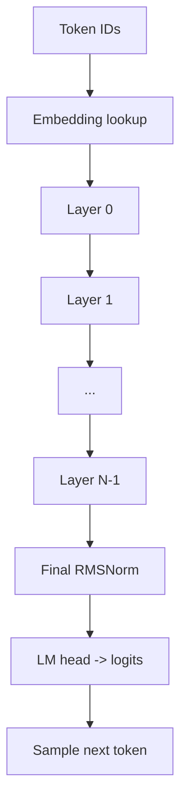
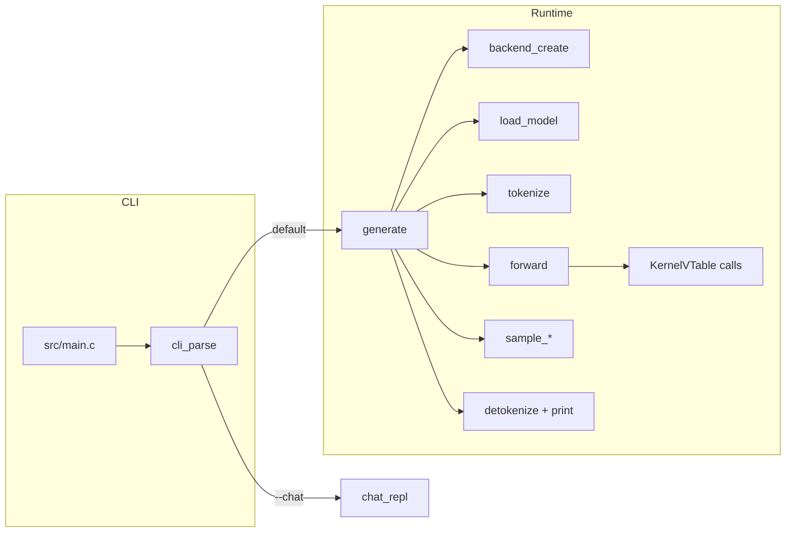

# Guanaco Local LLM Runtime — Detailed Architecture & Usage

This document has two goals:

1. Explain **how a modern decoder-only LLM works** (conceptually, model-agnostic).
2. Explain **how this repository implements an LLM runtime locally** (in C11), including file-by-file pointers, data layouts, and how to build/run/test.

> Scope note: This repo is a **CPU-first** inference runtime with a backend abstraction designed to support CUDA later. CUDA is currently scaffolded/stubbed.

---

## Table of contents

- [Quick start](#quick-start)
- [What an LLM is (high-level)](#what-an-llm-is-high-level)
- [Decoder-only transformer anatomy (the model we implement)](#decoder-only-transformer-anatomy-the-model-we-implement)
  - [Tokens, logits, and sampling](#tokens-logits-and-sampling)
  - [Prefill vs decode](#prefill-vs-decode)
  - [KV cache](#kv-cache)
  - [Attention (scaled dot-product)](#attention-scaled-dot-product)
  - [RoPE (rotary positional embedding)](#rope-rotary-positional-embedding)
  - [RMSNorm](#rmsnorm)
  - [SwiGLU MLP](#swiglu-mlp)
- [Repo architecture (what lives where)](#repo-architecture-what-lives-where)
- [Core runtime data structures](#core-runtime-data-structures)
  - [`Tensor` layout contract](#tensor-layout-contract)
  - [`ModelConfig`, `ModelWeights`, `LayerWeights`](#modelconfig-modelweights-layerweights)
- [Model loading (GGUF)](#model-loading-gguf)
  - [GGUF parsing strategy](#gguf-parsing-strategy)
  - [Tensor shape conventions (critical)](#tensor-shape-conventions-critical)
  - [Supported dtypes and what “supported” means](#supported-dtypes-and-what-supported-means)
- [Memory system](#memory-system)
  - [Arena allocator (session lifetime)](#arena-allocator-session-lifetime)
  - [Scratch allocator (per-forward lifetime)](#scratch-allocator-per-forward-lifetime)
  - [KV cache layout](#kv-cache-layout)
- [Backend abstraction](#backend-abstraction)
  - [Backend selection (`--device`)](#backend-selection---device)
  - [Kernel vtable (`KernelVTable`)](#kernel-vtable-kernelvtable)
- [CPU kernels](#cpu-kernels)
  - [GEMM contracts: `gemm_f32` vs `gemm_f32_nn`](#gemm-contracts-gemm_f32-vs-gemm_f32_nn)
  - [Threading: `--threads` and `USE_PTHREAD`](#threading---threads-and-use_pthread)
- [Forward pass in this repo (step-by-step)](#forward-pass-in-this-repo-step-by-step)
- [Generate loop (single-shot inference)](#generate-loop-single-shot-inference)
- [Chat REPL (context-based chat)](#chat-repl-context-based-chat)
- [Quantization (Phase B direction)](#quantization-phase-b-direction)
- [Testing](#testing)
- [Build & run reference](#build--run-reference)
- [Troubleshooting](#troubleshooting)

---

## Quick start

### Build

```bash
make
```

Binary output: `build/llmrt`

### Run (single prompt)

```bash
./build/llmrt \
  --model /path/to/model.gguf \
  --prompt "Hello from Guanaco" \
  --max-tokens 128 \
  --temperature 0.7 \
  --top-k 40 \
  --top-p 0.9
```

### Run (chat REPL)

```bash
./build/llmrt \
  --model /path/to/model.gguf \
  --chat \
  --max-tokens 256
```

### Run tests

```bash
make test
```

### Enable pthread-based CPU parallelism

Build with pthread support:

```bash
make clean && make USE_PTHREAD=1
```

Run with multiple threads (the backend passes this into the CPU threadpool):

```bash
./build/llmrt --model /path/to/model.gguf --prompt "Hi" --threads 8
```

---

## What an LLM is (high-level)

An LLM (large language model) is a neural network trained to predict the **next token** in a sequence.

- Input: tokens $t_0, t_1, ..., t_{n-1}$
- Output: logits (unnormalized scores) over the vocabulary for the next token $t_n$

At inference time, we:

1. Convert text into tokens (**tokenization**).
2. Run a forward pass to compute logits.
3. Choose the next token via a **sampling strategy** (greedy / temperature / top-k / top-p).
4. Append the new token and repeat.

The model itself is a stack of **transformer layers** that repeatedly mix information across the context (attention) and apply per-token nonlinear transforms (MLP).

---

## Decoder-only transformer anatomy (the model we implement)

This repo implements a **decoder-only** transformer in the LLaMA family style:

- RMSNorm
- RoPE
- (Grouped-query) multi-head self-attention (GQA)
- SwiGLU MLP
- Autoregressive KV caching

### Tokens, logits, and sampling

- The model produces **logits**: one float per vocabulary item.
- Sampling converts logits into a single token id.

Common strategies:

- **Greedy**: pick argmax(logits).
- **Temperature**: sample from softmax(logits / T).
- **Top-k**: restrict to the k highest logits, then sample (usually with temperature).
- **Top-p (nucleus)**: restrict to the smallest set whose cumulative probability ≥ p.

This repo implements all of these in `src/tokenizer/tokenizer.c`.

> Reproducibility note: sampling uses C `rand()`; there is currently no `--seed` flag. Runs are not guaranteed deterministic unless the process seeds `rand()` the same way.

### Prefill vs decode

Inference splits naturally into two regimes:

- **Prefill**: you process an initial prompt with $T > 1$ tokens.
  - This fills the KV cache for the prompt.
  - Compute is heavier (large matrix multiplies) but done once per prompt.

- **Decode**: you generate one token at a time with $T = 1$.
  - Each step reuses cached K/V from previous tokens.
  - Compute becomes dominated by matvec-like operations (M=1 paths).

In this repo:

- Prefill calls `forward(..., token_ids, n_tokens, pos=0, ...)` with `n_tokens = prompt_len`.
- Decode calls `forward(..., &next_token, 1, pos, ...)` repeatedly.

### KV cache

The key optimization for autoregressive decoding:

- For each layer, when you compute K and V for a token at position `pos`, you store them.
- On the next token, you reuse all stored K/V instead of recomputing them.

This turns attention from “recompute everything each step” into “compute Q for the new token and attend over cached K/V”.

### Attention (scaled dot-product)

For each head, attention computes:

1. **Scores** (dot products):

   $$S = Q K^T$$

2. **Scale + causal mask**:

   $$S_{i,j} \leftarrow \frac{S_{i,j}}{\sqrt{d}}$$

   and set future positions to $-\infty$ (causal).

3. **Softmax row-wise**:

   $$P = \text{softmax}(S)$$

4. **Context** (weighted sum of V):

   $$C = P V$$

In this repo, attention is expressed in GEMM form so it can be threaded on CPU and is compatible with future GPU GEMM offload.

### RoPE (rotary positional embedding)

RoPE encodes position by rotating each pair of channels in Q and K:

For each even index $i$ (operating on $(i, i+1)$ pairs):

- $\theta = \text{pos} \cdot 10000^{-i/d}$
- Apply a 2D rotation by $\theta$.

This is implemented in `src/kernels/cpu/kernels_cpu.c` (`rope`).

### RMSNorm

RMSNorm normalizes a vector by its root-mean-square:

- $\text{rms}(x) = \sqrt{\frac{1}{d} \sum x_i^2 + \epsilon}$
- $\text{out}_i = \gamma_i \cdot \frac{x_i}{\text{rms}(x)}$

Implemented in `src/kernels/cpu/kernels_cpu.c` (`rmsnorm`).

### SwiGLU MLP

The LLaMA-family MLP is typically:

- gate = SiLU(x W_gate)
- up   = x W_up
- y    = (gate ⊙ up) W_down

This is implemented in the layer code in `src/engine/engine.c`.

---

## Repo architecture (what lives where)

High level modules:

- **Entry & CLI**
  - `src/main.c` routes either to generation or chat.
  - `src/include/tokenizer.h` defines CLI flags (`--model`, `--prompt`, `--device`, `--threads`, `--chat`, ...).
  - `src/tokenizer/tokenizer.c` implements `cli_parse()`.

- **Backend abstraction**
  - `src/include/backend.h` defines `BackendConfig`, `BackendKind`, and `KernelVTable`.
  - `src/backend/backend.c` implements selection logic (AUTO → try CUDA → CPU).
  - `src/backend/cpu_backend.c` wires the CPU kernel functions into the vtable.
  - `src/backend/cuda_backend.c` is a stub that currently returns NULL (CUDA not implemented yet).

- **Model loading (GGUF)**
  - `src/include/engine.h` declares `load_model()` / `free_model()`.
  - `src/engine/loader.c` mmaps the GGUF file and builds `ModelWeights` + `Tensor` views.

- **Forward pass (transformer)**
  - `src/engine/engine.c` implements:
    - `forward()`
    - `transformer_layer()`

- **Generation orchestration**
  - `src/engine/generate.c` implements `generate()` (prefill + decode + printing + stats).

- **Chat REPL**
  - `src/include/chat.h` declares `chat_repl()`.
  - `src/engine/chat.c` implements an interactive loop with KV reuse.

- **Memory & KV cache**
  - `src/include/memory.h` defines the arena/scratch/KV cache APIs.
  - `src/memory/arena.c` implements an `mmap`-backed arena.
  - `src/memory/scratch.c` implements an `mmap`-backed scratch allocator.
  - `src/memory/kv_cache.c` implements head-major KV storage.

- **CPU kernels**
  - `src/include/kernels.h` is the core kernel API.
  - `src/include/kernels_ext.h` adds `gemm_f32_nn()` without changing the original kernel header.
  - `src/kernels/cpu/kernels_cpu.c` implements GEMM, RMSNorm, softmax, SiLU, RoPE, etc.

- **Quantization matvec**
  - `src/include/quant.h` declares quant matvec entrypoints.
  - `src/kernels/cpu/quant_matvec_q8_0.c` and `src/kernels/cpu/quant_matvec_q4_k.c` implement decode-style matvec for Q8_0 and Q4_K weights.

- **Threadpool**
  - `src/include/threadpool.h` defines a tiny `parallel_for` interface.
  - `src/threadpool/threadpool.c` implements:
    - a pthread-based pool when built with `USE_PTHREAD=1`
    - a serial fallback when built with `USE_PTHREAD=0`

---

## Core runtime data structures

All cross-module shared types live in `src/include/types.h`.

### `Tensor` layout contract

`Tensor` is a small descriptor for an n-dimensional array:

```c
typedef struct {
  void *data;
  int shape[4];
  int stride[4];
  int ndim;
  DataType dtype;
  uint32_t ggml_type;
  size_t byte_size;
} Tensor;
```

Important implementation details:

- **Row-major contiguous is assumed** in most kernels.
  - The `stride[]` fields exist, but kernel implementations largely treat tensors as contiguous for performance.
  - `tensor_is_contiguous_row_major()` is used in debug assertions to catch mis-wired shapes.

- `byte_size` matters for quantized tensors.
  - Quant dtypes are block-based; `dtype_size()` is only approximate.
  - The loader computes and fills `Tensor.byte_size` for each tensor to prevent out-of-bounds reads.

### `ModelConfig`, `ModelWeights`, `LayerWeights`

`ModelConfig` holds the essential hyperparameters and tokenizer metadata:

- hidden size H
- attention head counts (`n_heads`, `n_kv_heads`) and derived `head_dim`
- layer count
- vocab size + vocab strings/scores
- BOS/EOS ids
- feed-forward dimension
- context length (max_seq_len)

`ModelWeights` is the loaded model:

- `embedding`: (vocab_size, H)
- `layers[l]`: per-layer weights (Q/K/V/O, MLP gate/up/down, RMS norms)
- `rms_final`, `lm_head`

The loader populates these fields from GGUF tensor names like:

- `token_embd.weight`
- `blk.<layer>.attn_q.weight`, `blk.<layer>.ffn_gate.weight`, ...

---

## Model loading (GGUF)

Implemented in `src/engine/loader.c`.

### GGUF parsing strategy

The loader:

1. `open()` + `mmap()` the entire GGUF file (read-only).
2. Parses:
   - header (magic/version/counts)
   - metadata KVs (extracts model hyperparameters + tokenizer arrays)
   - tensor table (name → dims/dtype/offset)
3. Computes the aligned start of the tensor data block (`general.alignment`, default 32).
4. Creates a `Tensor` struct for each required tensor that **points directly into the mmap’d tensor data**.

This means:

- Weight tensors are **zero-copy** (no malloc + memcpy of tensor data).
- `free_model()` must `munmap()` and `close()` the file once you’re done.

### Tensor shape conventions (critical)

GGUF/ggml stores dimensions with `dims[0]` as the **fastest changing** dimension.

For 2D weight matrices:

- In GGUF, typical weight dims are:
  - `dims[0] = in_features (K)`
  - `dims[1] = out_features (N)`

In this repo we store weight tensors as row-major:

- `Tensor.shape[0] = rows = out_features (N)`
- `Tensor.shape[1] = cols = in_features (K)`

This matches the kernel contract used for linear layers:

- `gemm_f32(X(T,K), W(N,K)) -> Y(T,N)`

### Supported dtypes and what “supported” means

The loader accepts these dtypes (and will reject others):

- `DTYPE_F32`
- `DTYPE_Q8_0`
- `DTYPE_Q4_K`

Norm weights are required to be `DTYPE_F32`.

“Supported” here means:

- The loader knows the ggml block size and exact `byte_size`.
- The runtime has some compute path for that dtype.

However, performance differs substantially:

- `DTYPE_F32` uses GEMM kernels.
- Quantized weights currently route through per-row matvec decode kernels, which are correct for decode-style shapes but are not optimized for large prefill GEMMs.

---

## Memory system

All memory interfaces are defined in `src/include/memory.h`.

### Arena allocator (session lifetime)

`src/memory/arena.c` implements a bump allocator backed by `mmap()`.

- Allocations are aligned (minimum 64 bytes).
- `arena_alloc()` is O(1) pointer bump.
- `arena_reset()` invalidates all allocations (not used for normal sessions).

In `generate()` and `chat_repl()`, the arena primarily backs:

- the KV cache buffers
- KV cache tensor views

### Scratch allocator (per-forward lifetime)

`src/memory/scratch.c` is another `mmap()` bump allocator with a different lifecycle:

- The engine calls `scratch_reset(scr)` at the start of each `forward()`.
- All temporaries for that forward pass live in scratch.

This keeps allocation overhead low while allowing large intermediate buffers.

### KV cache layout

Implemented in `src/memory/kv_cache.c`.

The KV cache stores **float32** keys and values in a head-major layout:

- K[layer][kv_head][pos][dim]
- V[layer][kv_head][pos][dim]

The underlying buffers are flat `float*` arrays.

Accessors `kv_cache_get_k()` / `kv_cache_get_v()` return a `Tensor` view shaped:

- (n_kv_heads, seq_len, head_dim)

The layer code then slices per head.

---

## Backend abstraction

The backend abstraction is how we keep the engine clean while planning for GPU:

- Engine code never directly calls CPU kernel symbols.
- Engine code calls function pointers in a `KernelVTable`.

### Backend selection (`--device`)

CLI flag:

- `--device auto|cpu|cuda` (default: auto)

Runtime behavior in this branch:

- `auto` → attempts CUDA backend if compiled and available, else CPU.
- `cpu` → CPU backend.
- `cuda` → currently errors during CLI parsing (backend not implemented).

See `src/tokenizer/tokenizer.c` (`cli_parse`) and `src/backend/backend.c`.

### Kernel vtable (`KernelVTable`)

Defined in `src/include/backend.h`.

The vtable includes:

- GEMM variants (`gemm_f32`, `gemm_f32_nn`)
- elementwise ops (RMSNorm, softmax, SiLU, RoPE, residual add, elemwise mul)
- quant matvec hooks (`matvec_q8_0_f32`, `matvec_q4k_f32`)

CPU backend wiring is in `src/backend/cpu_backend.c`.

---

## CPU kernels

Implemented in `src/kernels/cpu/kernels_cpu.c`.

### GEMM contracts: `gemm_f32` vs `gemm_f32_nn`

This repo has **two** GEMM-like kernels because weights are stored in a GGUF-friendly layout.

1) `gemm_f32` (GGUF weight layout):

- Computes: $C(M,N) = A(M,K) \times B(N,K)^T$
- Shapes:
  - A: (M, K)
  - B: (N, K)  (rows are output features)
  - C: (M, N)

This is ideal for linear layers where weights are stored as “one output row per neuron”.

2) `gemm_f32_nn` (standard GEMM):

- Computes: $C(M,N) = A(M,K) \times B(K,N)$
- Used for attention context:
  - ctx(T, head_dim) = scores(T, seq_len) × V(seq_len, head_dim)

Both implementations are AVX2/FMA-based and parallelize across output columns when threading is enabled.

### Threading: `--threads` and `USE_PTHREAD`

- The CPU backend always creates a `ThreadPool` with `BackendConfig.threads`.
- Actual parallel execution depends on build flag:

  - `USE_PTHREAD=0` (default): threadpool is a **serial** implementation.
  - `USE_PTHREAD=1`: threadpool uses pthread worker threads and the caller participates.

Build:

```bash
make clean && make USE_PTHREAD=1
```

Run:

```bash
./build/llmrt --model /path/to/model.gguf --prompt "Hi" --threads 8
```

---

## Forward pass in this repo (step-by-step)

Implemented in `src/engine/engine.c`.

### High-level flow



### Per-layer flow (LLaMA-style)

For a batch of `T` tokens at positions `[pos, pos+T)`:

1. Save residual.
2. Pre-attention RMSNorm.
3. Linear projections to Q, K, V.
4. Apply RoPE to Q and K.
5. Append K and V into the KV cache at positions `pos+t`.
6. Read cached K and V for this layer up to `seq_len = pos + T`.
7. For each attention head:
   - Pack the per-head Q slice into a contiguous matrix.
   - Compute scores = Q × Kᵀ with `gemm_f32`.
   - Scale and apply causal mask.
   - Apply row-wise softmax.
   - Compute ctx = scores × V with `gemm_f32_nn`.
   - Scatter ctx into the output buffer.
8. Output projection.
9. Residual add.
10. Pre-MLP RMSNorm.
11. SwiGLU MLP (gate/up/down).
12. Residual add.

The forward pass ends by computing logits for the **last token only**.

---

## Generate loop (single-shot inference)

Implemented in `src/engine/generate.c`.

Steps:

1. Create backend and acquire `KernelVTable`.
2. Load model via `load_model()`.
3. Allocate:
   - Arena sized primarily for KV cache
   - Scratch sized for per-forward temporaries
4. Create KV cache.
5. Create tokenizer and tokenize prompt (injects BOS).
6. Prefill forward pass on the full prompt.
7. Decode loop:
   - forward pass for one token
   - sample next token
   - stop on EOS
8. Print timing stats (TTFT, tok/s).

---

## Chat REPL (context-based chat)

Implemented in `src/engine/chat.c`.

Key behaviors:

- Keeps a single KV cache and a `current_pos` counter.
- Tokenization policy:
  - Inject BOS exactly once at the beginning of a conversation.
  - Subsequent turns use `tokenize_no_bos()`.
- When the context window is full:
  - `current_pos` resets to 0
  - scratch resets
  - the next user message is re-tokenized with BOS.

Run:

```bash
./build/llmrt --model /path/to/model.gguf --chat
```

Exit: type `exit`.

---

## Quantization (Phase B direction)

Quantization reduces memory bandwidth and model size by storing weights in block-quantized formats.

This repo currently has:

- Loader support for GGML quant types `Q8_0` and `Q4_K`.
- CPU decode-style matvec kernels:
  - `matvec_q8_0_f32`: `src/kernels/cpu/quant_matvec_q8_0.c`
  - `matvec_q4k_f32`:  `src/kernels/cpu/quant_matvec_q4_k.c`

Integration point:

- `src/engine/engine.c` has `linear_dispatch()` which chooses:
  - `gemm_f32` for `DTYPE_F32`
  - per-row matvec for quant dtypes

Performance caveat:

- The Phase B design goal is “quantized **decode** matvec” (M=1).
- Today, quant weights will also route through matvec during prefill (T>1), which is functionally correct but can be extremely slow.

---

## Testing

All tests build and run via the Makefile.

Run everything:

```bash
make test
```

Individual suites:

```bash
make test_kernels
make test_memory
make test_tokenizer
make test_engine
make test_quant
make test_backend
make test_threadpool
```

Debug build (ASAN/UBSAN):

```bash
make debug
```

---

## Build & run reference

### Build flags

- `USE_PTHREAD=1`: enables pthread worker threads in the threadpool.
- `USE_CUDA=1`: currently only scaffolding; CUDA backend is not implemented.

Examples:

```bash
make clean && make USE_PTHREAD=1
make clean && make USE_CUDA=1   # will build, but --device cuda is still unavailable
```

### CLI flags

`--help` prints the authoritative list:

```bash
./build/llmrt --help
```

---

## Troubleshooting

### “Illegal instruction” on startup

The Makefile compiles with `-mavx2 -mfma`. If your CPU lacks AVX2/FMA support, the binary may crash.

Fix options:

- Remove/adjust those flags in `Makefile`.
- Build on a machine with AVX2/FMA.

### “--device cuda requested but CUDA is not enabled/implemented”

CUDA is intentionally stubbed in this branch.

- `--device cuda` currently errors in argument parsing.
- `--device auto` will select CPU.

### Slow performance / high memory usage

- This is a reference-oriented runtime.
- Scratch is currently allocated as 512 MiB in `generate()` and `chat_repl()`; KV cache sizing is based on `max_seq_len`.

---

## Appendix: control flow cheat sheet


