# Team of 4 — Revised Parallel Work Plan (MUST Features)

## Overview

4 people. Each has their **own dedicated component**. **You** (Person D) also own **integration** on top of your component. Nobody waits for anyone — everyone tests independently from Day 1.

| Person | Dedicated Component | Integration? | Effort (days) |
|---|---|---|---|
| **A** | Kernel Engineer — GEMM, softmax, RMSNorm, SiLU, RoPE, residual add | No | 7–12 |
| **B** | Model Loader — GGUF parser, mmap, tensor registry | No | 5–7 |
| **C** | Memory & KV Cache — arena, scratch allocators, KV cache | No | 5–7 |
| **D (You)** | Tokenizer + Sampler + Embedding **+ Integration** — forward pass, CLI, golden data, final wiring | Yes | 5 (own) + 5 (integ) |

### Why this split works

- **A, B, C** have the heaviest standalone tasks — they need full focus
- **Your** dedicated components (tokenizer, sampler, embedding) are the **bookends** of the pipeline — you process input and output, so you naturally understand the full data flow, which is exactly what the integrator needs
- Your dedicated tasks are lighter (~5 days), leaving bandwidth for integration (~5 days)
- All 4 components are independently testable with **zero** cross-dependencies

---

## Day 0 — Everyone Together (4 hours, non-negotiable)

### Step 1: Agree on shared types → `types.h`

```c
// types.h — THE contract. Touch this, everyone recompiles.

typedef enum { F32, F16, Q8_0, Q4_0, Q4_K_M } DataType;

typedef struct {
    void*    data;
    int      shape[4];   // [dim0, dim1, dim2, dim3], unused dims = 1
    int      stride[4];  // in elements, not bytes
    DataType dtype;
    int      ndim;       // 1, 2, 3, or 4
} Tensor;

typedef struct {
    int hidden_dim;      // H (e.g., 2048 for TinyLlama)
    int n_heads;         // number of attention heads
    int n_kv_heads;      // number of KV heads (GQA)
    int head_dim;        // H / n_heads
    int n_layers;        // number of transformer layers
    int vocab_size;      // vocabulary size
    int ff_dim;          // MLP intermediate dim (H_ff)
    int max_seq_len;     // maximum sequence length
} ModelConfig;

typedef struct {
    Tensor* token_embedding;   // (vocab_size × H)
    Tensor* final_norm_weight; // (H,)
    Tensor* output_proj;       // (H × vocab_size) or tied to embedding

    // Per-layer weights [n_layers]:
    Tensor** attn_norm;    // (H,) per layer
    Tensor** wq;           // (H × H) per layer
    Tensor** wk;           // (H × n_kv_heads*head_dim) per layer
    Tensor** wv;           // same as wk
    Tensor** wo;           // (H × H) per layer
    Tensor** mlp_norm;     // (H,) per layer
    Tensor** w_gate;       // (H × H_ff) per layer
    Tensor** w_up;         // (H × H_ff) per layer
    Tensor** w_down;       // (H_ff × H) per layer
} ModelWeights;

// Opaque handles — implementation hidden from other modules
typedef struct Arena Arena;
typedef struct Scratch Scratch;
typedef struct KVCache KVCache;
typedef struct Tokenizer Tokenizer;
```

### Step 2: Agree on function signatures → one header per person

**`kernels.h`** (Person A):
```c
// Core compute primitives. Stateless. Never allocate.
void gemm_f32(const float* A, const float* B, float* C, int M, int N, int K);
void rmsnorm(float* out, const float* x, const float* weight, int dim, float eps);
void softmax(float* x, int size);
void silu_inplace(float* x, int size);
void residual_add(float* out, const float* a, const float* b, int size);
void rope(float* q, float* k, int head_dim, int pos, int n_heads, int n_kv_heads);
void matmul(float* out, const float* x, const float* w, int n, int d);
// matmul = specialized M=1 GEMM (matvec) for decode hot path
```

**`loader.h`** (Person B):
```c
// Model I/O. Reads disk, returns populated structs.
ModelConfig*  load_config(const char* model_path);
ModelWeights* load_weights(const char* model_path, ModelConfig* cfg, Arena* arena);
void          free_weights(ModelWeights* w); // if not arena-managed
```

**`memory.h`** (Person C):
```c
// Memory management + KV cache
Arena*   arena_create(size_t capacity_bytes);
void*    arena_alloc(Arena* a, size_t size, size_t alignment);
void     arena_reset(Arena* a);
void     arena_destroy(Arena* a);

Scratch* scratch_create(size_t capacity_bytes);
void*    scratch_alloc(Scratch* s, size_t size);
void     scratch_reset(Scratch* s);
void     scratch_destroy(Scratch* s);

KVCache* kv_create(ModelConfig* cfg, int max_seq, Arena* arena);
void     kv_append(KVCache* kv, int layer, const float* k_vec, const float* v_vec, int pos);
float*   kv_key_layer(KVCache* kv, int layer, int head);   // contiguous (seq × head_dim)
float*   kv_val_layer(KVCache* kv, int layer, int head);   // contiguous (seq × head_dim)
int      kv_seq_len(KVCache* kv);
```

**`engine.h`** (You — Person D):
```c
// Tokenizer
Tokenizer* tokenizer_load(const char* model_path);
int*       tokenizer_encode(Tokenizer* t, const char* text, int* out_len);
char*      tokenizer_decode(Tokenizer* t, int token_id);
void       tokenizer_free(Tokenizer* t);

// Sampler
int        sample_argmax(const float* logits, int vocab_size);
int        sample_temperature(const float* logits, int vocab_size, float temp);

// Embedding
void       embed_token(float* out, const ModelWeights* w, int token_id, int dim);

// Forward pass & generation
void       forward(ModelConfig* cfg, ModelWeights* w, KVCache* kv,
                    float* logits, int token, int pos, Scratch* scr);
void       generate(const char* model_path, const char* prompt,
                     int max_tokens, float temperature);
```

### Step 3: Write stubs, commit, push

Everyone writes a trivial `.c` for their header that compiles but returns zeros/no-ops. Commit to `main`. Now everyone branches and works independently.

---

## Person A — Kernel Engineer (FULL DETAIL)

### Scope

All mathematical compute primitives. These are the CPU's inner loops — where 90%+ of execution time is spent.

### Files owned

```
src/kernels.c       ← all kernel implementations
tests/test_kernels.c ← standalone test suite
```

### Task breakdown

#### Task A1: Naive GEMM (Day 1–2)

**What:** `C[M×N] = A[M×K] × B[K×N]`, triple-nested loop.

**Implementation strategy:**
1. Start with the textbook `for i, for j, for k` loop
2. Accumulate in `float` (FP32) — never FP16 intermediate
3. Handle all shapes including M=1 (matvec), K=1, non-powers-of-2

**How to test (zero dependencies):**
```
Generate random A (M×K) and B (K×N) with srand(42)
Compute C_ref with a known-correct naive loop
Call your gemm_f32(A, B, C_test, M, N, K)
Assert max |C_ref[i] - C_test[i]| < 1e-5
```

**Test shapes (12 configs):**

| Shape (M×N×K) | Why this shape |
|---|---|
| 1 × 2048 × 2048 | Decode hot path — matvec for projection |
| 1 × 5504 × 2048 | Decode MLP up-projection |
| 1 × 2048 × 5504 | Decode MLP down-projection |
| 64 × 2048 × 2048 | Prefill small prompt |
| 512 × 2048 × 2048 | Prefill medium prompt |
| 512 × 5504 × 2048 | Prefill MLP up |
| 1 × 1 × 1 | Edge case: single element |
| 3 × 7 × 5 | Edge case: non-power-of-2 |
| 1 × 128 × 128 | Attention: Q × Kᵀ (per-head, decode) |
| 512 × 512 × 128 | Attention: Q × Kᵀ (per-head, prefill) |
| 512 × 128 × 512 | Attention: attn × V (prefill) |
| 1 × 128 × 1024 | Attention: Q × Kᵀ at seq=1024 (decode) |

**Pass criteria:** All 12 pass with max error < 1e-5.

---

#### Task A2: Tiled GEMM with SIMD (Day 3–6)

**What:** Rewrite GEMM with L1/L2 cache tiling and AVX2 intrinsics.

**Tiling strategy (from Phase 3):**
- **L1 tile:** 48×48 or 64×64 (fits in 32 KiB L1d with A-tile + B-tile + C-tile)
- **L2 tile:** 128×256 or 256×128 (fits in 512 KiB L2)
- Inner kernel: 8×8 or 6×16 micro-kernel using `_mm256_fmadd_ps`

**Key implementation details:**
- Iterate: L2 blocks → L1 blocks → AVX2 micro-kernel
- Pack A and B into contiguous tile buffers before computing (improves cache behavior)
- Handle edge tiles (non-divisible dimensions) with scalar fallback
- Accumulate in FP32 always

**How to test:**
- Same 12-shape test suite as A1 — output must match naive within 1e-5
- **Performance test:** Time both naive and tiled for (512×2048×2048). Tiled should be ≥ 3× faster. Record GFLOPS.

**Pass criteria:**
- Correctness unchanged (max error < 1e-5)
- Performance: ≥ 3× naive for M≥64 shapes
- Performance: ≥ 50% of OpenBLAS `cblas_sgemm` for M≥64 (optional stretch goal)

---

#### Task A3: matmul — Specialized M=1 path (Day 3, parallel with A2)

**What:** `out[N] = x[K] · W[K×N]` — the decode hot path.

**Why separate from GEMM:** M=1 is always memory-bandwidth-bound (arithmetic intensity ~1 FLOP/byte). The tiled GEMM optimizes for compute — wrong strategy. Matvec should optimize for streaming reads.

**Implementation strategy:**
- Sequentially read W row-by-row (or column-by-column depending on layout)
- Use AVX2 `_mm256_fmadd_ps` to accumulate 8 products at once
- Horizontal sum at the end with `_mm256_hadd_ps`
- Prefetch next row with `_mm_prefetch`

**How to test:**
- Same correctness as GEMM with M=1 shapes
- **Bandwidth test:** Measure bytes/sec = (K × N × 4) / time. Compare to STREAM benchmark baseline. Should achieve ≥ 60% of memory bandwidth.

---

#### Task A4: Softmax (Day 5)

**What:** Numerically stable softmax: `softmax(x)_i = exp(x_i - max(x)) / Σ exp(x_j - max(x))`

**Implementation (3 passes):**
1. Pass 1: Find `m = max(x[0..n-1])`
2. Pass 2: Compute `s = Σ exp(x[i] - m)` and write `x[i] = exp(x[i] - m)` in-place
3. Pass 3: Divide `x[i] /= s`

**Test cases (7):**

| Input | Expected output | Tests what |
|---|---|---|
| `[1.0, 2.0, 3.0]` | `[0.0900, 0.2447, 0.6652]` | Normal case |
| `[0.0, 0.0, 0.0]` | `[0.333, 0.333, 0.333]` | Uniform |
| `[1000.0, 1000.0, 1000.0]` | `[0.333, 0.333, 0.333]` | Large values (overflow without max-subtract) |
| `[-1000.0, -999.0, -998.0]` | `[0.0900, 0.2447, 0.6652]` | Negative large values |
| `[-∞, -∞, 1.0]` | `[0.0, 0.0, 1.0]` | Masked (causal attention) |
| `[-∞, -∞, -∞]` | `[0.333, 0.333, 0.333]` or `[0,0,0]` | All masked — clamp denom to eps |
| `[5.0]` (size=1) | `[1.0]` | Single element |

**Pass criteria:** All 7 pass. Each row sums to 1.0 ± 1e-6.

---

#### Task A5: RMSNorm + SiLU + RoPE + Residual Add (Day 5–6)

**RMSNorm:**
```
rms = sqrt(mean(x²) + eps)
out[i] = (x[i] / rms) * weight[i]
```
- Test: random x of dim 2048, verify output has RMS ≈ 1.0 after norm (before weight multiply)
- Test: x = all zeros → out = all zeros (eps prevents division by zero)
- Test: x = all same value (e.g., 3.0) → all outputs equal

**SiLU:**
```
silu(x) = x * sigmoid(x) = x / (1 + exp(-x))
```
- Test: compare against naive `x / (1 + exp(-x))` loop, max error < 1e-6
- Test: x = 0 → out = 0. x = large positive → out ≈ x. x = large negative → out ≈ 0.

**RoPE:**
```
For each pair (x[2i], x[2i+1]) at position pos:
  θ = pos / 10000^(2i/dim)
  x[2i]'   = x[2i] * cos(θ) - x[2i+1] * sin(θ)  
  x[2i+1]' = x[2i] * sin(θ) + x[2i+1] * cos(θ)
```
- Test: pos=0 → cos=1, sin=0 → output equals input
- Test: pos=1, dim=4 → compute expected rotation by hand, verify
- Test: verify Q and K get the same rotation at the same position

**Residual Add:**
```
out[i] = a[i] + b[i]
```
- Trivially testable. Include for completeness. AVX2 version with `_mm256_add_ps`.

---

#### Person A Deliverables Summary

| Deliverable | Pass criteria | Day |
|---|---|---|
| Naive GEMM, all 12 shapes | max error < 1e-5 | 2 |
| Tiled GEMM ≥ 3× naive | Correctness + perf | 6 |
| matmul (M=1) | ≥ 60% mem BW | 3 |
| Softmax, 7 test cases | Rows sum to 1.0 | 5 |
| RMSNorm, 3 test cases | RMS ≈ 1.0 | 6 |
| SiLU, RoPE, residual | max error < 1e-6 | 6 |
| Full test suite under ASAN | 0 errors | 7 |

---

## Person B — Model Loader Engineer (FULL DETAIL)

### Scope

Read a GGUF model file from disk and make all weight tensors available in memory. This person turns a file on disk into a `ModelWeights*` that the engine can use.

### Files owned

```
src/loader.c         ← GGUF parser + weight loading
tests/test_loader.c  ← standalone loader tests
tools/dump_gguf.c    ← CLI tool to print GGUF file contents (debugging aid)
```

### Background: GGUF format

GGUF is a binary file format used by llama.cpp:
```
[Magic: "GGUF" 4 bytes]
[Version: uint32]
[Tensor count: uint64]
[Metadata KV count: uint64]
[Metadata key-value pairs...]  ← model config, tokenizer vocab, etc.
[Tensor info array...]         ← name, shape, dtype, offset for each tensor
[Padding to alignment]
[Tensor data blob...]          ← raw weight bytes, contiguous
```

### Task breakdown

#### Task B1: GGUF Header Parser (Day 1–2)

**What:** Read and parse the GGUF header to extract:
- Model config (hidden_dim, n_heads, n_layers, etc.) from metadata KV pairs
- Tensor info array (name → shape, dtype, offset)

**Test model:** Download TinyLlama-1.1B-Chat-v1.0 GGUF (Q4_0, ~670 MB):
```
https://huggingface.co/TheBloke/TinyLlama-1.1B-Chat-v1.0-GGUF
```

**Key metadata keys to extract:**

| Key string in GGUF | Maps to ModelConfig field |
|---|---|
| `llama.embedding_length` | `hidden_dim` |
| `llama.attention.head_count` | `n_heads` |
| `llama.attention.head_count_kv` | `n_kv_heads` |
| `llama.block_count` | `n_layers` |
| `llama.feed_forward_length` | `ff_dim` |
| `llama.context_length` | `max_seq_len` |
| `tokenizer.ggml.tokens` | vocab tokens array |
| `tokenizer.ggml.scores` | vocab scores array |

**How to test (zero dependencies):**
```
1. Run your parser on TinyLlama GGUF
2. Print all metadata KV pairs
3. Compare against: python3 -c "from gguf import GGUFReader; r=GGUFReader('model.gguf'); ..."
   Or use llama.cpp's gguf-dump tool
4. Verify: hidden_dim=2048, n_heads=32, n_kv_heads=4, n_layers=22, ff_dim=5632
```

**Pass criteria:**
- All config values match reference exactly
- All tensor names (200+) and shapes printed, match reference
- No crashes, no memory leaks (ASAN clean)

---

#### Task B2: Weight Tensor Loading (Day 3–4)

**What:** Given parsed tensor info, make weight data accessible via `ModelWeights*`.

**Two loading strategies to implement:**

| Strategy | How | When to use |
|---|---|---|
| **mmap** | `mmap(fd, offset, size, PROT_READ, MAP_PRIVATE)` per tensor | Default: fast startup, lazy paging |
| **eager read** | `malloc` + `pread` the tensor data | Fallback: when mmap isn't available or for small models |

**Implementation details:**
- For mmap: return pointers directly into the mmap'd region (read-only, zero-copy)
- For eager: allocate using Person C's `Arena*` — but for now, use `aligned_alloc(64, size)` as temporary shim
- Build a `ModelWeights*` struct by matching tensor names to struct fields:
  - `"blk.{i}.attn_norm.weight"` → `weights->attn_norm[i]`
  - `"blk.{i}.attn_q.weight"` → `weights->wq[i]`
  - `"blk.{i}.attn_k.weight"` → `weights->wk[i]`
  - `"blk.{i}.attn_v.weight"` → `weights->wv[i]`
  - `"blk.{i}.attn_output.weight"` → `weights->wo[i]`
  - `"blk.{i}.ffn_gate.weight"` → `weights->w_gate[i]`
  - `"blk.{i}.ffn_up.weight"` → `weights->w_up[i]`
  - `"blk.{i}.ffn_down.weight"` → `weights->w_down[i]`
  - `"blk.{i}.ffn_norm.weight"` → `weights->mlp_norm[i]`
  - `"token_embd.weight"` → `weights->token_embedding`
  - `"output_norm.weight"` → `weights->final_norm_weight`
  - `"output.weight"` → `weights->output_proj`

**How to test:**
```
1. Load TinyLlama GGUF
2. For each weight tensor, print:
   - Name, shape, dtype, data pointer, first 5 float values
3. Cross-validate first 5 values against:
   python3: model = torch.load(...); print(model['blk.0.attn_q.weight'][:5])
4. Verify all 22 layers × 9 tensors + 3 global tensors = 201 tensors loaded
5. Verify no tensor pointer is NULL
```

**Pass criteria:**
- 201/201 tensors loaded, no NULLs
- First 5 values of 10 random tensors match PyTorch reference (within FP precision)
- Mmap mode: RSS < 100 MiB (pages not touched yet)
- Eager mode: RSS ≈ file size

---

#### Task B3: Tokenizer Vocabulary Extraction (Day 4–5)

**What:** Extract the tokenizer vocabulary and scores from the GGUF metadata so Person D can build the tokenizer.

**Output format:** Write a simple struct/file that Person D can consume:
```c
typedef struct {
    char** tokens;       // array of token strings
    float* scores;       // BPE merge scores
    int    vocab_size;
    int    bos_id;       // beginning-of-sequence token ID
    int    eos_id;       // end-of-sequence token ID
} VocabData;

VocabData* load_vocab(const char* model_path);
```

**How to test:**
```
1. Load vocab from TinyLlama GGUF
2. Print vocab_size — should be 32000
3. Print token[0], token[1], ..., token[10] — verify against Python tokenizer
4. Print bos_id (should be 1), eos_id (should be 2)
5. Verify token strings are valid UTF-8
```

---

#### Task B4: Debugging Tool — `dump_gguf` (Day 2, quick)

**What:** A standalone CLI that prints everything in a GGUF file. Useful for everyone.

```
$ ./dump_gguf model.gguf
Magic: GGUF v3
Tensors: 201
Metadata: 24 key-value pairs

Config:
  hidden_dim = 2048
  n_heads = 32
  n_kv_heads = 4
  n_layers = 22
  ...

Tensors:
  [000] token_embd.weight     (32000, 2048) F16   offset=0x00001000
  [001] blk.0.attn_norm.weight (2048,)      F32   offset=0x08001000
  ...
```

---

#### Person B Deliverables Summary

| Deliverable | Pass criteria | Day |
|---|---|---|
| Header parser, all metadata extracted | Config matches reference exactly | 2 |
| `dump_gguf` tool | Prints all 201 tensors + metadata | 2 |
| Weight loading (mmap + eager) | All tensors non-NULL, values match PyTorch ref | 4 |
| Vocab extraction | vocab_size=32000, bos=1, eos=2, valid UTF-8 | 5 |
| ASAN clean | 0 errors on all tests | 5 |

---

## Person C — Memory & KV Cache Engineer (FULL DETAIL)

### Scope

All memory management (arena, scratch allocators) and the KV cache data structure. This person ensures no `malloc`/`free` ever happens on the hot path.

### Files owned

```
src/arena.c          ← arena (bump) allocator
src/scratch.c        ← per-forward scratch allocator
src/kv_cache.c       ← KV cache (head-major layout)
tests/test_memory.c  ← allocator tests
tests/test_kv.c      ← KV cache tests
```

### Task breakdown

#### Task C1: Arena Allocator (Day 1–2)

**What:** A bump allocator backed by a single large `mmap` region. Allocations increment a pointer. Never frees individual allocations. `arena_reset` rewinds the pointer to the start.

**Internal structure:**
```c
struct Arena {
    uint8_t* base;       // start of mmap'd region
    size_t   offset;     // current allocation offset
    size_t   capacity;   // total size
};
```

**Key requirements:**
- All returned pointers 64-byte aligned (AVX-512 requirement)
- `arena_alloc(a, 13, 64)` → rounds up to 64, returns aligned pointer
- `arena_reset` sets offset = 0 (does NOT munmap — reuse the region)
- `arena_destroy` does `munmap`
- Overflow: if `offset + aligned_size > capacity`, return NULL (caller checks)

**How to test (zero dependencies):**
```c
// test_memory.c
void test_arena_alignment() {
    Arena* a = arena_create(1024 * 1024); // 1 MiB
    for (int i = 0; i < 10000; i++) {
        size_t random_size = (rand() % 1000) + 1; // 1–1000 bytes
        void* ptr = arena_alloc(a, random_size, 64);
        assert(ptr != NULL);
        assert(((uintptr_t)ptr % 64) == 0); // alignment check
    }
    arena_reset(a);
    // After reset, should be able to allocate again from the start
    void* ptr2 = arena_alloc(a, 100, 64);
    assert(ptr2 == a->base); // first allocation starts at base
    arena_destroy(a);
}

void test_arena_overflow() {
    Arena* a = arena_create(256); // tiny
    void* p1 = arena_alloc(a, 200, 64); // OK (rounds to 256 → fills it)
    void* p2 = arena_alloc(a, 1, 64);   // should return NULL
    assert(p1 != NULL);
    assert(p2 == NULL);
    arena_destroy(a);
}
```

**Pass criteria:**
- 10,000 allocations: 0 alignment violations
- No overlap between adjacent allocations (check pointer arithmetic)
- `arena_reset` enables full reuse
- Overflow returns NULL, no crash
- Valgrind: 0 leaks, 0 errors

---

#### Task C2: Scratch Allocator (Day 2–3)

**What:** Identical to arena in implementation, but semantically different — reset is called after every forward pass.

**The caller contract:**
```
scratch_reset(scr);          // start of forward pass
float* q = scratch_alloc(scr, 2048 * sizeof(float)); // used within this pass
float* scores = scratch_alloc(scr, 32 * seq_len * sizeof(float));
// ... forward pass uses q, scores ...
scratch_reset(scr);          // all allocations invalidated
```

**Implementation:** Can literally be the same code as arena with a different type name. The semantic difference matters for documentation and debugging:
- Arena: lives for session lifetime (KV cache, token buffer)
- Scratch: lives for one forward pass (activations, intermediates)

**How to test:**
```c
void test_scratch_reuse() {
    Scratch* s = scratch_create(1024 * 1024);
    
    // Simulate 100 forward passes
    for (int pass = 0; pass < 100; pass++) {
        scratch_reset(s);
        float* buf1 = scratch_alloc(s, 8192);
        float* buf2 = scratch_alloc(s, 22016);
        assert(buf1 != NULL && buf2 != NULL);
        // Write to buffers (detect stale-data bugs)
        memset(buf1, pass & 0xFF, 8192);
        memset(buf2, pass & 0xFF, 22016);
    }
    scratch_destroy(s);
}
```

---

#### Task C3: KV Cache — Head-Major Layout (Day 3–6)

**What:** Per-layer K and V storage. Layout B from Phase 2 (head-major):
```
K[layer][head][token_pos][dim_within_head]  — contiguous per head
V[layer][head][token_pos][dim_within_head]  — same layout
```

**Internal structure:**
```c
struct KVCache {
    float*  key_cache;    // contiguous block: n_layers * n_kv_heads * max_seq * head_dim
    float*  val_cache;    // same size
    int     seq_len;      // current number of tokens stored
    int     max_seq;
    int     n_layers;
    int     n_kv_heads;
    int     head_dim;
};
```

**Memory layout (contiguous):**
```
key_cache = [
  layer 0, head 0: [tok0_d0..d127, tok1_d0..d127, ..., tok_maxseq_d0..d127]
  layer 0, head 1: [tok0_d0..d127, ...]
  ...
  layer 0, head h: [...]
  layer 1, head 0: [...]
  ...
]
```

**Offset formula:**
```
key_offset(layer, head, pos, dim) = 
    ((layer * n_kv_heads + head) * max_seq + pos) * head_dim + dim
```

**Functions:**

`kv_append(kv, layer, k_vec, v_vec, pos)`:
- For each head h in 0..n_kv_heads-1:
  - Copy k_vec[h*head_dim .. (h+1)*head_dim-1] into key_cache at offset(layer, h, pos, 0)
  - Same for v_vec

`kv_key_layer(kv, layer, head)`:
- Return pointer to `key_cache + (layer * n_kv_heads + head) * max_seq * head_dim`
- This is a contiguous `(max_seq × head_dim)` block — exactly what attention needs

**How to test (zero dependencies):**
```c
void test_kv_write_read() {
    ModelConfig cfg = {.n_layers=2, .n_kv_heads=4, .head_dim=64, .max_seq_len=128, ...};
    Arena* a = arena_create(64 * 1024 * 1024);
    KVCache* kv = kv_create(&cfg, 128, a);
    
    // Write a known pattern at pos 0
    float k_vec[4 * 64]; // n_kv_heads * head_dim
    for (int i = 0; i < 256; i++) k_vec[i] = (float)i;
    kv_append(kv, /*layer=*/0, k_vec, k_vec, /*pos=*/0);
    
    // Read back head 0, layer 0
    float* k0 = kv_key_layer(kv, 0, 0);
    for (int d = 0; d < 64; d++) {
        assert(k0[0 * 64 + d] == (float)d);  // pos=0, head=0, dim=d
    }
    
    // Read back head 1, layer 0
    float* k1 = kv_key_layer(kv, 0, 1);
    for (int d = 0; d < 64; d++) {
        assert(k1[0 * 64 + d] == (float)(64 + d));  // pos=0, head=1, dim=d
    }
}

void test_kv_contiguity() {
    // Verify that kv_key_layer returns memory where tokens are contiguous
    // Write 50 tokens, then verify k_ptr[pos * head_dim + d] == expected for all pos, d
}

void test_kv_multi_layer() {
    // Write different data to layer 0 and layer 1
    // Verify layer isolation (writing to layer 1 doesn't corrupt layer 0)
}

void test_kv_max_capacity() {
    // Fill to max_seq_len
    // Verify pos == max_seq_len - 1 succeeds
    // Verify pos == max_seq_len fails gracefully
}
```

**Memory sizing formula (for reference):**
```
KV total bytes = 2 × n_layers × n_kv_heads × max_seq × head_dim × sizeof(float)

TinyLlama: 2 × 22 × 4 × 2048 × 64 × 4 = 92,274,688 bytes (~88 MiB)
```

---

#### Person C Deliverables Summary

| Deliverable | Pass criteria | Day |
|---|---|---|
| Arena allocator | 10,000 allocs, 0 alignment errors, overflow handled | 2 |
| Scratch allocator | 100 reset cycles, reuse works | 3 |
| KV cache write + read | All layers/heads/positions match written data | 5 |
| KV contiguity proof | `kv_key_layer` returns sequential token data | 5 |
| Capacity + isolation tests | Max-fill works, cross-layer isolation verified | 6 |
| Valgrind + ASAN clean | 0 leaks, 0 errors | 6 |

---

## Person D (YOU) — Tokenizer + Sampler + Embedding + Integration (FULL DETAIL)

### Scope

**Your component:** Tokenizer, sampler, embedding lookup (the "bookends" of the pipeline)
**Integration:** Forward pass orchestration, CLI, golden data generation, final wiring

### Files owned

```
src/tokenizer.c      ← BPE tokenizer
src/sampler.c         ← sampling strategies
src/engine.c          ← forward pass orchestration (transformer_layer + forward)
src/cli.c             ← main() + argument parsing
tests/test_tokenizer.c
tests/test_sampler.c
tests/test_engine.c   ← orchestration tests with stubs
scripts/gen_golden.py ← PyTorch golden data generation
```

### PART 1: Your Dedicated Components

#### Task D1: BPE Tokenizer (Day 1–3)

**What:** Encode text → token IDs. Decode token IDs → text.

**Implementation approach — BPE merge-based (from GGUF vocab):**

1. Person B gives you `VocabData*` with `tokens[]` and `scores[]`
2. Encoding algorithm:
   ```
   Split input text into individual UTF-8 bytes (byte-level BPE)
   Loop:
     Find the pair of adjacent tokens with the highest merge score
     If no valid merges remain, stop
     Merge that pair into a single token
   Return token IDs
   ```
3. Decoding: direct lookup `tokens[id]` → string. Handle byte-fallback tokens.

**How to test (Person B not needed yet):**

Until Person B's loader is ready, hardcode a tiny vocab for testing:
```c
// test_tokenizer.c
// Tiny test vocab (10 tokens):
char* test_vocab[] = {"h", "e", "l", "o", " ", "he", "ll", "lo", "hel", "hello"};
float test_scores[] = {0, 0, 0, 0, 0, 1.0, 1.5, 1.2, 2.0, 3.0};
// Encoding "hello" should merge: h+e→he, l+l→ll, he+ll→hell... etc
```

**After Person B delivers vocab:** re-test with real TinyLlama vocab:
```
Encode "Hello, world!" → verify against Python:
  from transformers import AutoTokenizer
  t = AutoTokenizer.from_pretrained("TinyLlama/TinyLlama-1.1B-Chat-v1.0")
  print(t.encode("Hello, world!"))  # reference IDs
```

**Test cases (8):**

| Input | What it tests |
|---|---|
| `"Hello"` | Basic encoding |
| `"Hello, world!"` | Punctuation + space |
| `""` | Empty string → empty array |
| `"a"` | Single character |
| `"The quick brown fox jumps over the lazy dog"` | Long sentence |
| `"🎉"` | Unicode emoji (byte-fallback) |
| `"   "` | Whitespace only |
| Roundtrip: encode then decode | All above inputs → decode back → exact match |

---

#### Task D2: Sampler (Day 3–4)

**What:** Convert a logit vector (float[vocab_size]) → a single token ID.

**Two strategies for MUST:**

**Greedy (argmax):**
```c
int sample_argmax(const float* logits, int n) {
    int best = 0;
    for (int i = 1; i < n; i++)
        if (logits[i] > logits[best]) best = i;
    return best;
}
```

**Temperature sampling:**
```c
int sample_temperature(const float* logits, int n, float temp) {
    // 1. Divide logits by temperature
    // 2. Apply softmax (reuse Person A's softmax or write inline)
    // 3. Sample from the probability distribution (cumulative sum + random)
    float* probs = ...; // scratch or stack
    for (int i = 0; i < n; i++) probs[i] = logits[i] / temp;
    softmax(probs, n);
    float r = (float)rand() / RAND_MAX;
    float cumsum = 0;
    for (int i = 0; i < n; i++) {
        cumsum += probs[i];
        if (cumsum >= r) return i;
    }
    return n - 1; // fallback
}
```

**How to test (zero dependencies):**
```c
void test_sampler() {
    float logits[5] = {1.0, 5.0, 2.0, 0.5, 3.0};
    
    // Greedy: must pick index 1 (value 5.0)
    assert(sample_argmax(logits, 5) == 1);
    
    // Temperature = very low (0.01): effectively greedy
    srand(42);
    int counts[5] = {0};
    for (int i = 0; i < 1000; i++)
        counts[sample_temperature(logits, 5, 0.01f)]++;
    assert(counts[1] > 990); // almost always picks index 1
    
    // Temperature = very high (100.0): near-uniform
    memset(counts, 0, sizeof(counts));
    for (int i = 0; i < 10000; i++)
        counts[sample_temperature(logits, 5, 100.0f)]++;
    // Each bucket should be ~2000 ± 500
    for (int i = 0; i < 5; i++)
        assert(counts[i] > 1000 && counts[i] < 3500);
    
    // Edge: all logits equal → uniform regardless of temperature
    float equal[3] = {1.0, 1.0, 1.0};
    memset(counts, 0, sizeof(counts));
    for (int i = 0; i < 9000; i++)
        counts[sample_temperature(equal, 3, 1.0f)]++;
    for (int i = 0; i < 3; i++)
        assert(counts[i] > 2000 && counts[i] < 4000);
}
```

---

#### Task D3: Embedding Lookup (Day 4, quick)

**What:** Token ID → dense vector. Simple table lookup.

```c
void embed_token(float* out, const ModelWeights* w, int token_id, int dim) {
    // token_embedding is (vocab_size × dim), row-major
    // Copy row `token_id` into `out`
    const float* row = (float*)w->token_embedding->data + token_id * dim;
    memcpy(out, row, dim * sizeof(float));
}
```

**How to test:**
- Create a fake embedding matrix (10 × 4), fill with known values
- `embed_token(out, w, 3, 4)` → verify out == row 3 of the matrix
- Edge: token_id = 0 → first row. token_id = vocab_size-1 → last row.
- Edge: token_id out of range → assert / bounds check

---

### PART 2: Integration (Your Second Hat)

#### Task D4: Forward Pass Orchestration — With Stubs (Day 1–5, parallel with D1-D3)

**What:** Wire the entire transformer forward pass. You call functions from A/B/C's headers, but link against **stubs** until their real code is ready.

**The forward pass, step by step:**

```c
void forward(ModelConfig* cfg, ModelWeights* w, KVCache* kv,
             float* logits, int token, int pos, Scratch* scr) {
    int dim = cfg->hidden_dim;
    int n_layers = cfg->n_layers;
    
    // 1. Embed the token
    float* x = scratch_alloc(scr, dim * sizeof(float));
    embed_token(x, w, token, dim);
    
    // 2. For each transformer layer:
    for (int l = 0; l < n_layers; l++) {
        float* residual = x; // save for skip connection
        
        // 2a. RMSNorm (pre-attention)
        float* xnorm = scratch_alloc(scr, dim * sizeof(float));
        rmsnorm(xnorm, x, w->attn_norm[l]->data, dim, 1e-6f);
        
        // 2b. QKV projections (3 matvecs for decode)
        float* q = scratch_alloc(scr, dim * sizeof(float));
        float* k = scratch_alloc(scr, cfg->n_kv_heads * cfg->head_dim * sizeof(float));
        float* v = scratch_alloc(scr, cfg->n_kv_heads * cfg->head_dim * sizeof(float));
        matmul(q, xnorm, w->wq[l]->data, dim, dim);
        matmul(k, xnorm, w->wk[l]->data, cfg->n_kv_heads * cfg->head_dim, dim);
        matmul(v, xnorm, w->wv[l]->data, cfg->n_kv_heads * cfg->head_dim, dim);
        
        // 2c. RoPE on Q and K
        rope(q, k, cfg->head_dim, pos, cfg->n_heads, cfg->n_kv_heads);
        
        // 2d. Append K, V to cache
        kv_append(kv, l, k, v, pos);
        
        // 2e. Multi-head attention (per head)
        float* attn_out = scratch_alloc(scr, dim * sizeof(float));
        for (int h = 0; h < cfg->n_heads; h++) {
            int kv_head = h / (cfg->n_heads / cfg->n_kv_heads); // GQA mapping
            float* key = kv_key_layer(kv, l, kv_head);
            float* val = kv_val_layer(kv, l, kv_head);
            int seq = kv_seq_len(kv);
            
            // Q[h] dot K[all positions] → scores
            float* scores = scratch_alloc(scr, seq * sizeof(float));
            float* q_head = q + h * cfg->head_dim;
            for (int t = 0; t < seq; t++) {
                float score = 0;
                for (int d = 0; d < cfg->head_dim; d++)
                    score += q_head[d] * key[t * cfg->head_dim + d];
                scores[t] = score / sqrtf(cfg->head_dim);
            }
            
            // Softmax
            softmax(scores, seq);
            
            // Weighted sum of V
            float* head_out = attn_out + h * cfg->head_dim;
            memset(head_out, 0, cfg->head_dim * sizeof(float));
            for (int t = 0; t < seq; t++)
                for (int d = 0; d < cfg->head_dim; d++)
                    head_out[d] += scores[t] * val[t * cfg->head_dim + d];
        }
        
        // 2f. Output projection + residual
        float* proj = scratch_alloc(scr, dim * sizeof(float));
        matmul(proj, attn_out, w->wo[l]->data, dim, dim);
        residual_add(x, residual, proj, dim);
        
        // 2g. RMSNorm (pre-MLP)
        rmsnorm(xnorm, x, w->mlp_norm[l]->data, dim, 1e-6f);
        
        // 2h. MLP (SwiGLU)
        residual = x;
        float* gate = scratch_alloc(scr, cfg->ff_dim * sizeof(float));
        float* up   = scratch_alloc(scr, cfg->ff_dim * sizeof(float));
        matmul(gate, xnorm, w->w_gate[l]->data, cfg->ff_dim, dim);
        matmul(up,   xnorm, w->w_up[l]->data,   cfg->ff_dim, dim);
        silu_inplace(gate, cfg->ff_dim);
        for (int i = 0; i < cfg->ff_dim; i++) gate[i] *= up[i]; // element-wise mul
        float* mlp_out = scratch_alloc(scr, dim * sizeof(float));
        matmul(mlp_out, gate, w->w_down[l]->data, dim, cfg->ff_dim);
        residual_add(x, residual, mlp_out, dim);
    }
    
    // 3. Final norm
    rmsnorm(x, x, w->final_norm_weight->data, dim, 1e-6f);
    
    // 4. Logits
    matmul(logits, x, w->output_proj->data, cfg->vocab_size, dim);
}
```

**Key thing about stubs for testing this:**
- Your `test_engine.c` links against `stub_kernels.c` which fills outputs with small deterministic values
- You verify: no crashes, no NULL dereferences, scratch doesn't overflow, KV positions increment correctly, shapes are consistent
- With stubs, output is meaningless math — but the **wiring** is proven correct

---

#### Task D5: Generate Loop + CLI (Day 4–5)

**The generate loop:**
```c
void generate(const char* model_path, const char* prompt,
              int max_tokens, float temperature) {
    // 1. Load model
    ModelConfig* cfg = load_config(model_path);
    Arena* arena = arena_create(ARENA_SIZE);
    ModelWeights* w = load_weights(model_path, cfg, arena);
    
    // 2. Load tokenizer
    Tokenizer* tok = tokenizer_load(model_path);
    
    // 3. Tokenize prompt
    int prompt_len;
    int* prompt_tokens = tokenizer_encode(tok, prompt, &prompt_len);
    
    // 4. Create KV cache + scratch
    KVCache* kv = kv_create(cfg, cfg->max_seq_len, arena);
    Scratch* scr = scratch_create(SCRATCH_SIZE);
    float* logits = malloc(cfg->vocab_size * sizeof(float));
    
    // 5. Prefill: process all prompt tokens
    for (int i = 0; i < prompt_len; i++) {
        scratch_reset(scr);
        forward(cfg, w, kv, logits, prompt_tokens[i], i, scr);
    }
    
    // 6. Decode: generate new tokens
    int next_token = sample_argmax(logits, cfg->vocab_size);
    for (int i = 0; i < max_tokens; i++) {
        char* text = tokenizer_decode(tok, next_token);
        printf("%s", text);
        fflush(stdout);
        
        if (next_token == /* eos_id */ 2) break;
        
        scratch_reset(scr);
        forward(cfg, w, kv, logits, next_token, prompt_len + i, scr);
        
        next_token = (temperature == 0)
            ? sample_argmax(logits, cfg->vocab_size)
            : sample_temperature(logits, cfg->vocab_size, temperature);
    }
    printf("\n");
}
```

**CLI (`main`):**
```c
int main(int argc, char** argv) {
    // Parse: --model <path> --prompt <text> --max-tokens <n> --temperature <f>
    // Call generate(...)
}
```

---

#### Task D6: Golden Data Generation Script (Day 2–3, parallel)

**What:** A Python script that runs TinyLlama in PyTorch and saves per-layer intermediate tensors. These become the ground truth for integration testing.

```python
# scripts/gen_golden.py
import torch
from transformers import AutoModelForCausalLM, AutoTokenizer
import numpy as np

model = AutoModelForCausalLM.from_pretrained("TinyLlama/TinyLlama-1.1B-Chat-v1.0",
                                              torch_dtype=torch.float32)
tokenizer = AutoTokenizer.from_pretrained("TinyLlama/TinyLlama-1.1B-Chat-v1.0")

prompt = "The capital of France is"
inputs = tokenizer(prompt, return_tensors="pt")
token_ids = inputs.input_ids[0].numpy()

# Save token IDs
np.save("golden/token_ids.npy", token_ids)

# Hook into each layer to capture intermediates
intermediates = {}
def make_hook(name):
    def hook(module, input, output):
        if isinstance(output, tuple):
            intermediates[name] = output[0].detach().float().numpy()
        else:
            intermediates[name] = output.detach().float().numpy()
    return hook

for i, layer in enumerate(model.model.layers):
    layer.register_forward_hook(make_hook(f"layer_{i}_output"))
    layer.self_attn.register_forward_hook(make_hook(f"layer_{i}_attn_output"))
    layer.mlp.register_forward_hook(make_hook(f"layer_{i}_mlp_output"))

with torch.no_grad():
    outputs = model(**inputs)

# Save final logits
np.save("golden/logits.npy", outputs.logits[0, -1].numpy())

# Save intermediates
for name, tensor in intermediates.items():
    np.save(f"golden/{name}.npy", tensor)

# Save expected next token
next_token = outputs.logits[0, -1].argmax().item()
print(f"Expected next token: {next_token} = '{tokenizer.decode(next_token)}'")
```

This generates ~70 `.npy` files that you compare against during integration.

---

### PART 3: Integration Week (Days 8–10)

This is where you merge everyone's real code and replace stubs.

#### Day 8: Module Wiring

| Step | What you do | With whom |
|---|---|---|
| 1 | Replace `stub_kernels.c` → Person A's `kernels.c` in the build | **A** sits with you |
| 2 | Replace `stub_memory.c` → Person C's `arena.c` + `scratch.c` + `kv_cache.c` | **C** sits with you |
| 3 | Replace `stub_loader.c` → Person B's `loader.c`, feed real `VocabData` to your tokenizer | **B** sits with you |
| 4 | Build everything together. Fix compile errors. | All 4 |
| 5 | Run `forward()` on TinyLlama with real weights | All 4 watch |

**Expected issues and how to fix:**
- Tensor shape mismatches → check `ModelWeights` field names between B's loader and your engine
- KV cache offset bugs → compare C's `kv_key_layer` output against known write
- GEMM output wrong shape → verify M, N, K argument order with A

#### Day 9: Correctness Validation

| Test | How | Pass criteria |
|---|---|---|
| Single-layer output | Run forward through layer 0 only, compare against `golden/layer_0_output.npy` | Max abs error < 1e-4 |
| Attention output | Compare `golden/layer_0_attn_output.npy` | Max abs error < 1e-4 |
| MLP output | Compare `golden/layer_0_mlp_output.npy` | Max abs error < 1e-4 |
| Final logits | Run full forward, compare `golden/logits.npy` | Top-5 token IDs match |
| Next token | `sample_argmax(logits)` matches golden expected next token | Exact match |
| 32-token generation | Run `generate("The capital of France is", 32)` | Output is coherent English |
| ASAN full pipeline | Build with `-fsanitize=address,undefined`, run generation | 0 errors |

**If layer 0 passes but full model fails:** The error accumulates across layers. Compare layer-by-layer to find where it diverges. Most likely causes: RoPE position offset bug, or residual connection wired wrong.

#### Day 10: Polish + Demo

- Add timing: record `clock_gettime` before/after prefill (TTFT) and per-token decode
- Print summary: `"TTFT: 45ms | Decode: 18 tok/s | Peak RSS: 1.2 GiB"`
- Final ASAN run
- Record a terminal video of generation in action

---

## Complete Timeline (All 4 People)

```mermaid
gantt
    title 4-Person Parallel Plan (10 days)
    dateFormat X
    axisFormat Day %s

    section Day 0 (All Together)
    types.h + headers + stubs           :d0, 0, 1

    section Person A - Kernels
    Naive GEMM + test                   :a1, 1, 2
    Tiled GEMM + SIMD                   :a2, 3, 4
    matmul (M=1 path)                   :a3, 3, 1
    Softmax (7 test cases)              :a4, 5, 1
    RMSNorm + SiLU + RoPE + residual   :a5, 5, 2
    ASAN full kernel suite              :a6, 7, 1

    section Person B - Model Loader
    GGUF header parser                  :b1, 1, 2
    dump_gguf debug tool                :b2, 2, 1
    Weight tensor loading (mmap+eager)  :b3, 3, 2
    Vocab extraction for tokenizer      :b4, 4, 2
    ASAN clean                          :b5, 6, 1

    section Person C - Memory + KV Cache
    Arena allocator + tests             :c1, 1, 2
    Scratch allocator + tests           :c2, 2, 2
    KV cache head-major + tests         :c3, 3, 4
    Valgrind + ASAN clean               :c4, 6, 1

    section Person D (YOU) - Components + Integration
    Tokenizer (BPE) + tests             :d1, 1, 3
    Golden data script (PyTorch)        :d2, 1, 2
    Sampler + tests                     :d3, 3, 2
    Embedding lookup                    :d4, 4, 1
    Forward pass wiring (with stubs)    :d5, 1, 5
    CLI + generate loop                 :d6, 5, 2

    section Integration (All Together)
    Wire real modules (Day 8)           :int1, 7, 1
    Correctness vs golden data (Day 9)  :int2, 8, 1
    Polish + timing + demo (Day 10)     :int3, 9, 1
```



---

## Workload Balance

| Person | Component effort | Integration effort | Total | Difficulty |
|---|---|---|---|---|
| **A** | 7 days (kernels are hard) | 0 | 7 days | ★★★★★ (SIMD, tiling, numerics) |
| **B** | 6 days (binary parsing, mmap) | 0 | 6 days | ★★★☆☆ (file I/O, format spec) |
| **C** | 6 days (allocators, data structures) | 0 | 6 days | ★★★☆☆ (memory layout, alignment) |
| **D (You)** | 5 days (tokenizer, sampler, embed) | 5 days (forward pass, CLI, golden, wiring) | 7 days + 3 integ | ★★★★☆ (breadth + orchestration) |

> Your load is the broadest but each individual piece is simpler. The trade-off is that you touch everything, which is exactly what makes you effective as the integrator.

---

## Independent Testing Summary

| Person | Can test from Day 1? | Tests against | Blocks on anyone? |
|---|---|---|---|
| **A** | ✅ Yes | Self-generated random data, hand-computed references | Nobody |
| **B** | ✅ Yes | Real GGUF files from HuggingFace, Python tools | Nobody |
| **C** | ✅ Yes | Synthetic allocation patterns, self-written test data | Nobody |
| **D (You)** | ✅ Yes | Tiny hardcoded vocab (tokenizer), random logits (sampler), stubs (engine) | Nobody (stubs from Day 0) |

---

## Git Workflow

```
main ← day0/interfaces (merged Day 0)
  ├── feat/kernels        (Person A)
  ├── feat/loader         (Person B)
  ├── feat/memory-kv      (Person C)
  └── feat/engine         (You — tokenizer + sampler + embed + forward + CLI)
```

**CI per branch:** Each push runs that person's test suite. All tests must pass before Day 8 merge.

**Day 8 merge order:** C → B → A → D (memory first, then data, then compute, then orchestration)

---

## Risk Matrix

| Risk | Severity | Mitigation |
|---|---|---|
| Person A's GEMM is slow | Low (correctness > speed for demo) | Ship naive GEMM on Day 2, optimize rest of week. Demo works either way. |
| Person B's GGUF parser can't read a file | High (blocks everything at integration) | Use llama.cpp's `gguf-dump` as oracle. Test on Day 2, not Day 7. |
| Person C's KV layout is wrong | High (attention gives garbage) | KV tests must verify contiguity AND correctness. Test on Day 5 at latest. |
| Your tokenizer output doesn't match model's vocab | Medium (wrong tokens in, wrong text out) | Cross-validate against Python `transformers` tokenizer on Day 3. |
| Your forward pass wiring has a subtle bug | High (silent wrong output) | Golden data comparison layer-by-layer catches this on Day 9. |
| Day 0 interface design has a flaw | High (everyone refactors) | Keep interfaces minimal. Types are simple structs. Functions take raw pointers. Less abstraction = fewer mismatches. |
| Someone falls behind | Medium | Everyone has a "minimum viable" deliverable by Day 4 (naive GEMM, header parser, arena, stub engine). |
